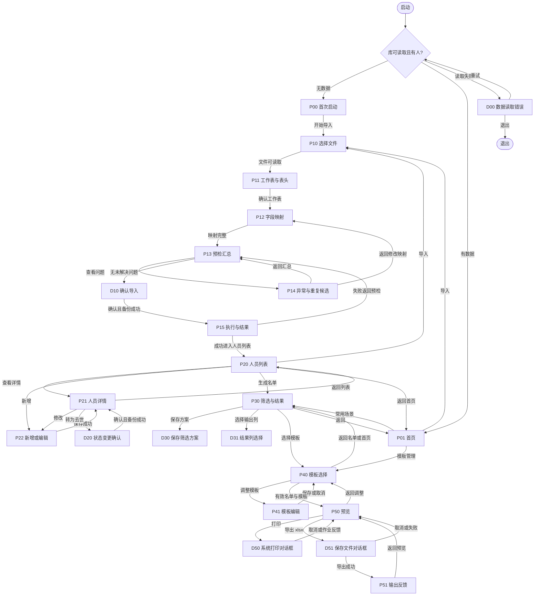

# D1B 使用流程与打印模板设计

版本：D1B-L0 v0.1｜日期：2026-10-01｜任务类型：docs（设计文档）

状态：B 轨设计材料已起草，待 A／C 对齐、甲方参数确认及 R 非作者复核。本文不构成 Gate 0 已通过或接口 v1 已冻结的结论。

## 1. 任务卡与基线

目标：使无技术背景的维护人员能够从首次启动走到名单预览，并明确导入、人员维护、筛选、模板和输出的正常及失败路径。

必须交付：页面流转图与简易原型、控件与 Tab 顺序、三类模板参数、操作复核步骤、待确认清单。有余力：提供便于离线阅读的 HTML。范围之外：D2 Win32 窗口代码、SQLite／xlsx 实现、正式数据导入、VM 测试、替 R 签认和 Git 发布。

| 依据 | 本次使用范围 | 核对结论 |
| --- | --- | --- |
| 开工清单.md、D1B_具体工作清单.md | 工作组织及 11 项完成定义 | 按 D1B 清单组织材料 |
| 方案冻结说明.md，2026-09-21 | 冻结边界及变更要求 | 不改原始需求、规则或 Schema |
| 当前需求说明.docx v2.0 §4–7 | 六类页面、模块职责、规则 R01–R05、验收 | 直接读取当前 Word；历史提取稿不作为现行依据 |
| 当前开发规划.docx v2.0 §5 D1–D5 | B 轨任务、A／C／R 责任与 Gate | 本次仅 D1；正式接口在 D2 对齐 |
| 七阶段开发任务清单.xlsx，“施工台账”第 10 行 | 页面、大字号、控件、三类模板、L0 原型与步骤 | 本文作为该项设计证据；不改原台账状态 |
| schema_types.hpp，Schema v1 | 29 个 FieldId、DTO、必填与敏感标志 | SHA-256 与冻结说明一致；缺口列入 Q 清单 |
| 员工信息表11111.xlsx，Sheet1 第 1／3 行 | 表头与映射风险 | 仅表头样本，无人员数据；第二份人员表缺失 |

术语沿用 CONTEXT.md：固定人员编号为永久内部标识；打印序号属于当次名单；筛选方案决定人员入选；打印模板决定版式；导入批次只在预检确认后执行正式写入。

采用 ask-matt 的流程路由：已有任务卡与冻结需求，完成范围明确的设计证据；以具体边界场景核对契约。未进入 implement／TDD／提交流程，也未建立新 tracker。

## 2. 页面流转图

图中 P 为页面，D 为对话框。箭头表示用户操作或服务结果；下面的路径表补全返回、取消与失败路径。



| 页面／对话框 | 入口与前进条件 | 返回／取消去向 | 失败时的行为 |
| --- | --- | --- | --- |
| P00 首次启动 | 库正常但记录数为 0 | 退出程序；再次启动仍显示 P00 | 读取失败进入 D00，不能把坏库显示成空库 |
| P01 首页 | 有数据；显示人数与最近方案 | 退出；有未保存编辑时 D90 | 场景生成失败留原页并显示原因 |
| P10 文件 | P00／P01／P20，保存来源页 | 取消整个向导，回来源页；无正式数据变化 | 文件缺失、格式不支持或读取失败：留 P10，可重新选 |
| P11 工作表 | 文件读取成功 | 上一步 P10；取消回来源页 | 无工作表、表头行不明确：留 P11 并请求选择 |
| P12 映射 | 工作表和表头确认 | 上一步 P11；取消回来源页 | 同名列或必填缺口：定位该行，不启用预检 |
| P13 汇总 | 由应用服务完成预检 | 上一步 P12；取消回来源页 | 服务失败留 P13；原汇总标为过期，禁用确认 |
| P14 问题 | P13；只查看／定位问题 | 返回 P13；修改映射到 P12 | 未解决问题保留；不提供自动合并或静默跳过 |
| D10 确认 | 可导入数大于 0；阻塞异常及重复候选为 0；预检未过期 | 默认焦点“返回检查”，取消回 P13 | 自动备份失败：取消本次写入并回 P13 |
| P15 执行／结果 | 用户明确确认后才提交服务 | 执行中不可返回或关闭写入；完成后可返回 | 回滚后回 P13；不能宣称成功或重试已提交的同批次 |
| P20 列表 | 导入成功、首页人员维护 | 返回 P01，保留搜索与滚动位置 | 搜索失败保留上次列表但标明未更新；空列表可新增／导入 |
| P21 详情 | 选定固定编号 | 返回 P20 同位置 | 找不到记录：提示刷新列表；历史读取失败不覆盖详情 |
| P22 新增／修改 | 新增或已有详情 | 取消回来源页；有改动先 D90 | 字段校验留页；并发冲突需重新载入，不覆盖新值 |
| D20 状态确认 | 详情在世且已填写离世日期 | 取消回 P21 | 备份或保存失败回 P21，保持原状态 |
| P30 筛选结果 | 首页场景或列表生成名单 | 返回原入口 P01／P20 | 请求失败留旧结果并标“未更新”；0 人时禁用输出 |
| D30／D31 | P30 保存方案／列选择 | 取消回 P30，原配置保留 | 重名方案不直接覆盖；至少选一列 |
| P40 模板选择 | P30 带名单上下文；或 P01 管理模式 | 返回来源 P30／P01 | 管理模式无名单，预览按钮禁用并提示先生成名单 |
| P41 模板编辑 | 选择一个模板 | 保存回 P40；取消先 D90 再回 P40 | 参数错误定位字段；保存失败保留草稿 |
| P50 预览 | 有效结果快照、有效模板 | 返回 P40，可继续到 P41 或 P30 调整 | 排版失败显示具体列／页参数，打印导出均禁用 |
| D50 打印 | P50，快照一致性检查通过 | 系统取消回 P50，无错误提示 | 无打印机／作业失败回 P50；显示作业状态，不声称已出纸 |
| D51 导出 | P50，有效保存路径 | 系统取消回 P50 | 路径不可写留 P50 可重选；不留半成品冒充成功 |
| P51 反馈 | 完整 xlsx 已写入成功 | 回 P50；可回 P30 生成新名单 | 文件打开失败只影响打开，保留导出成功状态 |
| D90 未保存提醒 | 编辑页返回、导航或关闭 | “继续编辑”回原页；“放弃修改”回目标页 | 若选保存但失败，留编辑页，不自动退出 |

关闭窗口与 Esc 使用相同取消策略。所有来源页与焦点都由导航上下文保存；P40 在管理模式返回首页，图中的 P40→P30 仅指名单模式。

## 3. 简易页面原型与操作约定

这些为 L0 静态布局草图。文末控件表是完整可操作控件目录，草图中的编号与目录一致。固定文字及汇总区采用 STATIC，完整编号为页面名-INFO，不进入 Tab 顺序。

### 3.1 首次启动与首页

```text
P00 首次启动
┌ 退休人员名册 ─────────────────────────────┐
│ 还没有人员资料。请先导入一份人员 Excel。  │
│ 1 选择表格 → 2 检查问题 → 3 生成名单      │
│ [开始导入 P00-01]  [查看帮助 P00-02]      │
│ [退出 P00-03]                             │
└──────────────────────────────────────────┘
P01 首页
人员总数／在世人数／上次导入日期
[发放名单] [重阳节] [党员名单] [党龄50周年]
[状态组合] [标签组合] [最近方案]
[人员维护] [导入] [模板管理] [使用帮助] [退出]
```

首页兼顾任务卡要求的四类筛选入口（重阳节、党龄50周年、状态组合、标签组合）和日常发放、党员入口。新用户导入成功先进入 P20 确认人员，再返回首页选择业务；不在空库强行选择模板。

### 3.2 导入向导

```text
P10 选文件 [文件路径只读] [选择文件] [下一步] [取消]
P11 工作表 [工作表下拉] [表头行] [只读表头预览] [上一步] [下一步] [取消]
P12 映射 [源列列表] [目标字段下拉] [应用到选中列] [取消该列映射]
          [源状态缺失时的批次状态选择] [确认该默认状态] [上一步] [开始预检] [取消]
P13 汇总  记录总数／可导入／阻塞异常／重复候选／未映射列
          [查看问题] [上一步修改] [确认导入] [取消]
P14 问题 [问题类别] [行／列／原表头／字段／脱敏原值／原因列表]
          [查看选中问题定位] [导出问题清单] [返回映射] [返回汇总]
P15 执行 [进度条] 提交中，请等待。完成后显示批次号、成功数与失败原因
          [进入人员列表] [返回预检] [导出批次报告]
```

P11 默认表头行由 A 的识别结果建议，不能固定猜第 1／3 行。列号与原表头同时显示，例如 C“姓名”和 AI“姓 名”保持两个独立源列；不靠去空格后名称自动合并。第 3 行 W 是保留空列，不映射；格式化到 IS 的空列不计为字段或人员。

现行 v2.0 支持映射确认。历史提取稿提过“标准模板直入”，但现行冻结 Word 未载明该分支；本设计默认仍经过 P12。是否启用“识别完全匹配时跳过逐列确认”的简化路径列为 Q01，不默认启用，预检和最终确认在任何路径都保留。

映射后只有 full_name 与 life_status 被 Schema 标记 required_for_import。姓名为实际源值；源表没有状态时，批次默认状态由维护人员选择并明确确认（初始未选择），由 A／R 批准此补值策略后启用。固定编号由服务生成，继承旧编号规则待确认；打印序号、年龄、党龄不是映射目标。学历、学位等没有 FieldId 的源字段显示“尚无目标字段”，在 A 给出保留方式前阻止确认，不静默丢弃。备注不能充当未经批准的字段合集。

日期只允许完整且有效日期或空值；“出生年月”仅有年月的样本不得补成每月 1 日。更换文件／工作表／表头／映射／默认状态使原预检失效；服务须重新产生批次与汇总。P14 的定位反馈包括文件、工作表、行号、列号、字段与处理建议。纠正源文件由维护人员在外部副本完成，再回 P10 重选，UI 不直接写源 Excel。

重复候选不得自动合并。D1 安全默认：任何未解决重复或阻塞异常都禁用确认；维护人员修正源副本后重检。选择性跳过、合并或更新已有人员不是当前 ConfirmImportRequest 能表达的行为，待 Q03 决定，不在页面放未经支持的操作按钮。

预检数量按行计算；同一行可有多个问题。异常数和重复数可能交叉，不能直接相加当成总记录数。展示服务返回的逐项定义及“待处理行数”，准确集合统计待 A 提供；无数据样表不假定导入成功数。

### 3.3 人员列表、详情与维护

```text
P20 [姓名／固定编号搜索] [状态下拉] [查询] [清空]
    [固定编号 | 姓名 | 状态 | 类别 | 原单位 | 周岁 | 当年年龄] 列表
    [查看详情] [新增] [导入] [生成名单] [返回首页]
P21 固定编号：只读，永不复用；身份证号／电话／地址按权限脱敏
    [基本／党务／动态状态／历史分组内容]
    [修改资料] [转为去世] [查看变更历史] [按规则查看敏感信息] [返回列表]
P22 固定编号及系统审计字段只读
    基本信息 → 退休信息 → 党务 → 日期和状态 → 动态关怀 → 标签 → 备注
    [保存] [取消]
D20 姓名、固定编号、当前状态、离世日期、保留历史说明
    [离世日期] [确认状态变更] [取消]
```

P22 新建时固定编号显示“保存后生成”；编辑不可改变 person_id。姓名必填，日期可空；未知不使用 1900-01-01。状态由单独 D20 改为去世，P22 状态只读，防止绕过备份与明确确认。去世日期必填并校验实际日历及不晚于操作日；去世档案仍可搜索、查看历史。误操作改回在世的更正流程待 Q04，不提供删除按钮。

出生日期、入党日期缺失时派生值显示“待补录”，不显示 0。当年年龄与党龄只由应用服务返回。工号是文本保留前导零。类别、级别、政治面貌以 A 的代码字典显示中文，不能根据职称自动猜级别。高龄标记、困难、患病、当年慰问和标签由维护人员按通知修改，不从年龄推断。

29 字段的控件覆盖见第 5 节。last_modified_by 虽在 FieldSpec 标为 mutable，UI 仍只显示由操作身份自动填入的值；无联网登录需求，操作身份采集方式待 R 确认。敏感查看规则未确认时 P21-04 禁用；日志和问题报告均保留脱敏值。

### 3.4 筛选与结果

```text
P30 [场景] [目标年份] [高级条件展开]
    [状态] [政治面貌] [类别] [级别] [原单位] [标签组合]
    [年龄口径] [最小年龄] [最大年龄] [条件规则摘要]
    [生成名单] [重置条件] [保存方案] [列选择] [排序]
    当前条件：在世，目标年份 2026，当年年龄 70/75/80/85 或 ≥90
    名单人数 N；排除或缺失日期提示；排序规则；生成时间
    [打印序号 | 固定人员编号 | 姓名 | 状态 | 年龄 | 原单位] 只读结果
    [选择模板] [返回]
```

默认目标年份为运行时本地年份，可修改；复核用 2026，不硬编码产品年份。跨年后旧结果显示生成时间与原目标年份，须明确重生成。条件未运行前标“条件已修改，名单未更新”，禁用模板输出，不能用旧人数冒充新结果。

| 常用入口 | 明示默认条件 | 缺失／边界 |
| --- | --- | --- |
| 发放名单 | 在世，拼音稳定排序 | 无年龄门槛；不排除缺日期者 |
| 重阳节 | 在世；当年年龄等于 70／75／80／85 或 ≥90 | 缺出生日期不入选并提示；90 包含；71–74 不入选 |
| 党员名单 | 在世＋政治面貌为党员（具体代码待 A） | 不把政治面貌空值当党员 |
| 党龄50周年 | 在世（建议默认，待 R）＋党员＋目标年份减入党年份等于 50 | 缺日期、非党员、49／51 不入选 |
| 状态组合 | 默认在世，可选去世或全部；另选政治面貌／类别／级别等 | 不同条件之间 AND；去世单选需服务明确支持 |
| 标签组合 | 默认在世＋选定标签全部满足 | 默认 AND；“任一满足”待 DTO 支持后再开放 |

级别“处级以上”必须由字典定义集合，不能对中文级别字符串比较大小。重置回进入场景的默认值；更换场景载入新默认并标未生成。普通条件之间 AND；重阳节内部年龄集合为 OR。FilterSpec 当前不能完整表达派生年龄与任意布尔组合，Q06 要求 A 统一解释，B 不自行计算。

默认排序为 pinyin_sort_key、full_name、person_id；切换排序必须让服务生成新结果和连续序号，UI 不单独排序后沿用旧序号。固定编号与打印序号在结果页分别显示；打印是否勾选固定编号由模板配置决定。列选择只改变显示，不改变筛选条件；输出列由模板独立控制，并在预览前展示差异。

### 3.5 模板与预览输出

```text
P40 名单：条件摘要／N 人／生成时间（管理模式显示“尚未选择名单”）
    [三类模板列表] [调整模板] [预览名单] [返回]
P41 [模板名] [标题] [字段勾选清单] [上移] [下移] [选中列宽]
    [字号] [纸张] [方向] [上／下／左／右边距] [每页人数] [行高]
    [签字列] [签字列宽] [空白备注列] [备注列宽] [重复表头] [页码]
    [保存为新模板] [保存修改] [取消]
P50 条件、N 人、模板、排序、总页数／当前页、生成时间
    [上一页] [下一页] [页码] [缩放] [预览画布（支持滚动）]
    [返回调整] [打印] [导出 Excel]
P51 已保存：文件名／路径／人数／模板／时间
    [打开文件] [打开所在文件夹] [返回预览]
```

模板负责展示，不能改筛选条件。默认模板作为种子配置，建议编辑后另存副本，覆盖已有模板需二次确认。模板失败保存不丢草稿；改变列、字号和纸张要重新排版，排版失败先禁用预览／输出。

名单生成后由应用服务持有不可变、有版本的结果上下文：条件、目标年份、稳定有序 RosterRow 集合、人数、生成时间和数据版本；预览、GDI 打印、xlsx 导出消费同一份值，不再次查询或计算。若档案已变动，显示“人员资料已更新，请重新生成名单”，阻止继续输出并保留旧预览供核对。结果快照接口尚缺，见 Q07；仅传 FilterSpec 再查库无法证明一致性。

0 人不产生空白名单或空白页。每页重新显示表头；不允许只有表头没有人员的一页。签字列与空白备注列是版式列，不写人员档案；人物备注 Remark 与空白备注列必须用不同名称。打印机提交成功显示“已提交打印作业”，实物完成由用户观察。导出先写服务管理的临时文件，成功后完成目标文件替换；已有文件需系统确认覆盖；失败不得破坏原文件。导出不依赖 Excel，打开文件可能因无关联程序失败，此时引导打开文件夹即可。

## 4. 大字号与键盘规则

本节为 B 的建议设计值，待 C 在 Win7 RTM x86／x64 验证。默认字体“微软雅黑”12 pt，备用系统可用中文字体；三档为 12／15／18 pt（100／125／150%），窗口初始目标 1024×720；1024×768 工作区内最大化可操作。界面字号与打印字号独立。

字体换档时按实际字体测量重排：双列表单变单列；标签在输入框上方；列表行高按字体高度加上下内距；长地址与备注换行；操作按钮不缩小文字。固定底部保存／取消区域，内容垂直滚动；焦点跳转自动滚入可视区。模板长字段名单可横向滚动，关键编号与姓名仍可定位。显示器 DPI 96／120／144 与字号档组合均列入 D2／D5 验证，不能只按比例扩大坐标。

高对比度采用系统颜色；错误提示含文字及具体字段，不只用红色。不要把必要操作藏在右键或双击中。窗口标题、字段标签、列表列头均需中文；按钮可加唯一助记键，避免同页冲突。

Tab 依第 5 节顺序表；Shift+Tab 完全逆序，跳过隐藏、禁用、STATIC、只读展示区。每次导航先聚焦页面首个可用控件；返回定位触发按钮；校验失败聚焦首个错误字段。列表是一个 Tab 停靠点，箭头选择行，Space 勾选，Enter 执行已明示的查看操作；上移／下移按钮提供替代拖拽。

Enter 仅触发当前页明确的下一步／查询／预览或焦点按钮；多行备注中的 Enter 仅换行。正式导入与状态确认不设危险默认按钮，初始焦点为取消／返回检查，确认需 Tab 至确认按钮后 Space 或 Enter。Esc 取消／返回；执行写入中的 Esc 不中断事务，显示等待说明。Alt+F4 与页面关闭均遵守 D90。原生文件、保存、打印、帮助及消息框由系统键盘顺序管理，取消后焦点回到触发按钮。

实现依据：[Microsoft 对话框键盘接口](https://learn.microsoft.com/en-us/windows/win32/dlgbox/dlgbox-programming-considerations)、[键盘可访问性指导](https://learn.microsoft.com/en-us/windows/win32/uxguide/inter-keyboard)、[原生控件目录](https://learn.microsoft.com/en-us/windows/win32/controls/individual-control-info)。这里采用可见控件的 WS_TABSTOP／WS_GROUP 与对话框导航约定；实际 API 和 manifest 兼容性由 C 验证。

## 5. 控件清单与逐页 Tab 顺序

编号为设计追踪编号，D2 再分配 Win32 整数资源 ID。控件表一行对应一个可操作控件；EDIT＋UPDOWN 复合输入视为一个用户停靠点，UPDOWN 使用同一输入校验；列表子项不额外进入 Tab。系统对话框内部控件不由 B 重新编号。

全局与导航控件在页面内容之后访问；模态窗口不包含主窗口导航。共用只读展示区采用 STATIC，或不可编辑列表且支持键盘查看。全局状态栏显示当前页、服务进度与可操作错误。

### G 主窗口共用区

| 编号 | 控件名称 | Win32类型 | 用途 | 默认状态 | 启用条件 | 输入校验 | 错误提示 |
| --- | --- | --- | --- | --- | --- | --- | --- |
| G-01 | 界面字号 | COMBOBOX CBS_DROPDOWNLIST | 切换字体与重排 | 12 pt | 无模态写入任务 | 仅12／15／18 pt | 放大后不得裁切，布局不足使用滚动 |
| G-02 | 使用帮助 | BUTTON | 打开只读操作说明（系统对话框） | 可用 | 空闲时 | 无输入；按页面前进条件校验 | 服务失败时留页并说明原因 |

### P00 首次启动

| 编号 | 控件名称 | Win32类型 | 用途 | 默认状态 | 启用条件 | 输入校验 | 错误提示 |
| --- | --- | --- | --- | --- | --- | --- | --- |
| P00-01 | 开始导入 | BUTTON | 进入P10 | 可用 | 空闲时 | 无输入；按页面前进条件校验 | 服务失败时留页并说明原因 |
| P00-02 | 查看帮助 | BUTTON | 打开首次导入说明 | 可用 | 空闲时 | 无输入；按页面前进条件校验 | 服务失败时留页并说明原因 |
| P00-03 | 退出 | BUTTON | 关闭程序 | 可用 | 空闲时 | 无输入；按页面前进条件校验 | 服务失败时留页并说明原因 |

### P01 首页

| 编号 | 控件名称 | Win32类型 | 用途 | 默认状态 | 启用条件 | 输入校验 | 错误提示 |
| --- | --- | --- | --- | --- | --- | --- | --- |
| P01-01 | 发放名单 | BUTTON | P30载入在世条件 | 可用 | 空闲时 | 无输入；按页面前进条件校验 | 服务失败时留页并说明原因 |
| P01-02 | 重阳节 | BUTTON | P30载入年度年龄条件 | 可用 | 空闲时 | 无输入；按页面前进条件校验 | 服务失败时留页并说明原因 |
| P01-03 | 党员名单 | BUTTON | P30载入党员条件 | 可用 | 空闲时 | 无输入；按页面前进条件校验 | 服务失败时留页并说明原因 |
| P01-04 | 党龄50周年 | BUTTON | P30载入党龄条件 | 可用 | 空闲时 | 无输入；按页面前进条件校验 | 服务失败时留页并说明原因 |
| P01-05 | 状态组合 | BUTTON | P30展开状态条件 | 可用 | 空闲时 | 无输入；按页面前进条件校验 | 服务失败时留页并说明原因 |
| P01-06 | 标签组合 | BUTTON | P30展开标签条件 | 可用 | 空闲时 | 无输入；按页面前进条件校验 | 服务失败时留页并说明原因 |
| P01-07 | 最近方案 | COMBOBOX CBS_DROPDOWNLIST | 选择已保存方案进入P30 | 未选择 | 存在已保存方案 | 仅选有效方案 | 方案已失效，请重新设置条件 |
| P01-08 | 人员维护 | BUTTON | 进入P20 | 可用 | 空闲时 | 无输入；按页面前进条件校验 | 服务失败时留页并说明原因 |
| P01-09 | 导入 | BUTTON | 进入P10 | 可用 | 空闲时 | 无输入；按页面前进条件校验 | 服务失败时留页并说明原因 |
| P01-10 | 模板管理 | BUTTON | P40管理模式 | 可用 | 空闲时 | 无输入；按页面前进条件校验 | 服务失败时留页并说明原因 |
| P01-11 | 使用帮助 | BUTTON | 打开操作说明 | 可用 | 空闲时 | 无输入；按页面前进条件校验 | 服务失败时留页并说明原因 |
| P01-12 | 退出 | BUTTON | 关闭程序并处理未保存提醒 | 可用 | 空闲时 | 无输入；按页面前进条件校验 | 服务失败时留页并说明原因 |

### P10 选择文件

| 编号 | 控件名称 | Win32类型 | 用途 | 默认状态 | 启用条件 | 输入校验 | 错误提示 |
| --- | --- | --- | --- | --- | --- | --- | --- |
| P10-01 | 选择文件 | BUTTON | 系统文件对话框选择xlsx | 可用 | 空闲时 | 无输入；按页面前进条件校验 | 文件不可读／格式不支持，请重新选择 |
| P10-02 | 下一步 | BUTTON | 读取文件后进入P11 | 禁用 | 文件存在且支持xlsx | 无输入；按页面前进条件校验 | 服务失败时留页并说明原因 |
| P10-03 | 取消 | BUTTON | 回导入来源页 | 可用 | 空闲时 | 无输入；按页面前进条件校验 | 服务失败时留页并说明原因 |

### P11 工作表与表头

| 编号 | 控件名称 | Win32类型 | 用途 | 默认状态 | 启用条件 | 输入校验 | 错误提示 |
| --- | --- | --- | --- | --- | --- | --- | --- |
| P11-01 | 工作表 | COMBOBOX CBS_DROPDOWNLIST | 选择读取对象 | 未选择 | 已读取工作簿 | 名称必须由服务枚举 | 没有可读取的工作表 |
| P11-02 | 表头行 | EDIT＋UPDOWN | 指定表头位置 | 服务建议值或未填 | 已选工作表 | 正整数且位于工作表实际范围 | 请指定有效表头行 |
| P11-03 | 表头预览 | SysListView32 LVS_REPORT | 查看列号和原始标题 | 只读 | 已选表头行 | 只展示服务读取的标题 | 无法读取表头，请检查工作表 |
| P11-04 | 上一步 | BUTTON | 回P10 | 可用 | 空闲时 | 无输入；按页面前进条件校验 | 服务失败时留页并说明原因 |
| P11-05 | 下一步 | BUTTON | 进入P12 | 禁用 | 工作表与表头有效 | 无输入；按页面前进条件校验 | 服务失败时留页并说明原因 |
| P11-06 | 取消 | BUTTON | 回来源页 | 可用 | 空闲时 | 无输入；按页面前进条件校验 | 服务失败时留页并说明原因 |

### P12 字段映射

| 编号 | 控件名称 | Win32类型 | 用途 | 默认状态 | 启用条件 | 输入校验 | 错误提示 |
| --- | --- | --- | --- | --- | --- | --- | --- |
| P12-01 | 源列与映射列表 | SysListView32 LVS_REPORT | 选择待处理源列并查看缺口 | 未解决行优先 | 表头可读 | 列索引唯一；同名列独立显示 | 该源列尚未确定目标字段 |
| P12-02 | 目标字段 | COMBOBOX CBS_DROPDOWNLIST | 为选中源列指定FieldId | 未选择 | 已选一个源列 | 仅Schema字段；不可重复绑定同一目标 | 目标字段已被另一源列占用 |
| P12-03 | 应用到选中列 | BUTTON | 更新临时映射并使预检失效 | 禁用 | 源列和目标字段均有效 | 无输入；按页面前进条件校验 | 服务失败时留页并说明原因 |
| P12-04 | 取消该列映射 | BUTTON | 清除临时绑定 | 禁用 | 选中已映射列 | 无输入；按页面前进条件校验 | 服务失败时留页并说明原因 |
| P12-05 | 缺失状态的批次默认值 | COMBOBOX CBS_DROPDOWNLIST | 源状态缺失时明确补值 | 未选择 | 源无状态且A／R批准Q02策略 | 在世／去世代码来自字典 | 请选择批次状态，不自动猜测 |
| P12-06 | 确认该默认状态 | BUTTON BS_AUTOCHECKBOX | 确认所选补值 | 未勾选 | 批次默认值已选择且策略批准 | 勾选后才满足状态来源 | 必须明确确认状态来源 |
| P12-07 | 上一步 | BUTTON | 回P11 | 可用 | 空闲时 | 无输入；按页面前进条件校验 | 服务失败时留页并说明原因 |
| P12-08 | 开始预检 | BUTTON | 调用服务进入P13 | 禁用 | 必填来源齐全且未映射字段处置已确定 | 无输入；按页面前进条件校验 | 服务失败时留页并说明原因 |
| P12-09 | 取消 | BUTTON | 回来源页 | 可用 | 空闲时 | 无输入；按页面前进条件校验 | 服务失败时留页并说明原因 |

### P13 预检汇总

| 编号 | 控件名称 | Win32类型 | 用途 | 默认状态 | 启用条件 | 输入校验 | 错误提示 |
| --- | --- | --- | --- | --- | --- | --- | --- |
| P13-01 | 查看问题 | BUTTON | 进入P14 | 按问题数 | 存在问题记录 | 无输入；按页面前进条件校验 | 服务失败时留页并说明原因 |
| P13-02 | 上一步修改 | BUTTON | 回P12 | 可用 | 空闲时 | 无输入；按页面前进条件校验 | 服务失败时留页并说明原因 |
| P13-03 | 确认导入 | BUTTON | 打开D10 | 禁用 | 可导入数>0、问题解决且预检未过期 | 无输入；按页面前进条件校验 | 服务失败时留页并说明原因 |
| P13-04 | 取消 | BUTTON | 回来源页 | 可用 | 空闲时 | 无输入；按页面前进条件校验 | 服务失败时留页并说明原因 |

### P14 异常与重复候选

| 编号 | 控件名称 | Win32类型 | 用途 | 默认状态 | 启用条件 | 输入校验 | 错误提示 |
| --- | --- | --- | --- | --- | --- | --- | --- |
| P14-01 | 问题类别 | COMBOBOX CBS_DROPDOWNLIST | 筛选异常／重复／未映射 | 全部 | 预检有问题 | 仅服务问题分类 | 无该类问题时显示0条 |
| P14-02 | 问题列表 | SysListView32 LVS_REPORT | 查看脱敏问题明细 | 第一条问题 | 有问题记录 | 只读；原值脱敏 | 问题无法定位时显示源行列缺口 |
| P14-03 | 查看选中问题定位 | BUTTON | 展示源文件、表、行列、原因及建议 | 按选择 | 已选问题 | 无输入；按页面前进条件校验 | 服务失败时留页并说明原因 |
| P14-04 | 导出问题清单 | BUTTON | 服务导出脱敏报告并显示保存反馈 | 可用 | 有问题且导出接口已对齐 | 无输入；按页面前进条件校验 | 无法写入报告，请换目录 |
| P14-05 | 返回映射 | BUTTON | 回P12并标预检需重做 | 可用 | 空闲时 | 无输入；按页面前进条件校验 | 服务失败时留页并说明原因 |
| P14-06 | 返回汇总 | BUTTON | 回P13 | 可用 | 空闲时 | 无输入；按页面前进条件校验 | 服务失败时留页并说明原因 |

### D10 确认导入

| 编号 | 控件名称 | Win32类型 | 用途 | 默认状态 | 启用条件 | 输入校验 | 错误提示 |
| --- | --- | --- | --- | --- | --- | --- | --- |
| D10-01 | 返回检查 | BUTTON | 取消确认回P13 | 初始焦点 | 空闲时 | 无输入；按页面前进条件校验 | 服务失败时留页并说明原因 |
| D10-02 | 确认入库 | BUTTON | 自动备份成功后执行P15 | 可用 | 满足P13条件且未提交过 | 无输入；按页面前进条件校验 | 备份失败：未写入；回P13处理 |

### P15 导入执行与结果

| 编号 | 控件名称 | Win32类型 | 用途 | 默认状态 | 启用条件 | 输入校验 | 错误提示 |
| --- | --- | --- | --- | --- | --- | --- | --- |
| P15-01 | 导入进度 | msctls_progress32 | 显示服务提交进度 | 执行中 | 只读 | 无输入；不加入Tab | 执行失败显示已回滚或待核对状态 |
| P15-02 | 进入人员列表 | BUTTON | 回P20核对结果 | 禁用 | 事务提交成功 | 无输入；按页面前进条件校验 | 服务失败时留页并说明原因 |
| P15-03 | 返回预检 | BUTTON | 回P13；重试须重新核对批次 | 禁用 | 执行失败且回滚完成 | 无输入；按页面前进条件校验 | 服务失败时留页并说明原因 |
| P15-04 | 导出批次报告 | BUTTON | 服务生成脱敏批次报告 | 禁用 | 执行完成且报告接口已对齐 | 无输入；按页面前进条件校验 | 报告未保存，请换目录 |

### D00 数据读取错误

| 编号 | 控件名称 | Win32类型 | 用途 | 默认状态 | 启用条件 | 输入校验 | 错误提示 |
| --- | --- | --- | --- | --- | --- | --- | --- |
| D00-01 | 重试 | BUTTON | 重新请求读取服务 | 可用 | 空闲时 | 无输入；按页面前进条件校验 | 服务失败时留页并说明原因 |
| D00-02 | 退出 | BUTTON | 退出并保留数据文件 | 可用 | 空闲时 | 无输入；按页面前进条件校验 | 服务失败时留页并说明原因 |

### P20 人员列表

| 编号 | 控件名称 | Win32类型 | 用途 | 默认状态 | 启用条件 | 输入校验 | 错误提示 |
| --- | --- | --- | --- | --- | --- | --- | --- |
| P20-01 | 姓名或固定编号 | EDIT | 输入搜索词 | 空 | 空闲时 | 按姓名／编号查询，空值为全部 | 查询失败，请重试，不清除旧列表 |
| P20-02 | 状态 | COMBOBOX CBS_DROPDOWNLIST | 选择在世／去世／全部 | 在世（建议） | 空闲时 | 使用服务状态枚举 | 不能加载状态字典 |
| P20-03 | 查询 | BUTTON | 调用人员查询服务 | 可用 | 空闲时 | 无输入；按页面前进条件校验 | 服务失败时留页并说明原因 |
| P20-04 | 清空 | BUTTON | 清空搜索并恢复默认状态 | 可用 | 空闲时 | 无输入；按页面前进条件校验 | 服务失败时留页并说明原因 |
| P20-05 | 人员列表 | SysListView32 LVS_REPORT | 选择固定编号 | 无选择 | 查询成功 | 只读；箭头选行，Enter查看详情 | 未找到人员，请刷新 |
| P20-06 | 查看详情 | BUTTON | 进入P21 | 禁用 | 已选人员 | 无输入；按页面前进条件校验 | 服务失败时留页并说明原因 |
| P20-07 | 新增 | BUTTON | 进入P22新增 | 可用 | 空闲时 | 无输入；按页面前进条件校验 | 服务失败时留页并说明原因 |
| P20-08 | 导入 | BUTTON | 进入P10 | 可用 | 空闲时 | 无输入；按页面前进条件校验 | 服务失败时留页并说明原因 |
| P20-09 | 生成名单 | BUTTON | 进入P30，以可见条件为建议起点 | 可用 | 空闲时 | 无输入；按页面前进条件校验 | 服务失败时留页并说明原因 |
| P20-10 | 返回首页 | BUTTON | 回P01 | 可用 | 空闲时 | 无输入；按页面前进条件校验 | 服务失败时留页并说明原因 |

### P21 人员详情

| 编号 | 控件名称 | Win32类型 | 用途 | 默认状态 | 启用条件 | 输入校验 | 错误提示 |
| --- | --- | --- | --- | --- | --- | --- | --- |
| P21-01 | 修改资料 | BUTTON | 进入P22 | 可用 | 空闲时 | 无输入；按页面前进条件校验 | 服务失败时留页并说明原因 |
| P21-02 | 转为去世 | BUTTON | 打开D20 | 按状态 | 当前在世 | 无输入；按页面前进条件校验 | 服务失败时留页并说明原因 |
| P21-03 | 查看变更历史 | BUTTON | 显示服务返回的只读历史（系统弹窗） | 可用 | 历史服务已对齐 | 无输入；按页面前进条件校验 | 服务失败时留页并说明原因 |
| P21-04 | 按规则查看敏感信息 | BUTTON | 经已批准规则临时展开敏感值 | 禁用 | Q11已确认且服务批准 | 无输入；按页面前进条件校验 | 服务失败时留页并说明原因 |
| P21-05 | 返回列表 | BUTTON | 回P20并恢复位置 | 可用 | 空闲时 | 无输入；按页面前进条件校验 | 服务失败时留页并说明原因 |

### D20 状态变更确认

| 编号 | 控件名称 | Win32类型 | 用途 | 默认状态 | 启用条件 | 输入校验 | 错误提示 |
| --- | --- | --- | --- | --- | --- | --- | --- |
| D20-01 | 离世日期 | SysDateTimePick32 DTS_SHOWNONE | 填写状态变更日期 | 空 | 当前在世 | 完整有效日期且不晚于操作日 | 请填写有效离世日期 |
| D20-02 | 确认状态变更 | BUTTON | 自动备份后提交状态和日期 | 禁用 | 日期有效 | 无输入；按页面前进条件校验 | 备份／保存失败，原状态不变 |
| D20-03 | 取消 | BUTTON | 回P21 | 初始焦点 | 空闲时 | 无输入；按页面前进条件校验 | 服务失败时留页并说明原因 |

### P30 筛选与结果

| 编号 | 控件名称 | Win32类型 | 用途 | 默认状态 | 启用条件 | 输入校验 | 错误提示 |
| --- | --- | --- | --- | --- | --- | --- | --- |
| P30-01 | 场景 | COMBOBOX CBS_DROPDOWNLIST | 选择六类入口 | 来源场景 | 空闲时 | 仅已定义场景 | 场景不可用，请选其他条件 |
| P30-02 | 目标年份 | EDIT＋UPDOWN | 指定年度口径 | 当前本地年份 | 空闲时 | 合法年份且服务接受；范围待A | 请输入有效目标年份 |
| P30-03 | 高级条件展开／收起 | BUTTON | 显示或收起条件；收起仍显示摘要 | 可用 | 空闲时 | 无输入；按页面前进条件校验 | 服务失败时留页并说明原因 |
| P30-04 | 状态 | COMBOBOX CBS_DROPDOWNLIST | 在世／去世／全部 | 在世 | 高级条件展开 | 服务状态字典 | 状态条件无效 |
| P30-05 | 政治面貌 | COMBOBOX CBS_DROPDOWNLIST | 组合党务条件 | 场景默认 | 高级条件展开 | 服务枚举或不限 | 政治面貌字典未加载 |
| P30-06 | 人员类别 | COMBOBOX CBS_DROPDOWNLIST | 组合工人／干部等 | 不限 | 高级条件展开 | 服务枚举或不限 | 人员类别字典未加载 |
| P30-07 | 干部级别 | COMBOBOX CBS_DROPDOWNLIST | 组合级别或处级以上 | 不限 | 高级条件展开 | 服务提供等级集合 | 请确认处级以上的等级集合 |
| P30-08 | 原单位 | COMBOBOX | 单位精确条件 | 不限 | 高级条件展开 | 使用有效字典项 | 单位条件不在字典中 |
| P30-09 | 标签组合 | SysListView32 LVS_REPORT＋复选框 | 选择全部须满足的标签 | 未选择 | 高级条件展开 | 服务标签代码集合；默认AND | 标签已失效，请重新选择 |
| P30-10 | 年龄口径 | COMBOBOX CBS_DROPDOWNLIST | 周岁／当年年龄／不限 | 场景默认 | 高级条件展开 | 重阳节使用年度口径 | 该场景须使用当年年龄 |
| P30-11 | 最小年龄 | EDIT＋UPDOWN | 闭区间下限 | 空 | 高级展开且年龄筛选启用 | 非负整数；不超过最大值 | 最小年龄不能大于最大年龄 |
| P30-12 | 最大年龄 | EDIT＋UPDOWN | 闭区间上限 | 空 | 高级展开且年龄筛选启用 | 非负整数；空代表无上限 | 请输入有效年龄上限 |
| P30-13 | 生成名单 | BUTTON | 服务统一计算并返回结果上下文 | 可用 | 条件校验通过 | 无输入；按页面前进条件校验 | 服务失败时留页并说明原因 |
| P30-14 | 重置条件 | BUTTON | 回当前场景默认值并标结果未更新 | 可用 | 空闲时 | 无输入；按页面前进条件校验 | 服务失败时留页并说明原因 |
| P30-15 | 保存方案 | BUTTON | 打开D30 | 可用 | 条件有效且保存接口已对齐 | 无输入；按页面前进条件校验 | 服务失败时留页并说明原因 |
| P30-16 | 列选择 | BUTTON | 打开D31 | 可用 | 空闲时 | 无输入；按页面前进条件校验 | 服务失败时留页并说明原因 |
| P30-17 | 排序 | COMBOBOX CBS_DROPDOWNLIST | 服务按选择重生成序号 | 拼音键／姓名／固定编号 | 结果有效或可生成 | 仅服务支持的排序 | 排序失败，旧结果标未更新 |
| P30-18 | 名单结果 | SysListView32 LVS_REPORT | 查看两个编号、字段和人数 | 只读 | 有有效结果 | 不在UI重算或单独排序 | 名单未更新，请重新生成 |
| P30-19 | 选择模板 | BUTTON | 进入P40名单模式 | 禁用 | 有效且非空结果 | 无输入；按页面前进条件校验 | 服务失败时留页并说明原因 |
| P30-20 | 返回 | BUTTON | 回P01或P20来源 | 可用 | 空闲时 | 无输入；按页面前进条件校验 | 服务失败时留页并说明原因 |

### D30 保存筛选方案

| 编号 | 控件名称 | Win32类型 | 用途 | 默认状态 | 启用条件 | 输入校验 | 错误提示 |
| --- | --- | --- | --- | --- | --- | --- | --- |
| D30-01 | 方案名称 | EDIT | 给条件命名 | 空 | 空闲时 | 去首尾空格后非空；重名需另名或明确确认 | 方案名为空／已存在，请重新命名 |
| D30-02 | 保存 | BUTTON | 调用方案服务回P30 | 禁用 | 名称有效 | 无输入；按页面前进条件校验 | 服务失败时留页并说明原因 |
| D30-03 | 取消 | BUTTON | 回P30 | 可用 | 空闲时 | 无输入；按页面前进条件校验 | 服务失败时留页并说明原因 |

### D31 结果列选择

| 编号 | 控件名称 | Win32类型 | 用途 | 默认状态 | 启用条件 | 输入校验 | 错误提示 |
| --- | --- | --- | --- | --- | --- | --- | --- |
| D31-01 | 显示列 | SysListView32 LVS_REPORT＋复选框 | 勾选屏幕展示字段 | 编号、序号、姓名及场景字段 | 空闲时 | 至少一列；不影响筛选与模板列 | 请至少保留一列 |
| D31-02 | 确定 | BUTTON | 应用展示配置回P30 | 可用 | 至少一列 | 无输入；按页面前进条件校验 | 服务失败时留页并说明原因 |
| D31-03 | 取消 | BUTTON | 回P30保留旧列 | 可用 | 空闲时 | 无输入；按页面前进条件校验 | 服务失败时留页并说明原因 |

### P40 模板选择

| 编号 | 控件名称 | Win32类型 | 用途 | 默认状态 | 启用条件 | 输入校验 | 错误提示 |
| --- | --- | --- | --- | --- | --- | --- | --- |
| P40-01 | 模板列表 | SysListView32 LVS_REPORT | 选择三类默认或已存副本 | 匹配场景的建议模板 | 空闲时 | 模板存在且版本可读 | 模板无法读取，请重新选择 |
| P40-02 | 调整模板 | BUTTON | 进入P41 | 按选择 | 已选择模板 | 无输入；按页面前进条件校验 | 服务失败时留页并说明原因 |
| P40-03 | 预览名单 | BUTTON | 应用服务准备PrintModel进入P50 | 禁用 | 有效非空结果和有效模板 | 无输入；按页面前进条件校验 | 服务失败时留页并说明原因 |
| P40-04 | 返回 | BUTTON | 回P30或P01来源 | 可用 | 空闲时 | 无输入；按页面前进条件校验 | 服务失败时留页并说明原因 |

### P41 模板编辑

| 编号 | 控件名称 | Win32类型 | 用途 | 默认状态 | 启用条件 | 输入校验 | 错误提示 |
| --- | --- | --- | --- | --- | --- | --- | --- |
| P41-01 | 模板名称 | EDIT | 配置名称 | 当前模板名 | 空闲时 | 去空格后非空；重名显式处理 | 模板名称不能为空或重复 |
| P41-02 | 标题 | EDIT | 配置名单标题 | 当前模板标题 | 空闲时 | 非空；年度变量只来自结果上下文 | 请填写标题 |
| P41-03 | 字段勾选清单 | SysListView32 LVS_REPORT＋复选框 | 选择输出字段并选中调整对象 | 模板当前列 | 空闲时 | 至少一列；派生列需Q08契约支持 | 请至少保留一列或先对齐字段契约 |
| P41-04 | 上移 | BUTTON | 列序上移一格 | 按选择 | 选中可见列且非首列 | 无输入；按页面前进条件校验 | 服务失败时留页并说明原因 |
| P41-05 | 下移 | BUTTON | 列序下移一格 | 按选择 | 选中可见列且非尾列 | 无输入；按页面前进条件校验 | 服务失败时留页并说明原因 |
| P41-06 | 选中列宽（mm） | EDIT＋UPDOWN | 调整实际物理列宽 | 当前列宽 | 选中可见列 | 8–100；总宽≤可打印宽 | 列宽超出纸张，请减少宽度或改方向 |
| P41-07 | 正文／表头字号（pt） | COMBOBOX | 设打印字体大小 | 14 | 空闲时 | 整数10–24；实际测量可容纳 | 字号超出范围或造成排版溢出 |
| P41-08 | 纸张 | COMBOBOX CBS_DROPDOWNLIST | 选择纸张 | A4 | 空闲时 | 当前候选仅A4 | 当前模板只支持A4 |
| P41-09 | 方向 | COMBOBOX CBS_DROPDOWNLIST | 纵向／横向 | 模板默认 | 空闲时 | 两种值；改变后重新校验尺寸 | 方向改变后列宽或高度超限 |
| P41-10 | 上边距（mm） | EDIT＋UPDOWN | 页面上边距 | 15 | 空闲时 | 5–40且不小于打印机硬边距 | 上边距不可用，请调整 |
| P41-11 | 下边距（mm） | EDIT＋UPDOWN | 页面下边距 | 15 | 空闲时 | 5–40且留够正文与页脚 | 下边距使正文高度不足 |
| P41-12 | 左边距（mm） | EDIT＋UPDOWN | 页面左边距 | 15 | 空闲时 | 5–40且留够列宽 | 左边距使表格过宽 |
| P41-13 | 右边距（mm） | EDIT＋UPDOWN | 页面右边距 | 15 | 空闲时 | 5–40且留够列宽 | 右边距使表格过宽 |
| P41-14 | 每页人数 | EDIT＋UPDOWN | 控制分页人数 | 模板默认 | 空闲时 | 1–50且高度公式通过 | 每页人数过多，请减少 |
| P41-15 | 行高（mm） | EDIT＋UPDOWN | 保证大字号及书写空间 | 模板默认 | 空闲时 | 8–30且内容测量通过 | 行高不足或造成分页溢出 |
| P41-16 | 签字列 | BUTTON BS_AUTOCHECKBOX | 添加空白签字列 | 勾选 | 空闲时 | 仅版式列 | 开启后超宽，请调整列宽 |
| P41-17 | 签字列宽（mm） | EDIT＋UPDOWN | 调整签字空间 | 模板默认 | 签字列已勾选 | 8–100且总宽通过 | 签字列宽使页面超宽 |
| P41-18 | 空白备注列 | BUTTON BS_AUTOCHECKBOX | 添加手写备注空列 | 不勾选 | 空闲时 | 不能混同人员Remark | 开启后超宽，请调整列宽 |
| P41-19 | 备注列宽（mm） | EDIT＋UPDOWN | 调整手写备注空间 | 20（建议） | 空白备注已勾选 | 8–100且总宽通过 | 备注列宽使页面超宽 |
| P41-20 | 重复表头 | BUTTON BS_AUTOCHECKBOX | 每页重复表头 | 勾选 | 空闲时 | 默认模板必须勾选以满足验收 | 多页名单必须重复表头 |
| P41-21 | 页码 | BUTTON BS_AUTOCHECKBOX | 页脚显示p／P | 勾选 | 空闲时 | 默认模板勾选；与总页数一致 | 页码配置无法保存 |
| P41-22 | 保存为新模板 | BUTTON | 保存副本回P40 | 可用 | 所有参数有效且新名称不重名 | 无输入；按页面前进条件校验 | 服务失败时留页并说明原因 |
| P41-23 | 保存修改 | BUTTON | 二次确认覆盖已存用户模板后回P40 | 可用 | 所有参数有效；默认种子建议另存 | 无输入；按页面前进条件校验 | 服务失败时留页并说明原因 |
| P41-24 | 取消 | BUTTON | D90后回P40 | 可用 | 空闲时 | 无输入；按页面前进条件校验 | 服务失败时留页并说明原因 |

### P50 预览

| 编号 | 控件名称 | Win32类型 | 用途 | 默认状态 | 启用条件 | 输入校验 | 错误提示 |
| --- | --- | --- | --- | --- | --- | --- | --- |
| P50-01 | 上一页 | BUTTON | 查看前一页 | 按页码 | 当前页>1 | 无输入；按页面前进条件校验 | 服务失败时留页并说明原因 |
| P50-02 | 下一页 | BUTTON | 查看后一页 | 按页码 | 当前页<总页数 | 无输入；按页面前进条件校验 | 服务失败时留页并说明原因 |
| P50-03 | 页码 | EDIT＋UPDOWN | 跳转指定页 | 1 | 分页完成 | 1到总页数 | 页码不在范围内 |
| P50-04 | 缩放 | COMBOBOX CBS_DROPDOWNLIST | 调整显示，不改输出尺寸 | 适合页宽 | 有预览 | 50／75／100／125／150%或适合页宽 | 缩放值无效 |
| P50-05 | 预览画布 | 自定义Win32窗口＋GDI＋滚动条 | 查看纸张与多页内容 | 第一页 | 预览完成 | 箭头滚动；无编辑 | 排版失败，请返回调整模板 |
| P50-06 | 返回调整 | BUTTON | 回P40 | 可用 | 空闲时 | 无输入；按页面前进条件校验 | 服务失败时留页并说明原因 |
| P50-07 | 打印 | BUTTON | 打开系统D50 | 按模型状态 | 有效且未过期的PrintModel | 无输入；按页面前进条件校验 | 服务失败时留页并说明原因 |
| P50-08 | 导出Excel | BUTTON | 打开系统D51 | 按模型状态 | 有效且未过期的同一结果 | 无输入；按页面前进条件校验 | 服务失败时留页并说明原因 |

### P51 输出反馈

| 编号 | 控件名称 | Win32类型 | 用途 | 默认状态 | 启用条件 | 输入校验 | 错误提示 |
| --- | --- | --- | --- | --- | --- | --- | --- |
| P51-01 | 打开文件 | BUTTON | 按系统关联打开已导出xlsx | 可用 | 文件存在 | 无输入；按页面前进条件校验 | 未安装关联程序，请打开文件夹 |
| P51-02 | 打开所在文件夹 | BUTTON | 系统文件夹定位输出 | 可用 | 目录存在 | 无输入；按页面前进条件校验 | 文件夹无法打开，请检查路径 |
| P51-03 | 返回预览 | BUTTON | 回P50 | 可用 | 空闲时 | 无输入；按页面前进条件校验 | 服务失败时留页并说明原因 |

### D90 未保存提醒

| 编号 | 控件名称 | Win32类型 | 用途 | 默认状态 | 启用条件 | 输入校验 | 错误提示 |
| --- | --- | --- | --- | --- | --- | --- | --- |
| D90-01 | 保存 | BUTTON | 保存成功后执行原导航 | 可用 | 草稿通过校验 | 无输入；按页面前进条件校验 | 保存失败，继续编辑 |
| D90-02 | 放弃修改 | BUTTON | 撤销草稿，执行原导航 | 可用 | 空闲时 | 无输入；按页面前进条件校验 | 服务失败时留页并说明原因 |
| D90-03 | 继续编辑 | BUTTON | 留原编辑页 | 初始焦点 | 空闲时 | 无输入；按页面前进条件校验 | 服务失败时留页并说明原因 |

### P22 人员新增／编辑

| 编号 | 控件名称 | Win32类型 | 用途 | 默认状态 | 启用条件 | 输入校验 | 错误提示 |
| --- | --- | --- | --- | --- | --- | --- | --- |
| P22-F01 | 固定人员编号 | STATIC | 维护person_id | 保存后生成／现有编号 | 只读显示 | 服务生成，只读，不可复用 | 无输入；展示读取失败时提示 |
| P22-F02 | 工号 | EDIT | 维护employee_no | 空或现值 | 编辑模式 | 文本保留前导零；唯一性由服务检查 | 工号不符合要求，请检查该字段；服务错误定位此处 |
| P22-F03 | 姓名 | EDIT | 维护full_name | 空或现值 | 编辑模式 | 必填；去首尾空格后不能为空 | 姓名不符合要求，请检查该字段；服务错误定位此处 |
| P22-F04 | 拼音排序键 | EDIT | 维护pinyin_sort_key | 服务建议或现值 | 编辑模式 | 允许人工修正；规则及空值排序由A确定 | 拼音排序键不符合要求，请检查该字段；服务错误定位此处 |
| P22-F05 | 身份证号 | EDIT | 维护national_id | 空或脱敏现值 | 编辑模式；敏感值替换需规则允许 | 未改变不回写掩码；修改时明确替换；格式由服务校验 | 身份证号不符合要求，请检查该字段；服务错误定位此处 |
| P22-F06 | 性别 | COMBOBOX CBS_DROPDOWNLIST | 维护sex | 未填写或现值 | 编辑模式 | 字典项或空 | 性别不符合要求，请检查该字段；服务错误定位此处 |
| P22-F07 | 民族 | EDIT | 维护ethnicity | 空或现值 | 编辑模式 | 可空；由字典或服务规则校验 | 民族不符合要求，请检查该字段；服务错误定位此处 |
| P22-F08 | 出生日期 | SysDateTimePick32 DTS_SHOWNONE | 维护birth_date | 未知或现值 | 编辑模式 | 完整日历日期或空；不补造年月中的日 | 出生日期不符合要求，请检查该字段；服务错误定位此处 |
| P22-F09 | 原单位／部门 | COMBOBOX | 维护original_organization | 空或现值 | 编辑模式 | 字典或已批准自由文本 | 原单位／部门不符合要求，请检查该字段；服务错误定位此处 |
| P22-F10 | 联系电话 | EDIT | 维护phone | 空或脱敏现值 | 编辑模式；敏感值替换需规则允许 | 可空；修改明确替换，不回写掩码 | 联系电话不符合要求，请检查该字段；服务错误定位此处 |
| P22-F11 | 家庭地址 | EDIT ES_MULTILINE | 维护home_address | 空或脱敏现值 | 编辑模式；敏感值替换需规则允许 | 可空；修改明确替换；多行可读 | 家庭地址不符合要求，请检查该字段；服务错误定位此处 |
| P22-F12 | 退休日期 | SysDateTimePick32 DTS_SHOWNONE | 维护retirement_date | 未知或现值 | 编辑模式 | 完整有效日期或空 | 退休日期不符合要求，请检查该字段；服务错误定位此处 |
| P22-F13 | 人员类别 | COMBOBOX CBS_DROPDOWNLIST | 维护personnel_category | 未填写或现值 | 编辑模式 | 仅服务字典，不从职称推断 | 人员类别不符合要求，请检查该字段；服务错误定位此处 |
| P22-F14 | 干部级别 | COMBOBOX CBS_DROPDOWNLIST | 维护cadre_rank | 未填写或现值 | 编辑模式 | 仅服务字典，处级以上由集合定义 | 干部级别不符合要求，请检查该字段；服务错误定位此处 |
| P22-F15 | 职称 | EDIT | 维护job_title | 空或现值 | 编辑模式 | 可空；不混同干部级别 | 职称不符合要求，请检查该字段；服务错误定位此处 |
| P22-F16 | 政治面貌 | COMBOBOX CBS_DROPDOWNLIST | 维护political_affiliation | 未填写或现值 | 编辑模式 | 仅服务字典；党员代码待A | 政治面貌不符合要求，请检查该字段；服务错误定位此处 |
| P22-F17 | 入党日期 | SysDateTimePick32 DTS_SHOWNONE | 维护party_join_date | 未知或现值 | 编辑模式 | 完整日期或空，不填0党龄 | 入党日期不符合要求，请检查该字段；服务错误定位此处 |
| P22-F18 | 在世状态 | STATIC | 维护life_status | 新建在世建议／当前状态 | 只读显示 | 由D20改变，P22只读；默认待R | 无输入；展示读取失败时提示 |
| P22-F19 | 离世日期 | STATIC | 维护death_date | 未知或现值 | 只读显示 | 由D20输入；详情显示历史日期 | 无输入；展示读取失败时提示 |
| P22-F20 | 困难 | BUTTON BS_AUTOCHECKBOX | 维护has_financial_difficulty | 不勾选或现值 | 编辑模式 | 仅维护人员按通知变更 | 困难不符合要求，请检查该字段；服务错误定位此处 |
| P22-F21 | 长期患病 | BUTTON BS_AUTOCHECKBOX | 维护has_long_term_illness | 不勾选或现值 | 编辑模式 | 仅维护人员按通知变更 | 长期患病不符合要求，请检查该字段；服务错误定位此处 |
| P22-F22 | 高龄标记 | BUTTON BS_AUTOCHECKBOX | 维护is_high_age_marked | 不勾选或现值 | 编辑模式 | 人工标记，不由年龄自动推断 | 高龄标记不符合要求，请检查该字段；服务错误定位此处 |
| P22-F23 | 当年已慰问 | BUTTON BS_AUTOCHECKBOX | 维护has_received_condolence_this_year | 不勾选或现值 | 编辑模式 | 年度含义由A／R确认，不跨年静默清零 | 当年已慰问不符合要求，请检查该字段；服务错误定位此处 |
| P22-F24 | 人员备注 | EDIT ES_MULTILINE | 维护remark | 空或现值 | 编辑模式 | 可空；不能混同打印空白备注列 | 人员备注不符合要求，请检查该字段；服务错误定位此处 |
| P22-F25 | 标签 | SysListView32 LVS_REPORT＋复选框 | 维护tag_codes | 现有标签或空 | 编辑模式 | 选择服务代码；TagRecord存储由A负责 | 标签不符合要求，请检查该字段；服务错误定位此处 |
| P22-F26 | 创建时间 | STATIC | 维护created_at | 服务生成 | 只读显示 | 系统审计，只读 | 无输入；展示读取失败时提示 |
| P22-F27 | 更新时间 | STATIC | 维护updated_at | 服务生成 | 只读显示 | 系统审计，只读 | 无输入；展示读取失败时提示 |
| P22-F28 | 导入批次 | STATIC | 维护import_batch_id | 服务生成／手工新增无批次 | 只读显示 | 系统审计，只读 | 无输入；展示读取失败时提示 |
| P22-F29 | 最后修改人 | STATIC | 维护last_modified_by | 当前操作身份／现值 | 只读显示 | 由服务记录；UI不可随意篡改 | 无输入；展示读取失败时提示 |
| P22-01 | 保存 | BUTTON | 新增或更新成功到P21 | 可用 | 字段有效；敏感草稿遵守替换规则 | 无输入；按页面前进条件校验 | 校验／备份／冲突失败，保留草稿 |
| P22-02 | 取消 | BUTTON | D90后回来源页 | 可用 | 空闲时 | 无输入；按页面前进条件校验 | 服务失败时留页并说明原因 |

### 系统窗口与只读展示区

D50 使用系统打印对话框（PrintDlgEx），D51 使用系统保存文件对话框；文件选择、报告保存、重名覆盖、帮助与历史查看使用系统对话框。由系统管理内部 Tab 顺序。其初始状态为有效默认或取消，取消回触发页面；保存路径、打印机和覆盖意图由相应服务复核。每页 PAGE-INFO、主窗口 G-STATUS、对话框 D10-INFO／D20-INFO／D90-INFO 均采用 STATIC 只读显示，不设 Tab 停靠点。

### 5.1 Schema 字段覆盖与输入规则

| FieldId | 契约键 | 名称 | 控件编号 | 导入必填 | 敏感 | UI维护方式 | 校验与约束 |
| --- | --- | --- | --- | --- | --- | --- | --- |
| PersonId | person_id | 固定人员编号 | P22-F01 | 否 | 否 | 只读 | 服务生成，只读，不可复用 |
| EmployeeNo | employee_no | 工号 | P22-F02 | 否 | 否 | 可编辑 | 文本保留前导零；唯一性由服务检查 |
| FullName | full_name | 姓名 | P22-F03 | 是 | 否 | 可编辑 | 必填；去首尾空格后不能为空 |
| PinyinSortKey | pinyin_sort_key | 拼音排序键 | P22-F04 | 否 | 否 | 可编辑 | 允许人工修正；规则及空值排序由A确定 |
| NationalId | national_id | 身份证号 | P22-F05 | 否 | 是 | 可编辑 | 未改变不回写掩码；修改时明确替换；格式由服务校验 |
| Sex | sex | 性别 | P22-F06 | 否 | 否 | 可编辑 | 字典项或空 |
| Ethnicity | ethnicity | 民族 | P22-F07 | 否 | 否 | 可编辑 | 可空；由字典或服务规则校验 |
| BirthDate | birth_date | 出生日期 | P22-F08 | 否 | 否 | 可编辑 | 完整日历日期或空；不补造年月中的日 |
| OriginalOrganization | original_organization | 原单位／部门 | P22-F09 | 否 | 否 | 可编辑 | 字典或已批准自由文本 |
| Phone | phone | 联系电话 | P22-F10 | 否 | 是 | 可编辑 | 可空；修改明确替换，不回写掩码 |
| HomeAddress | home_address | 家庭地址 | P22-F11 | 否 | 是 | 可编辑 | 可空；修改明确替换；多行可读 |
| RetirementDate | retirement_date | 退休日期 | P22-F12 | 否 | 否 | 可编辑 | 完整有效日期或空 |
| PersonnelCategory | personnel_category | 人员类别 | P22-F13 | 否 | 否 | 可编辑 | 仅服务字典，不从职称推断 |
| CadreRank | cadre_rank | 干部级别 | P22-F14 | 否 | 否 | 可编辑 | 仅服务字典，处级以上由集合定义 |
| JobTitle | job_title | 职称 | P22-F15 | 否 | 否 | 可编辑 | 可空；不混同干部级别 |
| PoliticalAffiliation | political_affiliation | 政治面貌 | P22-F16 | 否 | 否 | 可编辑 | 仅服务字典；党员代码待A |
| PartyJoinDate | party_join_date | 入党日期 | P22-F17 | 否 | 否 | 可编辑 | 完整日期或空，不填0党龄 |
| LifeStatus | life_status | 在世状态 | P22-F18 | 是 | 否 | 只读 | 由D20改变，P22只读；默认待R |
| DeathDate | death_date | 离世日期 | P22-F19 | 否 | 否 | 只读 | 由D20输入；详情显示历史日期 |
| HasFinancialDifficulty | has_financial_difficulty | 困难 | P22-F20 | 否 | 否 | 可编辑 | 仅维护人员按通知变更 |
| HasLongTermIllness | has_long_term_illness | 长期患病 | P22-F21 | 否 | 否 | 可编辑 | 仅维护人员按通知变更 |
| IsHighAgeMarked | is_high_age_marked | 高龄标记 | P22-F22 | 否 | 否 | 可编辑 | 人工标记，不由年龄自动推断 |
| HasReceivedCondolenceThisYear | has_received_condolence_this_year | 当年已慰问 | P22-F23 | 否 | 否 | 可编辑 | 年度含义由A／R确认，不跨年静默清零 |
| Remark | remark | 人员备注 | P22-F24 | 否 | 否 | 可编辑 | 可空；不能混同打印空白备注列 |
| TagCodes | tag_codes | 标签 | P22-F25 | 否 | 否 | 可编辑 | 选择服务代码；TagRecord存储由A负责 |
| CreatedAt | created_at | 创建时间 | P22-F26 | 否 | 否 | 只读 | 系统审计，只读 |
| UpdatedAt | updated_at | 更新时间 | P22-F27 | 否 | 否 | 只读 | 系统审计，只读 |
| ImportBatchId | import_batch_id | 导入批次 | P22-F28 | 否 | 否 | 只读 | 系统审计，只读 |
| LastModifiedBy | last_modified_by | 最后修改人 | P22-F29 | 否 | 否 | 只读 | 由服务记录；UI不可随意篡改 |

### 5.2 Tab 顺序及默认动作

每页数字顺序即 Tab 顺序。新增和编辑共用 P22，初始焦点为姓名；详情以修改资料为初始焦点。页内隐藏或禁用项被跳过，返回动作按第 2 节。复核时需在 12／15／18 pt 各走一次主要路径。

| 页面 | 初始焦点 | Tab顺序（Shift+Tab逆序） | Enter动作 | Esc／关闭 |
| --- | --- | --- | --- | --- |
| G | G-01 | G-01 → G-02 | 焦点按钮 | 按§2取消路径；写入中等待 |
| P00 | P00-01 | P00-01 → P00-02 → P00-03 | 开始导入 | 按§2取消路径；写入中等待 |
| P01 | P01-01 | P01-01 → P01-02 → P01-03 → P01-04 → P01-05 → P01-06 → P01-07 → P01-08 → P01-09 → P01-10 → P01-11 → P01-12 | 焦点按钮／选择最近方案 | 按§2取消路径；写入中等待 |
| P10 | P10-01 | P10-01 → P10-02 → P10-03 | 下一步 | 按§2取消路径；写入中等待 |
| P11 | P11-01 | P11-01 → P11-02 → P11-03 → P11-04 → P11-05 → P11-06 | 下一步 | 按§2取消路径；写入中等待 |
| P12 | P12-01 | P12-01 → P12-02 → P12-03 → P12-04 → P12-05 → P12-06 → P12-07 → P12-08 → P12-09 | 开始预检 | 按§2取消路径；写入中等待 |
| P13 | P13-01 | P13-01 → P13-02 → P13-03 → P13-04 | 查看问题；入库仅确认页明确操作 | 按§2取消路径；写入中等待 |
| P14 | P14-01 | P14-01 → P14-02 → P14-03 → P14-04 → P14-05 → P14-06 | 查看选中问题 | 按§2取消路径；写入中等待 |
| D10 | D10-01 | D10-01 → D10-02 | 只触发当前焦点按钮 | 按§2取消路径；写入中等待 |
| P15 | P15-02 | P15-02 → P15-03 → P15-04 | 焦点已启用按钮 | 按§2取消路径；写入中等待 |
| D00 | D00-01 | D00-01 → D00-02 | 焦点按钮 | 按§2取消路径；写入中等待 |
| P20 | P20-01 | P20-01 → P20-02 → P20-03 → P20-04 → P20-05 → P20-06 → P20-07 → P20-08 → P20-09 → P20-10 | 查询／列表查看详情 | 按§2取消路径；写入中等待 |
| P21 | P21-01 | P21-01 → P21-02 → P21-03 → P21-04 → P21-05 | 修改资料 | 按§2取消路径；写入中等待 |
| D20 | D20-03 | D20-01 → D20-02 → D20-03 | 只触发当前焦点按钮 | 按§2取消路径；写入中等待 |
| P30 | P30-01 | P30-01 → P30-02 → P30-03 → P30-04 → P30-05 → P30-06 → P30-07 → P30-08 → P30-09 → P30-10 → P30-11 → P30-12 → P30-13 → P30-14 → P30-15 → P30-16 → P30-17 → P30-18 → P30-19 → P30-20 | 生成名单 | 按§2取消路径；写入中等待 |
| D30 | D30-01 | D30-01 → D30-02 → D30-03 | 焦点按钮 | 按§2取消路径；写入中等待 |
| D31 | D31-01 | D31-01 → D31-02 → D31-03 | 焦点按钮 | 按§2取消路径；写入中等待 |
| P40 | P40-01 | P40-01 → P40-02 → P40-03 → P40-04 | 预览名单 | 按§2取消路径；写入中等待 |
| P41 | P41-01 | P41-01 → P41-02 → P41-03 → P41-04 → P41-05 → P41-06 → P41-07 → P41-08 → P41-09 → P41-10 → P41-11 → P41-12 → P41-13 → P41-14 → P41-15 → P41-16 → P41-17 → P41-18 → P41-19 → P41-20 → P41-21 → P41-22 → P41-23 → P41-24 | 保存；多行编辑不触发保存 | 按§2取消路径；写入中等待 |
| P50 | P50-01 | P50-01 → P50-02 → P50-03 → P50-04 → P50-05 → P50-06 → P50-07 → P50-08 | 焦点按钮／页码跳转 | 按§2取消路径；写入中等待 |
| P51 | P51-01 | P51-01 → P51-02 → P51-03 | 打开所在文件夹 | 按§2取消路径；写入中等待 |
| D90 | D90-03 | D90-01 → D90-02 → D90-03 | 继续编辑（初始） | 按§2取消路径；写入中等待 |
| P22 | P22-F03 | P22-F02 → P22-F03 → P22-F04 → P22-F05 → P22-F06 → P22-F07 → P22-F08 → P22-F09 → P22-F10 → P22-F11 → P22-F12 → P22-F13 → P22-F14 → P22-F15 → P22-F16 → P22-F17 → P22-F20 → P22-F21 → P22-F22 → P22-F23 → P22-F24 → P22-F25 → P22-01 → P22-02 | 保存；多行EDIT仅换行 | 按§2取消路径；写入中等待 |
| D50／D51／文件选择／帮助／覆盖提示 | 系统默认／取消 | 系统原生顺序 | 由系统对话框定义 | 取消回触发控件 |

## 6. 三类默认模板参数表

以下所有名称和数值均为“建议默认值，待甲方／R 确认”，不冒充原需求已规定数值。以 A4 和大字号提供可复核起点；参数存配置，不写入筛选规则。年度标题的年份来自结果上下文，而非渲染时读取系统日期。

列宽采用毫米作为 GDI 排版的设计单位；传到现行 width_in_chars 前需要定义转换，见 Q08，不能把毫米值原样当字符宽。表格宽度可小于可打印宽度，居中放置，禁止自动缩小打印字号掩盖超宽。长值换行；行高不能容纳时提示增高行高／减少每页人数，不截断内容。

### T01 日常发放签字名单

| 参数 | 建议默认值 |
| --- | --- |
| 名称／状态 | 日常发放签字名单；建议，待甲方／R确认 |
| 用途 | 在世发放、现场登记 |
| 标题 | {目标年份}年发放名单 |
| 纸张／方向 | A4 210×297 mm；纵向 |
| 四边距 | 上15／下15／左15／右15 mm |
| 字号／字体 | 标题18 pt；表头14 pt；正文14 pt；宋体 |
| 每页人数／行高 | 20人／10 mm |
| 签字列 | 启用；最后一列；38 mm；空白 |
| 空白备注列 | 默认关闭；启用建议20 mm，须重新减配列宽 |
| 标题／总人数／表头 | 每页重复；标题12 mm／总人数8 mm／表头12 mm |
| 页码／页脚 | 每页底部 p／P；预留8 mm |
| 排序／编号 | 承接结果顺序；序号跨页连续；固定编号按列勾选 |
| 宽高初检 | 154≤180 mm；240≤267 mm；实际字宽、换行及硬边距待D5验证 |

| 列序 | 显示字段 | 数据来源 | 列宽mm | 状态 |
| --- | --- | --- | --- | --- |
| 1 | 打印序号 | 派生序号 | 12 | 默认勾选；建议待确认 |
| 2 | 姓名 | FullName | 26 | 默认勾选；建议待确认 |
| 3 | 人员类别 | PersonnelCategory | 22 | 默认勾选；建议待确认 |
| 4 | 原单位 | OriginalOrganization | 56 | 默认勾选；建议待确认 |
| 5 | 签字 | 空白版式列 | 38 | 默认勾选；建议待确认 |

### T02 重阳节祝寿名单

| 参数 | 建议默认值 |
| --- | --- |
| 名称／状态 | 重阳节祝寿名单；建议，待甲方／R确认 |
| 用途 | 年度祝寿及签字 |
| 标题 | {目标年份}年重阳节祝寿名单 |
| 纸张／方向 | A4 210×297 mm；纵向 |
| 四边距 | 上15／下15／左15／右15 mm |
| 字号／字体 | 标题18 pt；表头14 pt；正文14 pt；宋体 |
| 每页人数／行高 | 18人／11 mm |
| 签字列 | 启用；最后一列；38 mm；空白 |
| 空白备注列 | 默认关闭；启用建议20 mm，须重新减配列宽 |
| 标题／总人数／表头 | 每页重复；标题12 mm／总人数8 mm／表头12 mm |
| 页码／页脚 | 每页底部 p／P；预留8 mm |
| 排序／编号 | 承接结果顺序；序号跨页连续；固定编号按列勾选 |
| 宽高初检 | 154≤180 mm；238≤267 mm；实际字宽、换行及硬边距待D5验证 |

| 列序 | 显示字段 | 数据来源 | 列宽mm | 状态 |
| --- | --- | --- | --- | --- |
| 1 | 打印序号 | 派生序号 | 12 | 默认勾选；建议待确认 |
| 2 | 姓名 | FullName | 26 | 默认勾选；建议待确认 |
| 3 | 当年年龄 | 派生年度年龄 | 22 | 默认勾选；建议待确认 |
| 4 | 原单位 | OriginalOrganization | 56 | 默认勾选；建议待确认 |
| 5 | 签字 | 空白版式列 | 38 | 默认勾选；建议待确认 |

### T03 党员／党龄纪念名单

| 参数 | 建议默认值 |
| --- | --- |
| 名称／状态 | 党员／党龄纪念名单；建议，待甲方／R确认 |
| 用途 | 党员活动或党龄50周年；条件由筛选方案选择 |
| 标题 | {目标年份}年党员／党龄纪念名单（按用途修改） |
| 纸张／方向 | A4 297×210 mm；横向 |
| 四边距 | 上15／下15／左15／右15 mm |
| 字号／字体 | 标题18 pt；表头14 pt；正文14 pt；宋体 |
| 每页人数／行高 | 12人／11 mm |
| 签字列 | 启用；最后一列；38 mm；空白 |
| 空白备注列 | 默认关闭；启用建议20 mm，须重新减配列宽 |
| 标题／总人数／表头 | 每页重复；标题12 mm／总人数8 mm／表头12 mm |
| 页码／页脚 | 每页底部 p／P；预留8 mm |
| 排序／编号 | 承接结果顺序；序号跨页连续；固定编号按列勾选 |
| 宽高初检 | 252≤267 mm；172≤180 mm；实际字宽、换行及硬边距待D5验证 |

| 列序 | 显示字段 | 数据来源 | 列宽mm | 状态 |
| --- | --- | --- | --- | --- |
| 1 | 打印序号 | 派生序号 | 12 | 默认勾选；建议待确认 |
| 2 | 固定人员编号 | PersonId | 30 | 默认勾选；建议待确认 |
| 3 | 姓名 | FullName | 26 | 默认勾选；建议待确认 |
| 4 | 政治面貌 | PoliticalAffiliation | 26 | 默认勾选；建议待确认 |
| 5 | 入党日期 | PartyJoinDate | 34 | 默认勾选；建议待确认 |
| 6 | 年度党龄 | 派生党龄 | 24 | 默认勾选；建议待确认 |
| 7 | 原单位 | OriginalOrganization | 62 | 默认勾选；建议待确认 |
| 8 | 签字 | 空白版式列 | 38 | 默认勾选；建议待确认 |

共同安排：字体宋体（待确认）；标题 18 pt 居中；表头与正文 14 pt；黑色网格；每页标题与表头重复；第 1 页及后续页均显示“总人数 N”；页脚“第 p 页／共 P 页”。签字空白，预留书写宽度；一人一个序号，跨页连续。纸张分页只由同一排版模型计算，不利用人工插空行。

布局预检规则（建议）：可打印宽 W＝纸宽−左右边距，可打印高 H＝纸高−上下边距；所有列宽之和≤W；每页高度＝标题 12 mm＋汇总 8 mm＋表头 12 mm＋人数×行高＋页脚 8 mm≤H。实际字号测量、长值换行、打印机硬边距及 xlsx 的字体度量必须在 D5 验证，算术可容纳不等于打印验收通过。

纸张暂只 A4；方向可纵／横；边距建议 5–40 mm；字号建议 10–24 pt；人数建议 1–50；行高建议 8–30 mm；列宽建议 8–100 mm。这些为交互校验范围候选，R 可调整。即使输入在范围内，组合尺寸不满足也必须阻止保存。签字列、备注列关闭后宽度控件禁用，导出不留下空白隐藏列。

## 7. 非技术维护人员复核步骤（R 执行）

这是 L0 原型走查脚本，不是已经运行的 Win32 软件测试。先由 R 在本文页面草图／HTML 中指认入口、控件、提示及返回路径；D3–D5 再在实际程序执行。所有复核结果初始为“待 R 复核”。R 不能由本次作者代签。

复核样例使用虚构人员与编号；正式数据及未脱敏源文件不进入原型。C 后续准备 12 行脱敏样本：2026 年当年年龄为 70／75／80／85／90／91／71 的在世人员，另有去世 70 岁者；党员入党年份 1976／1977／1975，包含缺出生日期、缺入党日期、非党员同入党年份；交叉属性需记录固定编号与期望集合。党龄、标签组合和排序样本可单独补充，最终期待人数由 A／R 对脱敏样本手算后登记，不用无数据的当前样表伪造结果。

| 编号 | 维护人员按顺序操作 | R 的预期观察／证据 | 当前结论 |
| --- | --- | --- | --- |
| RV01 首次导入 | 打开程序 → 开始导入 → 选择脱敏 xlsx → 选工作表和表头行 → 逐列确认姓名和状态来源 → 开始预检 → 确认导入 → 进入人员列表 | 空库下一步明确；源列号可见；确认前人员库不变化；成功数与样例手算一致。记录页面编号／截图及批次号 | 待 R 复核 |
| RV02 纠正异常 | 选错日期样例 → P13 查看问题 → P14 定位文件／表／行／列 → 返回映射或修改源副本 → 重选并重新预检 | 错行可定位；旧预检失效；仍有异常时确认不可用；取消回来源页且库未写入 | 待 R 复核 |
| RV03 重复候选 | 选同工号／同证号候选样例 → 查看重复候选 → 返回修正 → 重检 | 不自动合并、不悄悄跳过；候选未解决不能确认；同名不同人由 A 规则区分 | 待 R 复核 |
| RV04 修改资料与状态 | 搜索一个虚构固定编号 → 详情 → 修改地址／拼音键 → 保存 → 转为去世 → 填日期 → 先取消，再确认一次 → 查看历史 | 编号不变；取消不改变状态；确认先备份；去世记录仍能查；常规在世名单自动排除 | 待 R 复核 |
| RV05 四类筛选 | 首页依次进入重阳节、党龄50周年、状态组合、标签组合 → 改目标年或条件 → 生成名单 → 核对摘要、人数、编号和序号 | 70／75／80／85／90+边界；50 年且党员；缺日期明确提示；标签 AND；0 人禁用输出；重置可用 | 待 R 复核 |
| RV06 模板调整 | 从有效名单选模板 → 调整字段／上移下移／列宽／字号／方向／边距／人数／签字列 → 另存新模板 → 预览 → 返回调整 | 每个设置有控件；原默认种子保留；非法超宽／超高被指出；返回不丢名单与参数 | 待 R 复核 |
| RV07 预览与输出 | 在多页名单翻页／缩放 → 导出，先取消再保存 → 打印，先取消再提交 → 打开文件夹 | N 人及顺序与结果一致；每页重复表头；签字栏和连续序号可读；无 Excel 也能输出；反馈区分提交作业与实物打印 | 待 R 复核 |
| RV08 失败与过期结果 | 模拟备份不可写／导出目录不可写／无打印机；生成名单后修改人员；返回尝试输出 | 失败可重试且正式数据／已有文件保留；过期名单阻止输出，回 P30 重生成；不假成功 | 待 R 复核 |
| RV09 全键盘与大字号 | 不用鼠标完成 RV01、RV04、RV05、RV06；Tab／Shift+Tab、箭头、Space、Enter、Esc；切 12／15／18 pt | 焦点可见、无陷阱；列表与按钮都有替代操作；错误聚焦字段；放大后文字和底部按钮不被裁切 | 待 R 复核 |

R 记录：姓名____；日期____；材料版本____；结论□通过 □返工 □阻塞；证据位置____；问题编号及责任人____。逐项通过需写实际证据，不能用勾选“全部通过”代替未做的检查。

## 8. 待确认与接口对接清单

本表记录设计未决项与契约缺口，不把当前缺口包装为可绕过的技术债。关键项未关闭时 Gate 0 状态继续待 R 判断；不由作者自动评为通过。

| 编号 | 问题／依据 | 当前安全处理 | 决策责任与最晚对齐 | 对后续实现的影响 |
| --- | --- | --- | --- | --- |
| Q01 | 当前 v2.0 与历史提取稿的标准直入说法不同；表头 1／3 行有不同字段集 | 默认经过映射页；不默认启用跳页 | A／R，D1 | 识别策略、表头优先级、23 字段模板认定 |
| Q02 | 第二份人员表和脱敏数据缺失；部分日期只命名为年月；源状态缺失 | 不猜日期日值；批次状态须明确确认且策略待批准；当前不能做导入对账 | 甲方／A／R，D1 | 必填规则、日期精度、旧编号继承、错误样本 |
| Q03 | ConfirmImportRequest 仅批次号和确认人；无重复处置或跳过行策略 | 未解决异常／重复禁止确认；修正副本重检 | A／R，D1–D2 | 查重规则、统计定义、重试幂等和事务结果 |
| Q04 | 状态更正与变更历史接口未提供；允许改回在世的规则未冻结 | 去世确认保留历史；暂不出现“恢复在世”按钮 | A／R，D2 | 服务、自动备份、错误更正与历史 DTO |
| Q05 | 23 源字段与 29 FieldId 不一一对应；学历／学位／参加工作／职务／支部／转正／籍贯／亲属电话等缺目标 | 无目标字段列为未解决，不静默丢弃或写入备注 | A／R，D1 | 数据字典、扩展保留策略或 Schema 版本变更 |
| Q06 | FilterSpec 无明确派生年龄条件、年龄集合、任一标签逻辑；去世／全部的解释未规定 | 默认条件 AND，标签全部满足；场景由 A 服务提供，UI 不计算 | A／R，D2 | 规则 DTO、场景 ID／组合表达、党员与级别代码 |
| Q07 | ExportRosterRequest 只有 filter，无快照／数据版本；缺 PrintModel 与分页 DTO | 文档定义同一结果消费原则；实现前补齐一致性接口 | A／B／R，D2 | 导出重新查询风险、过期结果检查、预览与打印共用 |
| Q08 | PrintTemplate 缺纸张、边距、行高、页码、列字体与签字宽度；TemplateColumn 只认 FieldId，不认序号／年龄／党龄等派生列 | 参数表先完整记录建议；不把派生值伪装成 FieldId 或 mm 当字符宽 | A／B／R，D2 | 配置版本、列种类、单位转换、GDI 与 xlsx 同版式 |
| Q09 | 三类模板的名称、标题、字段和数值未由甲方确认 | 三表均标建议；只作 L0 起点 | 甲方／R，D1 确认意向，D5 打印前签认 | 可复用默认配置与实物版式 |
| Q10 | 未提供 D1C 实际 VM／字体／DPI／打印机证据 | 使用原生控件建议，未声称 Win7 验证通过 | C／R，D1 基线、D2／D5 验证 | 12／15／18 pt、键盘、硬边距、打印路径 |
| Q11 | 缺筛选方案／模板保存／字典／权限／历史服务接口及操作人采集约定 | 保存入口和失败路径设计；敏感查看未批准前禁用 | A／B／R，D2 | 持久化、重名覆盖、日志脱敏及可写目录 |
| Q12 | 需求说明对 L0／L1 的定义与规划／台账存在文字不一致 | 本次按 D1 任务卡称 L0 设计证据，不冒充代码或 VM 测试 | R，D1 | 证据命名与 Gate 分类，需要统一说明 |
| Q13 | 项目引用的 GitHub协作命名规范.md 本地未找到；开工清单 ASCII 与 AGENTS 中文分支规则冲突；远程 fetch 认证失败 | 不创建分支或发布；命名依据优先采用当前 AGENTS；保留诊断记录 | 用户／R，实际 Git 操作前 | 交付当前在 Git 仓库外；后续纳入版本控制需单独安排 |

对接包：A 复核第 3／5／8 节字段、映射、规则与 DTO；C 复核第 4／6 节原生控件、字体和打印尺寸；R 按第 7 节操作脚本逐项记录，并请甲方填写 Q02／Q09／Q11。接口或 Schema 的变更须依冻结说明登记影响范围，本次没有修改头文件。

## 9. 交付检查与收尾

| 检查 | 本次结果 | 证据或范围 |
| --- | --- | --- |
| 控件编号唯一 | 通过 | 170个控件／字段展示项 |
| Schema字段覆盖 | 通过 | 29／29个字段逐一对应 |
| 每个控件有完整八项记录 | 通过 | 编号、名称、类型、用途、默认、条件、校验、提示齐全 |
| 模板宽高算术 | 通过 | [{"id": "T01", "width_mm": 154, "available_width_mm": 180, "height_mm": 240, "available_height_mm": 267, "pass": true}, {"id": "T02", "width_mm": 154, "available_width_mm": 180, "height_mm": 238, "available_height_mm": 267, "pass": true}, {"id": "T03", "width_mm": 252, "available_width_mm": 267, "height_mm": 172, "available_height_mm": 180, "pass": true}] |
| 正文无未填生成占位符 | 通过 | 仅R签认空格与待确认项保留 |
| 正文引用控件存在 | 通过 | 草图、字段表、Tab表引用已知编号 |
| 原始文件保持：退休人员名册打印小程序需求说明.docx | 通过 | 与读取时SHA-256一致 |
| 原始文件保持：退休人员名册打印小程序开发规划.docx | 通过 | 与读取时SHA-256一致 |
| 原始文件保持：员工信息表11111.xlsx | 通过 | 与读取时SHA-256一致 |
| 原始文件保持：七阶段开发任务清单.xlsx | 通过 | 与读取时SHA-256一致 |
| 冻结Schema保持 | 通过 | 与2026-09-21冻结值一致 |
| R结论未预填通过 | 通过 | 9项操作走查保留待复核 |

检查范围：静态设计结构、控件覆盖、字段引用、模板算术尺寸、源文件未改动及页面返回路径。未运行：Win32 程序／GDI、真实导入、物理打印、xlsx 版式对账和 Win7 RTM VM。这些属于 D2–D5／C 后续工作，当前样表也没有实际人员数据。

逐文件变更原因与 Git 状态详见同目录《D1B_交付与审核记录.md》。下一起点为 A／C 对齐与 R 复核；Gate 0 未签认前不扩展 D2。建议提交主题为 `docs: 完成D1B使用流程与模板设计`，本次未 add、commit、push、创建 PR 或合并。分支与 PR 名称在缺失命名规范补齐和单独授权后再定。
