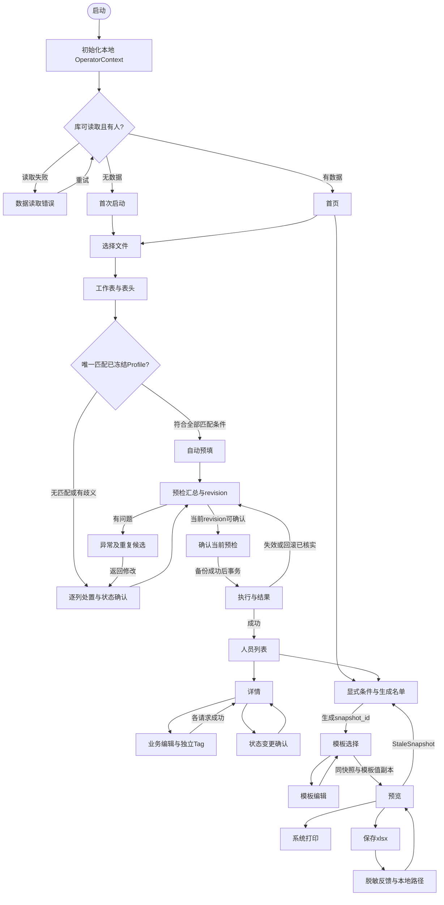

# D1B 使用流程与打印模板设计

版本：D1B-L0 v0.2｜日期：2026-10-01｜工作类型：docs｜当前状态：Draft，Gate 0 未通过，待非作者 R 复核。

本轮按 PR1 详细修改清单返工，设计对齐 PR2 的 ContractVersion 3 草案。契约修订号不表示业务批准、接口冻结或数据库迁移版本。DatabaseSchemaVersion 独立且尚未分配；本文没有实现业务服务或签认 Gate。

## 1. 任务、基线与权威来源

交付范围：页面流转、静态原型、控件及键盘、大字号、34 个 Person 字段、独立 Tag、三类模板、RV01–RV09 复核脚本、Q01–Q13 对接项，以及可重复生成的 MD／离线 HTML／JSON。Win32、数据库、导入事务、规则引擎、GDI／xlsx 适配器和 Win7 VM 留给 D2–D5。

| 基线 | 当前定位 |
| --- | --- |
| PR1 HEAD `4a141ede0d3a0d82a647e774cbc4ae6861fed8ed` | 原 v0.1 历史设计；本轮纠正旧字段、接口缺口和冻结表述 |
| PR2 HEAD `279a204aaf00233fac262f79ac4e3dd80d392f21` | 本轮隔离返工工作树的起点；未合并的稳定化草案，不自动升级为批准基线 |
| [基线与权威来源](https://github.com/gaoyizhe934/retiree-roster-win7/blob/279a204aaf00233fac262f79ac4e3dd80d392f21/docs/baseline/00_%E5%9F%BA%E7%BA%BF%E4%B8%8E%E6%9D%83%E5%A8%81%E6%9D%A5%E6%BA%90.md) | 已批准 Owner Decision／ADR > 需求 v2.0 > 规划 v2.0 > 任务台账 > Gate 冻结公共契约 > README／CONTRIBUTING；未合并 PR 为草案。未批准 ADR 无覆盖效力 |
| [schema_types.hpp](https://github.com/gaoyizhe934/retiree-roster-win7/blob/279a204aaf00233fac262f79ac4e3dd80d392f21/include/retiree_roster/schema_types.hpp) | ContractVersion 3 Draft；FieldSpec、输入 DTO、导入、FilterSpec、快照及打印模板的具体表达 |
| [Gate Status](https://github.com/gaoyizhe934/retiree-roster-win7/blob/279a204aaf00233fac262f79ac4e3dd80d392f21/docs/status/GATE_STATUS.md) | Gate 0 未通过；A/B/C/R 和甲方证据仍待齐备。本轮不改正式状态表 |
| [导入 Profile](https://github.com/gaoyizhe934/retiree-roster-win7/blob/279a204aaf00233fac262f79ac4e3dd80d392f21/docs/baseline/01_%E5%AF%BC%E5%85%A5Profile%E5%86%BB%E7%BB%93%E8%AF%B4%E6%98%8E.md) | 当前没有已冻结 Profile；配置仓储与审批证据负责判定冻结状态 |
| [源字段保留](https://github.com/gaoyizhe934/retiree-roster-win7/blob/279a204aaf00233fac262f79ac4e3dd80d392f21/docs/baseline/02_%E5%AD%97%E6%AE%B5%E6%98%A0%E5%B0%84%E4%B8%8E%E6%95%B0%E6%8D%AE%E4%BF%9D%E7%95%99%E7%AD%96%E7%95%A5.md) | Sheet1 第 3 行 23 个非空标题候选映射；第 1 行额外与重复字段、第二份样表待确认 |
| [日期 ADR](https://github.com/gaoyizhe934/retiree-roster-win7/blob/279a204aaf00233fac262f79ac4e3dd80d392f21/docs/decisions/ADR-0002-%E6%97%A5%E6%9C%9F%E7%B2%BE%E5%BA%A6%E6%A8%A1%E5%9E%8B.md)、[快照 ADR](https://github.com/gaoyizhe934/retiree-roster-win7/blob/279a204aaf00233fac262f79ac4e3dd80d392f21/docs/decisions/ADR-0003-%E5%90%8D%E5%8D%95%E5%BF%AB%E7%85%A7%E4%B8%8E%E8%BE%93%E5%87%BA%E4%B8%80%E8%87%B4%E6%80%A7.md)、[标签 ADR](https://github.com/gaoyizhe934/retiree-roster-win7/blob/279a204aaf00233fac262f79ac4e3dd80d392f21/docs/decisions/ADR-0004-%E6%A0%87%E7%AD%BE%E4%B8%8E%E5%85%B3%E6%80%80%E7%8A%B6%E6%80%81%E6%A8%A1%E5%9E%8B.md) | Proposed；用于本轮草案对齐，不冒充已批准规则 |
| [GitHub 协作命名规范](https://github.com/gaoyizhe934/retiree-roster-win7/blob/279a204aaf00233fac262f79ac4e3dd80d392f21/GitHub%E5%8D%8F%E4%BD%9C%E5%91%BD%E5%90%8D%E8%A7%84%E8%8C%83.md)、[OD-0001](https://github.com/gaoyizhe934/retiree-roster-win7/blob/279a204aaf00233fac262f79ac4e3dd80d392f21/docs/decisions/OD-0001-%E5%88%86%E6%94%AF%E5%91%BD%E5%90%8D%E8%A7%84%E5%88%99.md) | 新分支只用 ASCII；本轮不擅自重命名 PR1 的既有中文分支 |

术语：PersonId 是内部永久 ID；PersonCode 是业务可见固定编号，服务生成且只读；EmployeeNo 是源工号，可空、可重复，不是上述两种标识。print_serial_number 属于一次名单，从 1 连续生成。筛选决定入选，模板决定展示，snapshot_id 决定三条输出消费的同一名单。旧 CONTEXT 或历史提取稿的冲突描述按上述权威顺序定位，不反向覆盖当前草案。

工作采用 ask-matt 路由及 beginning-work：清单已给出范围，直接修复设计表达和证据；不为设计检查伪造产品功能测试。用户原始 Word／Excel 与 PR2 契约均保持不变。

## 2. 页面流转与失败返回

P 为页面，D 为对话框。首次运行先初始化本地操作员归属，再读取库；读库失败不能显示为空库。



当前无已冻结 Profile，因此当前导入必须经过 P12；图中自动预填分支只有未来满足冻结和唯一匹配要求后可用。所有分支保留预检和明确确认。

| 页面／对话框 | 前进条件与结果 | 返回／取消 | 失败或失效 |
| --- | --- | --- | --- |
| P00／P01 | 稳定非空本机 operator_id；空库导入，有库选业务 | 退出；未保存草稿进入 D90 | 读取错误到 D00，不冒充空库 |
| P10／P11 | 可读 xlsx；有效工作表和 1 起算表头行 | 上一步；取消回 P00/P01/P20 来源页 | 文件／表头无法读取留页；无 Person 写入 |
| P12 | 每个源列明确处置；仅可导入字段；姓名与状态可解析 | 上一步 P11；取消回来源页 | Unsupported、歧义、重复目标或未确认状态阻止前进，定位源列 |
| P13／P14 | 服务完成预检；问题定位文件名、表、行、列及字段 | 返回 P12/P13；取消整个向导回来源 | 修改语义后标旧revision失效；问题报告只含脱敏摘要 |
| D10 | valid_record_count>0、invalid_record_count=0、unresolved_duplicate_count=0，列与状态全部解决，revision仍有效且未成功确认 | 初始焦点返回检查；取消回 P13 | 服务再校验；备份失败不入库；失效重新预检 |
| P15 | 保存的预检副本事务入库；成功后到 P20 | 写入中等待，完成才可返回 | 已回滚才可重预检；结果不确定先核对，不盲目再次提交；成功revision不重复确认 |
| P20／P21 | 搜索姓名、PersonCode或工号；查看选中记录 | 详情回原列表位置；列表回首页 | 搜索失败留旧列表并标未更新；内部PersonId不作固定编号展示 |
| P22 | 新增、编辑、Tag各自契约和服务校验成功 | 有草稿 D90；取消回来源详情／列表 | 业务资料与Tag不声称跨请求原子；各区独立反馈和草稿，成功部分刷新，失败部分保留 |
| D20 | 明确状态意图、有效 DateValue、业务更正规则对齐，备份后更新 | 取消回 P21，原状态不变 | 日期精度和死亡日期必填／未来日期政策见Q04，不新增未批准限制；保存失败保留原状态 |
| P30 | 完整as_of_date、显式状态、有效条件；生成RosterResult | 回来源P01/P20 | 条件改变禁用旧结果输出；0人禁用模板输出；生成失败不拿旧人数冒充新结果 |
| D30／D31 | 保存方案／屏幕列选择，至少一列 | 取消回P30保留原配置 | 重名不得静默覆盖；屏幕列不改变模板或快照排序 |
| P40／P41 | snapshot_id和template值副本；模板合法 | 回来源；有模板草稿D90 | 管理模式无名单不能预览；参数错误定位列或尺寸 |
| P50 | 服务校验快照版本后生成PrintModel | 回P40调整模板；旧快照回P30 | StaleSnapshot禁用预览、打印与导出；旧画面加失效水印仅供核对，不作为有效预览 |
| D50／D51 | 同快照和同模板物理语义 | 系统取消回P50，无错误 | 设备或路径失败留页；拒绝旧快照；作业提交不是实物打印成功 |
| P51 | 导出完整成功；本地私有日志含真实路径 | 回P50，打开文件或文件夹 | 打开失败不抹掉导出结果；普通反馈与公共证据脱敏 |
| D90／D00 | 保存／放弃／继续编辑；读取重试／退出 | 默认继续编辑或安全取消 | 保存失败留编辑页；事务写入期间关闭不打断 |

窗口关闭和 Esc 遵守同一导航策略；导航上下文保存来源页、滚动位置和触发控件，返回恢复焦点。系统文件、覆盖、帮助、历史及打印对话框使用原生取消路径。

## 3. 静态原型与请求边界

### 3.1 首次启动、操作员与首页

```text
P00 本地维护员：显示名[可选] [使用固定本机维护员标识] [保存本地设置]
    说明：仅记录本机操作归属；无登录和身份认证
    还没有人员资料。选择表格 → 检查问题 → 生成名单
    [开始导入] [查看帮助] [退出]
P01 人数／最近导入；维护员显示名或本机标识
    [发放名单] [重阳节] [党员名单] [党龄50周年] [状态组合] [标签组合]
    [最近方案] [人员维护] [导入] [模板管理] [帮助] [退出]
```

本机非空稳定 operator_id 由本地配置保存；显示名修改不追改历史。confirmed_by／changed_by／requested_by 等来自 OperatorContext，只用于审计归属，不提供权限控制；管理员手册后续需解释标识采集和更换。六类首页入口是 UI 预设，只对应 Custom、Chongyang、Party50 三个 RosterScenario。

### 3.2 Profile、全列处置与不可变预检

```text
P10 [文件名／本地选取位置] [选择文件] [下一步] [取消]
P11 [工作表] [表头行] [列位置与原表头预览] [上一步] [下一步] [取消]
P12 [列索引 | 原标题 | 处置 | ImportFieldId | 状态源确认 | 问题]
    [处置方式] [可导入目标] [确认状态源列] [应用] [重置为Unsupported]
    [缺失状态默认值：未选择] [明确确认默认值]
    Profile ID/版本、映射版本、状态来源（只读）
    [上一步] [开始预检] [取消]
P13 总记录／有效／异常／重复候选／未解决重复；Profile／映射／状态摘要
    技术信息：batch_id、preview_revision、source_sha256
    [查看问题] [上一步修改] [确认导入] [取消]
D10 明确确认当前预检身份；不编辑映射、状态或重复处置
    [返回检查（初始焦点）] [确认入库]
P15 [进度] 事务状态、批次与revision反馈
    [进入人员列表] [返回并重新预检] [导出脱敏批次报告]
```

唯一匹配已冻结 Profile 且无缺失、重复、歧义、顺序变化、未知列时才自动预填。表头行是具体 Profile 配置，不能全球固定第1或第3行。配置仓储按 profile_id/version 查批准证据；UI 的标识或布尔勾选不构成冻结证明。

P12 的处置方式为 ImportColumnDisposition：PersonField 绑定唯一 ImportFieldId；BatchRawOnly 由维护员明确确认仅保存在本机 ImportRawCell，目标必须 Unspecified，不进入 Person 或公共日志；Unsupported 是默认，阻断确认。重复标题、有值无标题和未知列必须逐列处理，空白列保留物理位置，不能压缩后右移。第3行 W 当前为空，X 是备注，格式化空列不作人员。

当前 27 个可导入字段由 FieldSpec.source_importable 与 ImportFieldId 联合限定。PersonId、PersonCode、PinyinSortKey、CreatedAt、UpdatedAt、ImportBatchId、LastModifiedBy 不在目标下拉；打印序号、年龄、党龄和Tag也不在 Person 导入目标中。FullName 是唯一 required_for_import=true 的字段，但所有新建／导入状态仍必须解析为 Living 或 Deceased，不能从元数据必填标志推导 Unknown 可确认。

LifeStatus 源列要求 status_source_confirmed=true，仍逐值解析；源缺失可以明确确认批次默认或采用已冻结 Profile 约定，非法源值不能被默认值掩盖。ImportStatusResolution.source 为 Unresolved／SourceColumn／ConfirmedBatchDefault／FrozenProfile／Mixed，fallback_status 与 fallback_confirmed 记录缺失值补充；确认状态来源和目标变更同样使旧预检失效。当前样表无状态列，初始不猜在世。

P13 保存 ImportPreview 的 batch_id、preview_revision、source_sha256、source_record_count、valid_record_count、invalid_record_count、duplicate_candidate_count、unresolved_duplicate_count、profile_id、profile_version、mapping_version、status_resolution、column_bindings和issues。普通用户看到数量和版本摘要，技术身份在只读信息区列明；指纹由服务计算。这里是总记录、有效、异常、重复候选、未解决重复5项计数，不相加推算总量，一行可交叉有多类问题，定义与处置对账待D3实现。

ConfirmImportRequest 只含 ApiMeta、batch_id、preview_revision、confirmed_by。确认时加载服务保管的不可变预检副本，不能重读可能已变化的 Excel，也不再次接收映射、默认状态或重复处置。文件内容、工作表、表头、Profile及版本、列绑定、mapping_version、状态解析、重复候选处置任一变化均使旧revision失效，必须重新预检获得新revision。成功revision不可重复确认；网络／服务结果未知先核对，不能盲重提。服务缓存、生命周期、事务和幂等仍待D3证据。

重复工号不证明同一人，不自动覆盖或合并档案。未解决重复候选禁用确认，候选算法与人工处置待 A/R；修正源副本后重检。不提供未经契约实现的确认时跳过／合并按钮。原始Excel由维护员在外部副本修正，UI不写源文件。

### 3.3 34 字段、日期精度与独立 Tag

```text
P20 [姓名／PersonCode／工号] [显式状态] [查询] [清空]
    固定编号PersonCode | 工号EmployeeNo | 姓名 | 状态 | 类别 | 原单位 | 派生年龄
P21 固定编号：业务只读；工号单独显示；技术详情中PersonId只读
    敏感值默认脱敏；[本地显示／隐藏] [修改] [状态变更] [历史] [返回]
P22 A 业务资料区：34字段按能力呈现，新增与编辑模式分别启用
        每个日期：精度[未知／年／年月／完整日期] 年[ ] 月[ ] 日[ ]
        [保存业务资料] [取消]
    B 标签区（已保存人员）：Tag列表、代码、值、适用年、审计只读
        [添加／修改标签] [删除标签]
    C 系统信息：PersonId、PersonCode、创建／更新时间、批次、修改归属只读
D20 明确转为去世，DateValue精度与组件；[确认] [取消（初始）]
```

新增使用 PersonCreateInput：仅业务字段，服务生成 PersonId、PersonCode、初始PinyinSortKey和审计字段。编辑用 PersonEditInput.changes[]／FieldChange，只接 EditableFieldId；未改变字段不发change，清空用clear_value=true，不能把脱敏掩码当新值写回。日期通过 date_value，文本 value 不充当隐式日期解析器。PinyinSortKey 创建时只读，保存后允许人工修正，不能导入。LifeStatus 新增必须显式选择；已有人员状态经 D20 确认路径修改，DeathDate 日期补录仍遵守业务校验。PersonRecord 只作存储／输出，不整对象回传作为输入。

DateValue 为 Unknown（组件全0）、Year（有效年，月日0）、YearMonth（有效年月，日0）、FullDate（有效年月日含闰日）。所有六个日期字段使用该精度模型，显示“未知”／“YYYY”／“YYYY-MM”／“YYYY-MM-DD”，导出保留精度；不补造组件、不把年月填成1日、不用1900-01-01代替未知。周岁需完整生日；当年年龄与党龄只需有效年份；不足对应精度不参与精确规则，UI显示“不可计算／待补录”，不显示为0。快照派生字段的-1仅是契约不可计算标记，不能参与比较。未知死亡日期的业务政策和更正回在世仍见Q04，不能凭UI自行冻结。

独立 TagRecord 持久化困难、长期患病、慰问等人工关怀信息；P22与P30读同一来源，快照保存副本。TagMutation 只含 tag_code、tag_value、applicable_year、remove；UpdateTagRequest 另含PersonId、changed_by和ApiMeta。updated_at／updated_by仅服务生成；添加、修改、删除均独立反馈。常年标签 applicable_year=0；年度慰问须具体年，不跨年继承；代码和值域待A/R。高龄是规则派生，不作为可写Person字段或“高龄”标签。新增人员保存后才可操作Tag，业务保存与Tag保存不宣称同一事务。

敏感字段 NationalId／Phone／RelativePhone／HomeAddress 默认脱敏、不打印；显示／隐藏采用本地二次确认，离页恢复，不是认证机制。备注和原始批次值同样可能敏感，不进入公开报告。业务固定编号的格式和旧编号策略待甲方，不从源工号自动继承。

### 3.4 FilterSpec 与名单快照

```text
P30 [场景Custom/Chongyang/Party50] [目标年] [完整as_of_date] [人员状态]
    [年龄口径] [年龄启用] [年龄集合] [下限启用] [含边界下限]
    [党龄启用] [党龄集合] [下限启用] [含边界下限] [要求党员]
    字段条件：字段／比较／首值／次值 [添加更新] [删除] [All/Any]
    标签条件：代码／值／适用年 [添加更新] [删除] [All/Any]
    [生成名单] [重置] [保存方案] [屏幕列选择]
    排序只读：拼音键、姓名、PersonId
    snapshot_id／data_version／生成时间／已展开条件／N人
    连续打印序号 | 固定编号PersonCode | 工号 | 姓名 | 快照派生值
    [选择模板] [返回]
```

| UI入口 | 契约场景和条件 | 状态与边界 |
| --- | --- | --- |
| 发放名单 | Custom；无年龄条件，业务分组用FieldCondition | 状态由维护员显式选择；不暗设在世 |
| 重阳节 | Chongyang；CalendarYearAge；accepted_values={70,75,80,85} OR minimum=90 | R02展开LivingOnly；89不入，90/91入；无出生年排除并提示 |
| 党员名单 | Custom；require_party_member=true | 状态显式选择；政治代码待字典，不把空值当党员 |
| 党龄50周年 | Party50；require_party_member=true；party_seniority.accepted_values={50} | 不额外强制在世；初始Unspecified须明确选择；49/51、缺入党年、非党员排除 |
| 状态组合 | Custom；字段条件按类型和值域设置 | LivingOnly／DeceasedOnly／All明确传入 |
| 标签组合 | Custom；TagCondition含适用年；tag_match=All或Any | 状态显式；年度慰问不引用旧年份；空标签集合不约束 |

FilterSpec 为 target_year、FullDate as_of_date、scenario、life_status、age_basis、age、party_seniority、require_party_member、conditions/field_match、tags/tag_match，并可带filter_id和display_name。UI可传当天完整as_of_date，测试固定日期，服务不隐读全局时钟。Chongyang固定条件与手工输入冲突时ValidationFailed，不由UI另设优先级。Custom／Party50的Unspecified不能被当成LivingOnly，默认状态仍待业务确认。

YearCountCondition 关闭不约束，开启须非空 accepted_values 或 has_minimum=true；集合中任一值 OR 含边界minimum即匹配。没有最大年龄控件或maximum输入。Comparison 支持 Equals、NotEquals、Contains、IsEmpty、IsNotEmpty、BetweenInclusive、GreaterThanOrEqual、LessThanOrEqual，按字段类型限制可用项和值域。field_match和tag_match各自支持All／Any，空组不约束；两组与状态、年龄、党龄、党员条件之间AND。等级集合由字典决定，不对中文“处级以上”字符串比较大小。

生成后服务返回不可变 RosterResult：snapshot_id、data_version、generated_at、展开后的filter_spec、rows、total_count（必须等于rows.size）。每行含person_id、person副本、同版本tags副本、print_serial_number、completed_age、calendar_year_age、party_seniority_years。服务按pinyin_sort_key、full_name、PersonId稳定排序；UI不能重排后沿用旧序号。更换屏幕可见列不改名单，改条件后旧输出上下文禁用，生成新快照才能继续。

### 3.5 PrintTemplate、PrintModel 与输出隐私

```text
P40 快照ID、数据版本、N人、模板ID与版本 [模板列表] [调整] [预览] [返回]
P41 模板标识只读、名称、标题；columns[]列表（顺序、visible）
    source[PersonField/DerivedField/BlankSignature/StaticText]
    活动成员[field/derived_field/static_text]、display_name、列宽mm
    [应用列] [添加] [删除] [上移] [下移] [添加签字列]
    正文pt／标题pt／表头pt；A4／方向；四边距mm／行高mm
    每页人数[0自动或正数]／repeat_header／page_number_policy
    [另存] [保存修改] [取消]
P50 snapshot_id/data_version/template_id/template_version/N人
    [翻页] [缩放] [画布] [返回调整] [打印] [导出xlsx]
    StaleSnapshot：已失效，输出禁用，[回P30重新生成]
P51 脱敏结果摘要 [显示本地文件位置] [打开文件] [打开文件夹] [返回]
```

预览、打印、导出的名单输入只含 snapshot_id 和 PrintTemplate 值副本；各请求附ApiMeta，打印／导出还含本地requested_by，导出含目标路径，不能把FilterSpec再次提交重新筛选。PrintModel持有不可变RosterResult与模板const视图。换模板不改名单和序号；模板版本在一次输出中固定。

人员、Tag、拼音键、导入、恢复、迁移变化均使data_version失效，旧输出请求返回StaleSnapshot；恢复不能复用旧版本号。输出开始前服务在同一临界区检查并固定快照，过程中不补查询新数据或标签。旧画面只能明显标失效供核对；有效预览、xlsx、打印必须同一snapshot_id，N人同序。具体版本仓储与输出锁待D4/D5实现。

TemplateColumn.source为四种来源，只解释当前活动成员。签字是columns[]中的BlankSignature，添加／删除动作编辑数组，没有第二个全局签字开关。人员备注用PersonField::Remark；确需纯空白列可用StaticText空字符串，不冒充Remark。派生列只能从快照读取PrintSerialNumber／CompletedAge／CalendarYearAge／PartySeniorityYears。

模板列宽、四边距、行高为0.1mm整数，UI毫米值乘10转换并检查精度与uint16范围，不静默舍入。A4是2100×2970，横向反转；字号为pt。rows_per_page=0由版式服务计算容量，正数须验证可容纳，不能压缩／截断行。打印机硬边距、字体度量、换行、标题、表头和页脚参与验证，非法版式InvalidTemplate。GDI与xlsx转换同一物理语义；xlsx字符宽度仍需字体度量和实际打开／实物证据，算术通过不等于打印验收。

ExportLogRecord在本机私有数据库保留真实output_path、snapshot_id、模板ID版本、脱敏条件摘要、人数、时间、归属和结果。P51普通摘要脱敏，本地用户明确点击可查看真实位置或打开文件夹；文档、截图、JSON公共证据及GitHub报告不披露真实私有绝对路径。导出失败不破坏已有文件，覆盖须系统确认；无Excel仍可导出，打开关联失败单独提示。打印反馈为“已提交作业”，实物完成另行观察。

## 4. 大字号与键盘规则

建议界面微软雅黑12／15／18pt，备用系统中文字体；界面字号与打印字号独立。1024×768工作区可操作，字体换档依据实际测量重排；双列表单转单列，长地址备注换行，内容滚动，底部保存取消可达；焦点自动滚入可见区。96／120／144DPI与三档字号组合留给C在Win7 RTM x86/x64验证，不能仅比例放大坐标。

使用系统颜色和高对比度；错误文字说明字段，不能只靠红色。必要操作不能仅右键、双击或拖拽：列表箭头选行、Space勾选、Enter执行明示动作，上下移有按钮。Tab按§5.2，Shift+Tab逆序，跳过隐藏、禁用、STATIC和进度条；列表一个停靠点，日期精度及组件分别列入Tab，多行Enter换行。

导入／状态确认初始焦点返回检查／取消，不自动触发写入。Enter只触发焦点按钮或安全的页内主动作，确认需明确聚焦；Esc与关闭遵守§2，写入中提示等待，D90初始继续编辑。返回恢复触发焦点，失败聚焦首个错误。系统对话框由原生键盘规则管理；当前仅设计约定，实际Win32导航和manifest由C验证。

## 5. 控件清单、字段能力与 Tab

编号为设计追踪ID，D2再分配整数资源ID；每项包含名称、Win32类型、用途、默认、启用、校验及错误。EDIT＋UPDOWN视为一个用户停靠点；日期精度和年月日是独立控件。各页PAGE-INFO和主窗口状态栏为只读STATIC，不设Tab；列表虽只读仍可键盘选择查看。系统打印、保存、覆盖和帮助内部控件不由本稿重编号。

### G 主窗口共用区

| 编号 | 名称 | Win32类型 | 用途 | 默认 | 启用条件 | 校验 | 错误提示 |
| --- | --- | --- | --- | --- | --- | --- | --- |
| G-01 | 界面字号 | COMBOBOX CBS_DROPDOWNLIST | 切换字体与重排 | 12 pt | 无模态写入任务 | 仅12／15／18 pt | 放大后不得裁切，布局不足使用滚动 |
| G-02 | 使用帮助 | BUTTON | 打开只读操作说明（系统对话框） | 可用 | 空闲时 | 无输入；按页面前进条件校验 | 服务失败时留页并说明原因 |

### P00 首次启动与本地操作员

| 编号 | 名称 | Win32类型 | 用途 | 默认 | 启用条件 | 校验 | 错误提示 |
| --- | --- | --- | --- | --- | --- | --- | --- |
| P00-01 | 维护员显示名 | EDIT | 配置 OperatorContext.display_name | 空，可选 | 空闲时 | 不作为认证；修改不追改历史 | 请检查输入；失败留页并保留草稿 |
| P00-02 | 使用固定本机维护员标识 | BUTTON BS_AUTOCHECKBOX | 选择本机非空稳定 operator_id | 勾选 | 空闲时 | 仅审计归属；无密码、登录或权限判断 | 请检查输入；失败留页并保留草稿 |
| P00-03 | 保存本地设置 | BUTTON | 固定本机 operator_id 并保存可选显示名 | 可用 | 空闲时 | 按页面前进条件校验 | 服务失败留页并说明原因 |
| P00-04 | 开始导入 | BUTTON | 进入P10 | 可用 | 本地操作员标识已初始化 | 按页面前进条件校验 | 服务失败留页并说明原因 |
| P00-05 | 查看帮助 | BUTTON | 打开首次导入及操作员说明 | 可用 | 空闲时 | 按页面前进条件校验 | 服务失败留页并说明原因 |
| P00-06 | 退出 | BUTTON | 关闭程序 | 可用 | 空闲时 | 按页面前进条件校验 | 服务失败留页并说明原因 |

### P01 首页

| 编号 | 名称 | Win32类型 | 用途 | 默认 | 启用条件 | 校验 | 错误提示 |
| --- | --- | --- | --- | --- | --- | --- | --- |
| P01-01 | 发放名单 | BUTTON | P30 Custom预设；状态由维护员显式确认 | 可用 | 空闲时 | 无输入；按页面前进条件校验 | 服务失败时留页并说明原因 |
| P01-02 | 重阳节 | BUTTON | P30 Chongyang，按R02展开LivingOnly与年度年龄 | 可用 | 空闲时 | 无输入；按页面前进条件校验 | 服务失败时留页并说明原因 |
| P01-03 | 党员名单 | BUTTON | P30 Custom预设，require_party_member；状态显式确认 | 可用 | 空闲时 | 无输入；按页面前进条件校验 | 服务失败时留页并说明原因 |
| P01-04 | 党龄50周年 | BUTTON | P30 Party50；状态初始Unspecified待确认 | 可用 | 空闲时 | 无输入；按页面前进条件校验 | 服务失败时留页并说明原因 |
| P01-05 | 状态组合 | BUTTON | P30展开状态条件 | 可用 | 空闲时 | 无输入；按页面前进条件校验 | 服务失败时留页并说明原因 |
| P01-06 | 标签组合 | BUTTON | P30展开标签条件 | 可用 | 空闲时 | 无输入；按页面前进条件校验 | 服务失败时留页并说明原因 |
| P01-07 | 最近方案 | COMBOBOX CBS_DROPDOWNLIST | 选择已保存方案进入P30 | 未选择 | 存在已保存方案 | 仅选有效方案 | 方案已失效，请重新设置条件 |
| P01-08 | 人员维护 | BUTTON | 进入P20 | 可用 | 空闲时 | 无输入；按页面前进条件校验 | 服务失败时留页并说明原因 |
| P01-09 | 导入 | BUTTON | 进入P10 | 可用 | 空闲时 | 无输入；按页面前进条件校验 | 服务失败时留页并说明原因 |
| P01-10 | 模板管理 | BUTTON | P40管理模式 | 可用 | 空闲时 | 无输入；按页面前进条件校验 | 服务失败时留页并说明原因 |
| P01-11 | 使用帮助 | BUTTON | 打开操作说明 | 可用 | 空闲时 | 无输入；按页面前进条件校验 | 服务失败时留页并说明原因 |
| P01-12 | 退出 | BUTTON | 关闭程序并处理未保存提醒 | 可用 | 空闲时 | 无输入；按页面前进条件校验 | 服务失败时留页并说明原因 |

### P10 选择文件

| 编号 | 名称 | Win32类型 | 用途 | 默认 | 启用条件 | 校验 | 错误提示 |
| --- | --- | --- | --- | --- | --- | --- | --- |
| P10-01 | 选择文件 | BUTTON | 系统文件对话框选择xlsx | 可用 | 空闲时 | 无输入；按页面前进条件校验 | 文件不可读／格式不支持，请重新选择 |
| P10-02 | 下一步 | BUTTON | 读取文件后进入P11 | 禁用 | 文件存在且支持xlsx | 无输入；按页面前进条件校验 | 服务失败时留页并说明原因 |
| P10-03 | 取消 | BUTTON | 回导入来源页 | 可用 | 空闲时 | 无输入；按页面前进条件校验 | 服务失败时留页并说明原因 |

### P11 工作表与表头

| 编号 | 名称 | Win32类型 | 用途 | 默认 | 启用条件 | 校验 | 错误提示 |
| --- | --- | --- | --- | --- | --- | --- | --- |
| P11-01 | 工作表 | COMBOBOX CBS_DROPDOWNLIST | 选择读取对象 | 未选择 | 已读取工作簿 | 名称必须由服务枚举 | 没有可读取的工作表 |
| P11-02 | 表头行 | EDIT＋UPDOWN | 指定表头位置 | 服务建议值或未填 | 已选工作表 | 正整数且位于工作表实际范围 | 请指定有效表头行 |
| P11-03 | 表头预览 | SysListView32 LVS_REPORT | 查看列号和原始标题 | 只读 | 已选表头行 | 只展示服务读取的标题 | 无法读取表头，请检查工作表 |
| P11-04 | 上一步 | BUTTON | 回P10 | 可用 | 空闲时 | 无输入；按页面前进条件校验 | 服务失败时留页并说明原因 |
| P11-05 | 下一步 | BUTTON | 进入P12 | 禁用 | 工作表与表头有效 | 无输入；按页面前进条件校验 | 服务失败时留页并说明原因 |
| P11-06 | 取消 | BUTTON | 回来源页 | 可用 | 空闲时 | 无输入；按页面前进条件校验 | 服务失败时留页并说明原因 |

### P12 Profile与逐列处置

| 编号 | 名称 | Win32类型 | 用途 | 默认 | 启用条件 | 校验 | 错误提示 |
| --- | --- | --- | --- | --- | --- | --- | --- |
| P12-01 | 源列处置列表 | SysListView32 LVS_REPORT | 列索引、标题、处置、目标及问题；保留空列物理位置 | 未解决行优先 | 表头可读 | 0起算列索引；重复标题分别处置 | 请检查输入；失败留页并保留草稿 |
| P12-02 | 处置方式 | COMBOBOX CBS_DROPDOWNLIST | ImportColumnDisposition | Unsupported | 已选源列 | PersonField／BatchRawOnly／Unsupported；未知列不静默忽略 | 请检查输入；失败留页并保留草稿 |
| P12-03 | 导入目标字段 | COMBOBOX CBS_DROPDOWNLIST | 选择 ImportFieldId | 未选择 | PersonField且已选源列 | 只列27个可导入业务字段；排除系统字段与拼音键；目标唯一 | 请检查输入；失败留页并保留草稿 |
| P12-04 | 确认状态源列 | BUTTON BS_AUTOCHECKBOX | status_source_confirmed | 未勾选 | 目标为LifeStatus | 仍须逐值解析，不以勾选替代预检 | 请检查输入；失败留页并保留草稿 |
| P12-05 | 应用到选中列 | BUTTON | 保存临时绑定并使旧 preview_revision 失效 | 可用 | 绑定有效且BatchRawOnly已明确确认 | 按页面前进条件校验 | 服务失败留页并说明原因 |
| P12-06 | 重置选中列 | BUTTON | 重置为Unsupported，清除目标与状态源确认 | 可用 | 空闲时 | 按页面前进条件校验 | 服务失败留页并说明原因 |
| P12-07 | 批次缺失状态默认值 | COMBOBOX CBS_DROPDOWNLIST | ImportStatusResolution.fallback_status | Unknown | 状态缺失 | Living／Deceased；非法源值不能被默认值覆盖 | 请检查输入；失败留页并保留草稿 |
| P12-08 | 确认批次默认状态 | BUTTON BS_AUTOCHECKBOX | fallback_confirmed | 未勾选 | 默认值已明确选择 | 状态来源与确认绑定当前预检语义 | 请检查输入；失败留页并保留草稿 |
| P12-09 | Profile与映射信息 | STATIC | profile_id/profile_version/mapping_version/status_resolution | 无已冻结Profile；人工映射 | 只读 | 冻结证据来自配置仓储，不接收UI可写frozen标志 | 请检查输入；失败留页并保留草稿 |
| P12-10 | 上一步 | BUTTON | 回P11 | 可用 | 空闲时 | 按页面前进条件校验 | 服务失败留页并说明原因 |
| P12-11 | 开始预检 | BUTTON | ImportPreviewRequest生成新revision | 可用 | 每列有合法处置，姓名来源明确，状态可解析；无Unsupported | 按页面前进条件校验 | 服务失败留页并说明原因 |
| P12-12 | 取消 | BUTTON | 回来源页，无Person写入 | 可用 | 空闲时 | 按页面前进条件校验 | 服务失败留页并说明原因 |

### P13 预检汇总与版本

| 编号 | 名称 | Win32类型 | 用途 | 默认 | 启用条件 | 校验 | 错误提示 |
| --- | --- | --- | --- | --- | --- | --- | --- |
| P13-01 | 预检身份与统计 | STATIC | batch_id、preview_revision、source_sha256、5项数量、Profile/映射版本及状态来源 | 等待服务预检 | 只读 | 保存服务返回值；不能由UI拼接revision | 请检查输入；失败留页并保留草稿 |
| P13-02 | 查看问题 | BUTTON | 进入P14 | 可用 | 有问题记录 | 按页面前进条件校验 | 服务失败留页并说明原因 |
| P13-03 | 上一步修改 | BUTTON | 回P12；修改即失效 | 可用 | 空闲时 | 按页面前进条件校验 | 服务失败留页并说明原因 |
| P13-04 | 确认导入 | BUTTON | 打开D10 | 可用 | 当前revision有效且未成功确认；valid>0、invalid=0、unresolved_duplicate=0；全部列与状态已解决 | 按页面前进条件校验 | 服务失败留页并说明原因 |
| P13-05 | 取消 | BUTTON | 回来源页 | 可用 | 空闲时 | 按页面前进条件校验 | 服务失败留页并说明原因 |

### P14 异常与重复候选

| 编号 | 名称 | Win32类型 | 用途 | 默认 | 启用条件 | 校验 | 错误提示 |
| --- | --- | --- | --- | --- | --- | --- | --- |
| P14-01 | 问题类别 | COMBOBOX CBS_DROPDOWNLIST | 筛选异常／重复／未映射 | 全部 | 预检有问题 | 仅服务问题分类 | 无该类问题时显示0条 |
| P14-02 | 问题列表 | SysListView32 LVS_REPORT | 查看脱敏问题明细 | 第一条问题 | 有问题记录 | 只读；原值脱敏 | 问题无法定位时显示源行列缺口 |
| P14-03 | 查看选中问题定位 | BUTTON | 展示源文件、表、行列、原因及建议 | 按选择 | 已选问题 | 无输入；按页面前进条件校验 | 服务失败时留页并说明原因 |
| P14-04 | 导出问题清单 | BUTTON | 服务导出脱敏报告并显示保存反馈 | 可用 | 有问题且导出接口已对齐 | 无输入；按页面前进条件校验 | 无法写入报告，请换目录 |
| P14-05 | 返回映射 | BUTTON | 回P12并标预检需重做 | 可用 | 空闲时 | 无输入；按页面前进条件校验 | 服务失败时留页并说明原因 |
| P14-06 | 返回汇总 | BUTTON | 回P13 | 可用 | 空闲时 | 无输入；按页面前进条件校验 | 服务失败时留页并说明原因 |

### D10 确认当前预检

| 编号 | 名称 | Win32类型 | 用途 | 默认 | 启用条件 | 校验 | 错误提示 |
| --- | --- | --- | --- | --- | --- | --- | --- |
| D10-01 | 返回检查 | BUTTON | 回P13 | 初始焦点 | 空闲时 | 按页面前进条件校验 | 服务失败留页并说明原因 |
| D10-02 | 确认入库 | BUTTON | 只提交ApiMeta、batch_id、preview_revision、confirmed_by | 可用 | P13前进条件仍成立 | 按页面前进条件校验 | revision失效须重新预检；备份失败不写入 |

### P15 执行与revision结果

| 编号 | 名称 | Win32类型 | 用途 | 默认 | 启用条件 | 校验 | 错误提示 |
| --- | --- | --- | --- | --- | --- | --- | --- |
| P15-01 | 导入进度 | msctls_progress32 | 显示事务执行状态 | 执行中 | 只读 | 不加入Tab；未知结果先查询核对，禁止盲目重提 | 请检查输入；失败留页并保留草稿 |
| P15-02 | 进入人员列表 | BUTTON | 成功后到P20；成功revision不重复确认 | 禁用 | 事务已确认成功 | 按页面前进条件校验 | 服务失败留页并说明原因 |
| P15-03 | 返回并重新预检 | BUTTON | 回P13再调用预检；失效必须获得新revision | 禁用 | 失败且回滚已确认 | 按页面前进条件校验 | 服务失败留页并说明原因 |
| P15-04 | 导出批次报告 | BUTTON | 保存脱敏摘要，不包含ImportRawCell原值 | 禁用 | 完成且报告服务可用 | 按页面前进条件校验 | 服务失败留页并说明原因 |

### D00 数据读取错误

| 编号 | 名称 | Win32类型 | 用途 | 默认 | 启用条件 | 校验 | 错误提示 |
| --- | --- | --- | --- | --- | --- | --- | --- |
| D00-01 | 重试 | BUTTON | 重新请求读取服务 | 可用 | 空闲时 | 无输入；按页面前进条件校验 | 服务失败时留页并说明原因 |
| D00-02 | 退出 | BUTTON | 退出并保留数据文件 | 可用 | 空闲时 | 无输入；按页面前进条件校验 | 服务失败时留页并说明原因 |

### P20 人员列表

| 编号 | 名称 | Win32类型 | 用途 | 默认 | 启用条件 | 校验 | 错误提示 |
| --- | --- | --- | --- | --- | --- | --- | --- |
| P20-01 | 姓名／固定编号／工号 | EDIT | 姓名、PersonCode或EmployeeNo查询；工号重复返回多行 | 空 | 空闲时 | EmployeeNo可空可重复；不作内部身份键 | 请检查输入；失败留页并保留草稿 |
| P20-02 | 状态 | COMBOBOX CBS_DROPDOWNLIST | 显式人员状态筛选 | All | 空闲时 | LivingOnly／DeceasedOnly／All，服务接受显式值 | 请检查输入；失败留页并保留草稿 |
| P20-03 | 查询 | BUTTON | 查询人员 | 可用 | 空闲时 | 按页面前进条件校验 | 服务失败留页并说明原因 |
| P20-04 | 清空 | BUTTON | 清空搜索并恢复All | 可用 | 空闲时 | 按页面前进条件校验 | 服务失败留页并说明原因 |
| P20-05 | 人员列表 | SysListView32 LVS_REPORT | 固定编号PersonCode、工号、姓名等；PersonId不突出 | 无选择 | 查询成功 | 只读；稳定标识由服务返回，键盘选行可查看 | 请检查输入；失败留页并保留草稿 |
| P20-06 | 查看详情 | BUTTON | 进入P21 | 可用 | 已选人员 | 按页面前进条件校验 | 服务失败留页并说明原因 |
| P20-07 | 新增 | BUTTON | 进入P22新增 | 可用 | 空闲时 | 按页面前进条件校验 | 服务失败留页并说明原因 |
| P20-08 | 导入 | BUTTON | 进入P10 | 可用 | 空闲时 | 按页面前进条件校验 | 服务失败留页并说明原因 |
| P20-09 | 生成名单 | BUTTON | 进入P30，条件须显式确认 | 可用 | 空闲时 | 按页面前进条件校验 | 服务失败留页并说明原因 |
| P20-10 | 返回首页 | BUTTON | 回P01 | 可用 | 空闲时 | 按页面前进条件校验 | 服务失败留页并说明原因 |

### P21 人员详情

| 编号 | 名称 | Win32类型 | 用途 | 默认 | 启用条件 | 校验 | 错误提示 |
| --- | --- | --- | --- | --- | --- | --- | --- |
| P21-01 | 修改资料 | BUTTON | 进入P22 | 可用 | 空闲时 | 按页面前进条件校验 | 服务失败留页并说明原因 |
| P21-02 | 转为去世 | BUTTON | 打开D20 | 可用 | 当前在世 | 按页面前进条件校验 | 服务失败留页并说明原因 |
| P21-03 | 查看变更历史 | BUTTON | 只读历史；服务缺口见Q04 | 可用 | 历史服务已对齐 | 按页面前进条件校验 | 服务失败留页并说明原因 |
| P21-04 | 显示／隐藏敏感信息 | BUTTON | 本地二次确认后临时显示，离页恢复脱敏 | 可用 | 空闲时 | 按页面前进条件校验 | 本地显示失败留脱敏态 |
| P21-05 | 返回列表 | BUTTON | 回P20原位置 | 可用 | 空闲时 | 按页面前进条件校验 | 服务失败留页并说明原因 |

### D20 状态变更确认

| 编号 | 名称 | Win32类型 | 用途 | 默认 | 启用条件 | 校验 | 错误提示 |
| --- | --- | --- | --- | --- | --- | --- | --- |
| D20-01 | 离世日期精度 | COMBOBOX CBS_DROPDOWNLIST | DatePrecision | Unknown | 空闲时 | Unknown／Year／YearMonth／FullDate；不补造组件 | 请检查输入；失败留页并保留草稿 |
| D20-02 | 离世年 | EDIT＋UPDOWN | DateValue.year | 0 | 精度非Unknown | 1–9999；未来日期规则待A/R确认 | 请检查输入；失败留页并保留草稿 |
| D20-03 | 离世月 | EDIT＋UPDOWN | DateValue.month | 0 | YearMonth或FullDate | 1–12；非活动组件为0 | 请检查输入；失败留页并保留草稿 |
| D20-04 | 离世日 | EDIT＋UPDOWN | DateValue.day | 0 | FullDate | 真实日历含闰日；非活动组件为0 | 请检查输入；失败留页并保留草稿 |
| D20-05 | 确认状态变更 | BUTTON | 备份后以PersonEditInput提交LifeStatus与DateValue | 可用 | 状态意图明确且日期有效；Q04业务规则已确认 | 按页面前进条件校验 | 服务失败留页并说明原因 |
| D20-06 | 取消 | BUTTON | 回P21 | 初始焦点 | 空闲时 | 按页面前进条件校验 | 服务失败留页并说明原因 |

### P30 筛选与不可变名单

| 编号 | 名称 | Win32类型 | 用途 | 默认 | 启用条件 | 校验 | 错误提示 |
| --- | --- | --- | --- | --- | --- | --- | --- |
| P30-01 | 场景 | COMBOBOX CBS_DROPDOWNLIST | RosterScenario | Custom | 空闲时 | 仅Custom／Chongyang／Party50；首页六入口是UI预设 | 请检查输入；失败留页并保留草稿 |
| P30-02 | 目标年份 | EDIT＋UPDOWN | target_year | 本地当前年 | 空闲时 | 有效年份由服务接受 | 请检查输入；失败留页并保留草稿 |
| P30-03 | 计算基准日期 | SysDateTimePick32 | as_of_date | UI传当天完整日期 | 空闲时 | FullDate；测试固定日期；服务不隐读时钟 | 请检查输入；失败留页并保留草稿 |
| P30-04 | 人员状态 | COMBOBOX CBS_DROPDOWNLIST | LifeStatusFilter | Unspecified；重阳按R02展开LivingOnly | 空闲时 | Custom/Party50显式选LivingOnly／DeceasedOnly／All；不得暗设在世 | 请检查输入；失败留页并保留草稿 |
| P30-05 | 年龄口径 | COMBOBOX CBS_DROPDOWNLIST | AgeBasis | CalendarYearAge | 空闲时 | CompletedAge／CalendarYearAge；Chongyang固定年度 | 请检查输入；失败留页并保留草稿 |
| P30-06 | 启用年龄条件 | BUTTON BS_AUTOCHECKBOX | age.enabled | 未勾选／按场景 | 空闲时 | 开启须有集合或下限 | 请检查输入；失败留页并保留草稿 |
| P30-07 | 年龄取值集合 | EDIT | age.accepted_values | 空／重阳70,75,80,85 | 年龄条件开启 | 非负整数去重；集合与下限为OR | 请检查输入；失败留页并保留草稿 |
| P30-08 | 启用年龄下限 | BUTTON BS_AUTOCHECKBOX | age.has_minimum | 未勾选／重阳勾选 | 年龄条件开启 | 无最大年龄参数 | 请检查输入；失败留页并保留草稿 |
| P30-09 | 年龄下限 | EDIT＋UPDOWN | age.minimum | 空／重阳90 | age.has_minimum | 非负整数，含边界 | 请检查输入；失败留页并保留草稿 |
| P30-10 | 启用党龄条件 | BUTTON BS_AUTOCHECKBOX | party_seniority.enabled | 未勾选／Party50勾选 | 空闲时 | 开启须集合或下限 | 请检查输入；失败留页并保留草稿 |
| P30-11 | 党龄取值集合 | EDIT | party_seniority.accepted_values | 空／Party50为50 | 党龄条件开启 | 有效非负整数；目标年减入党年 | 请检查输入；失败留页并保留草稿 |
| P30-12 | 启用党龄下限 | BUTTON BS_AUTOCHECKBOX | party_seniority.has_minimum | 未勾选 | 党龄条件开启 | 与集合为OR | 请检查输入；失败留页并保留草稿 |
| P30-13 | 党龄下限 | EDIT＋UPDOWN | party_seniority.minimum | 空 | party_seniority.has_minimum | 非负整数 | 请检查输入；失败留页并保留草稿 |
| P30-14 | 要求党员 | BUTTON BS_AUTOCHECKBOX | require_party_member | Party50勾选，其余按显式预设 | 空闲时 | 党员代码待字典确认，不靠字符串推测 | 请检查输入；失败留页并保留草稿 |
| P30-15 | 字段条件列表 | SysListView32 LVS_REPORT | 查看conditions[]；类别级别政治面貌原单位均为FieldCondition | 空 | 空闲时 | 列表仅编辑草稿，生成后不原地改快照 | 请检查输入；失败留页并保留草稿 |
| P30-16 | 条件字段 | COMBOBOX CBS_DROPDOWNLIST | FieldCondition.field | 未选择 | 空闲时 | PersonFieldId；敏感字段值不进公开摘要 | 请检查输入；失败留页并保留草稿 |
| P30-17 | 比较方式 | COMBOBOX CBS_DROPDOWNLIST | Comparison | Equals | 空闲时 | Equals／NotEquals／Contains／IsEmpty／IsNotEmpty／BetweenInclusive／GreaterThanOrEqual／LessThanOrEqual | 请检查输入；失败留页并保留草稿 |
| P30-18 | 条件首值 | EDIT | first_value | 空 | 非空值比较 | 按字段类型及字典校验 | 请检查输入；失败留页并保留草稿 |
| P30-19 | 条件次值 | EDIT | second_value | 空 | BetweenInclusive | 上下界含边界，服务校验 | 请检查输入；失败留页并保留草稿 |
| P30-20 | 添加／更新字段条件 | BUTTON | 写conditions[]草稿，使现有输出上下文失效 | 可用 | 所选条件有效 | 按页面前进条件校验 | 服务失败留页并说明原因 |
| P30-21 | 删除字段条件 | BUTTON | 移除所选条件 | 可用 | 已选条件 | 按页面前进条件校验 | 服务失败留页并说明原因 |
| P30-22 | 字段组合 | COMBOBOX CBS_DROPDOWNLIST | field_match | All | 空闲时 | All／Any；空集合不约束 | 请检查输入；失败留页并保留草稿 |
| P30-23 | 标签条件列表 | SysListView32 LVS_REPORT | 查看tags[]，与P22使用同一Tag来源 | 空 | 空闲时 | 非Person字段；快照内保存Tag副本 | 请检查输入；失败留页并保留草稿 |
| P30-24 | 标签代码 | COMBOBOX CBS_DROPDOWNLIST | TagCondition.tag_code | 未选择 | 空闲时 | 字典代码，不包含派生高龄 | 请检查输入；失败留页并保留草稿 |
| P30-25 | 标签值 | EDIT | TagCondition.tag_value | 空 | 空闲时 | 按标签字典值域 | 请检查输入；失败留页并保留草稿 |
| P30-26 | 标签适用年 | EDIT＋UPDOWN | TagCondition.applicable_year | 0／年度条件显式目标年 | 空闲时 | 0常年；年度慰问须具体年 | 请检查输入；失败留页并保留草稿 |
| P30-27 | 添加／更新标签条件 | BUTTON | 写TagCondition草稿并失效输出上下文 | 可用 | 条件有效 | 按页面前进条件校验 | 服务失败留页并说明原因 |
| P30-28 | 删除标签条件 | BUTTON | 移除标签条件 | 可用 | 已选条件 | 按页面前进条件校验 | 服务失败留页并说明原因 |
| P30-29 | 标签组合 | COMBOBOX CBS_DROPDOWNLIST | tag_match | All | 空闲时 | All／Any；空集合不约束 | 请检查输入；失败留页并保留草稿 |
| P30-30 | 生成名单 | BUTTON | GenerateRosterRequest返回RosterResult与snapshot_id | 可用 | 显式状态、日期和全部条件有效 | 按页面前进条件校验 | 服务失败留页并说明原因 |
| P30-31 | 重置条件 | BUTTON | 重置UI预设并失效旧输出上下文 | 可用 | 空闲时 | 按页面前进条件校验 | 服务失败留页并说明原因 |
| P30-32 | 保存方案 | BUTTON | 打开D30；持久化接口待对齐 | 可用 | 空闲时 | 按页面前进条件校验 | 服务失败留页并说明原因 |
| P30-33 | 列选择 | BUTTON | 打开D31，仅改变屏幕可见列 | 可用 | 空闲时 | 按页面前进条件校验 | 服务失败留页并说明原因 |
| P30-34 | 排序说明 | STATIC | 服务按拼音键、姓名、PersonId稳定排序 | 只读 | 只读 | UI不自行重排、不改print_serial_number | 请检查输入；失败留页并保留草稿 |
| P30-35 | 名单结果 | SysListView32 LVS_REPORT | 显示PersonCode、工号、连续序号与快照派生值 | 等待生成 | 有RosterResult | total_count等于rows.size；列表排序交互禁用 | 请检查输入；失败留页并保留草稿 |
| P30-36 | 选择模板 | BUTTON | 将snapshot_id带到P40 | 可用 | 当前非空有效快照且条件未改 | 按页面前进条件校验 | 服务失败留页并说明原因 |
| P30-37 | 返回 | BUTTON | 回来源P01／P20 | 可用 | 空闲时 | 按页面前进条件校验 | 服务失败留页并说明原因 |

### D30 保存筛选方案

| 编号 | 名称 | Win32类型 | 用途 | 默认 | 启用条件 | 校验 | 错误提示 |
| --- | --- | --- | --- | --- | --- | --- | --- |
| D30-01 | 方案名称 | EDIT | 给条件命名 | 空 | 空闲时 | 去首尾空格后非空；重名需另名或明确确认 | 方案名为空／已存在，请重新命名 |
| D30-02 | 保存 | BUTTON | 调用方案服务回P30 | 禁用 | 名称有效 | 无输入；按页面前进条件校验 | 服务失败时留页并说明原因 |
| D30-03 | 取消 | BUTTON | 回P30 | 可用 | 空闲时 | 无输入；按页面前进条件校验 | 服务失败时留页并说明原因 |

### D31 结果列选择

| 编号 | 名称 | Win32类型 | 用途 | 默认 | 启用条件 | 校验 | 错误提示 |
| --- | --- | --- | --- | --- | --- | --- | --- |
| D31-01 | 显示列 | SysListView32 LVS_REPORT＋复选框 | 勾选屏幕展示字段 | 编号、序号、姓名及场景字段 | 空闲时 | 至少一列；不影响筛选与模板列 | 请至少保留一列 |
| D31-02 | 确定 | BUTTON | 应用展示配置回P30 | 可用 | 至少一列 | 无输入；按页面前进条件校验 | 服务失败时留页并说明原因 |
| D31-03 | 取消 | BUTTON | 回P30保留旧列 | 可用 | 空闲时 | 无输入；按页面前进条件校验 | 服务失败时留页并说明原因 |

### P40 模板选择

| 编号 | 名称 | Win32类型 | 用途 | 默认 | 启用条件 | 校验 | 错误提示 |
| --- | --- | --- | --- | --- | --- | --- | --- |
| P40-01 | 模板列表 | SysListView32 LVS_REPORT | 选择建议种子或用户模板 | 按场景建议 | 空闲时 | template_id与template_version有效，值副本固定 | 请检查输入；失败留页并保留草稿 |
| P40-02 | 快照信息 | STATIC | snapshot_id、data_version、generated_at、人数 | 管理模式无快照 | 只读 | 不重新提交FilterSpec | 请检查输入；失败留页并保留草稿 |
| P40-03 | 调整模板 | BUTTON | 进入P41 | 可用 | 已选模板 | 按页面前进条件校验 | 服务失败留页并说明原因 |
| P40-04 | 预览名单 | BUTTON | PreviewRosterRequest(snapshot_id,PrintTemplate值副本) | 可用 | 非空有效快照和合法模板 | 按页面前进条件校验 | 服务失败留页并说明原因 |
| P40-05 | 返回 | BUTTON | 回P30／P01 | 可用 | 空闲时 | 按页面前进条件校验 | 服务失败留页并说明原因 |

### P41 模板编辑

| 编号 | 名称 | Win32类型 | 用途 | 默认 | 启用条件 | 校验 | 错误提示 |
| --- | --- | --- | --- | --- | --- | --- | --- |
| P41-01 | 模板标识与版本 | STATIC | template_id/template_version | 读取当前模板 | 只读 | 配置仓储分配与版本递增策略待实现 | 请检查输入；失败留页并保留草稿 |
| P41-02 | 模板名称 | EDIT | template_name | 当前值 | 空闲时 | 非空，重名显式处理 | 请检查输入；失败留页并保留草稿 |
| P41-03 | 标题 | EDIT | title | 当前值 | 空闲时 | 标题变量先解析为固定文本值 | 请检查输入；失败留页并保留草稿 |
| P41-04 | 列清单 | SysListView32 LVS_REPORT＋复选框 | columns[]及visible；数组顺序就是列序 | 当前列 | 空闲时 | 至少一列可见；仅解释活动source成员 | 请检查输入；失败留页并保留草稿 |
| P41-05 | 列来源 | COMBOBOX CBS_DROPDOWNLIST | TemplateColumn.source | PersonField | 空闲时 | PersonField／DerivedField／BlankSignature／StaticText | 请检查输入；失败留页并保留草稿 |
| P41-06 | 人员字段 | COMBOBOX CBS_DROPDOWNLIST | field | FullName | source=PersonField | PersonFieldId；Remark为真实人员备注；敏感列默认不选 | 请检查输入；失败留页并保留草稿 |
| P41-07 | 派生字段 | COMBOBOX CBS_DROPDOWNLIST | derived_field | PrintSerialNumber | source=DerivedField | PrintSerialNumber／CompletedAge／CalendarYearAge／PartySeniorityYears | 请检查输入；失败留页并保留草稿 |
| P41-08 | 固定文本 | EDIT | static_text | 空 | source=StaticText | 空字符串可表示空白静态列，不冒充Remark | 请检查输入；失败留页并保留草稿 |
| P41-09 | 列名 | EDIT | display_name | 当前列名 | 已选列 | 可读名称，不改变数据语义 | 请检查输入；失败留页并保留草稿 |
| P41-10 | 列宽（mm） | EDIT＋UPDOWN | width_tenth_mm=UI毫米×10 | 当前列宽 | 已选可见列 | 正数且0.1mm精度，无浮点静默舍入，uint16范围及版式校验 | 请检查输入；失败留页并保留草稿 |
| P41-11 | 应用列设置 | BUTTON | 保存选中列活动成员、宽度和visible | 可用 | 列参数有效 | 按页面前进条件校验 | 服务失败留页并说明原因 |
| P41-12 | 添加列 | BUTTON | 在columns[]增加选定source列 | 可用 | 空闲时 | 按页面前进条件校验 | 服务失败留页并说明原因 |
| P41-13 | 删除列 | BUTTON | 从columns[]删除选中列 | 可用 | 已选列 | 按页面前进条件校验 | 服务失败留页并说明原因 |
| P41-14 | 上移 | BUTTON | 调整columns[]数组顺序 | 可用 | 非首列 | 按页面前进条件校验 | 服务失败留页并说明原因 |
| P41-15 | 下移 | BUTTON | 调整columns[]数组顺序 | 可用 | 非尾列 | 按页面前进条件校验 | 服务失败留页并说明原因 |
| P41-16 | 正文字号（pt） | EDIT＋UPDOWN | font_size_pt | 14（建议） | 空闲时 | 正整数uint16范围；字体测量后验证 | 请检查输入；失败留页并保留草稿 |
| P41-17 | 标题字号（pt） | EDIT＋UPDOWN | title_font_size_pt | 18（建议） | 空闲时 | 正整数；不与正文字号合并 | 请检查输入；失败留页并保留草稿 |
| P41-18 | 表头字号（pt） | EDIT＋UPDOWN | header_font_size_pt | 14（建议） | 空闲时 | 正整数；独立设置 | 请检查输入；失败留页并保留草稿 |
| P41-19 | 纸张 | COMBOBOX CBS_DROPDOWNLIST | paper_size | A4 | 空闲时 | 仅A4 | 请检查输入；失败留页并保留草稿 |
| P41-20 | 方向 | COMBOBOX CBS_DROPDOWNLIST | orientation | 模板建议 | 空闲时 | Portrait／Landscape；改变须重新排版 | 请检查输入；失败留页并保留草稿 |
| P41-21 | 左边距（mm） | EDIT＋UPDOWN | left_tenth_mm=毫米×10 | 15（建议） | 空闲时 | 非负0.1mm精度，uint16范围；打印机硬边距与内容区均验证 | 请检查输入；失败留页并保留草稿 |
| P41-22 | 右边距（mm） | EDIT＋UPDOWN | right_tenth_mm=毫米×10 | 15（建议） | 空闲时 | 非负0.1mm精度，uint16范围；打印机硬边距与内容区均验证 | 请检查输入；失败留页并保留草稿 |
| P41-23 | 上边距（mm） | EDIT＋UPDOWN | top_tenth_mm=毫米×10 | 15（建议） | 空闲时 | 非负0.1mm精度，uint16范围；打印机硬边距与内容区均验证 | 请检查输入；失败留页并保留草稿 |
| P41-24 | 下边距（mm） | EDIT＋UPDOWN | bottom_tenth_mm=毫米×10 | 15（建议） | 空闲时 | 非负0.1mm精度，uint16范围；打印机硬边距与内容区均验证 | 请检查输入；失败留页并保留草稿 |
| P41-25 | 行高（mm） | EDIT＋UPDOWN | row_height_tenth_mm | 10／11（建议） | 空闲时 | 正数0.1mm精度，字体与换行测量后验证 | 请检查输入；失败留页并保留草稿 |
| P41-26 | 每页人数 | EDIT＋UPDOWN | rows_per_page | 模板建议 | 空闲时 | 0自动计算；正数经版式可容纳性校验，不压缩截断 | 请检查输入；失败留页并保留草稿 |
| P41-27 | 重复表头 | BUTTON BS_AUTOCHECKBOX | repeat_header | 勾选（建议） | 空闲时 | 多页验收须验证 | 请检查输入；失败留页并保留草稿 |
| P41-28 | 页码策略 | COMBOBOX CBS_DROPDOWNLIST | page_number_policy | CurrentAndTotal（建议） | 空闲时 | None／CurrentAndTotal | 请检查输入；失败留页并保留草稿 |
| P41-29 | 添加签字列 | BUTTON | 仅向columns[]追加BlankSignature列，统一列宽编辑 | 可用 | 空闲时 | 按页面前进条件校验 | 服务失败留页并说明原因 |
| P41-30 | 保存为新模板 | BUTTON | 保存用户副本，保留建议种子 | 可用 | 所有参数与版式有效 | 按页面前进条件校验 | 服务失败留页并说明原因 |
| P41-31 | 保存修改 | BUTTON | 明确确认覆盖用户模板；种子建议另存 | 可用 | 有效且非默认种子 | 按页面前进条件校验 | 服务失败留页并说明原因 |
| P41-32 | 取消 | BUTTON | D90后回P40 | 可用 | 空闲时 | 按页面前进条件校验 | 服务失败留页并说明原因 |

### P50 快照预览

| 编号 | 名称 | Win32类型 | 用途 | 默认 | 启用条件 | 校验 | 错误提示 |
| --- | --- | --- | --- | --- | --- | --- | --- |
| P50-01 | 输出身份 | STATIC | snapshot_id、data_version、template_id、template_version及N人 | 已选固定值 | 只读 | 只使用同一快照和模板值副本 | 请检查输入；失败留页并保留草稿 |
| P50-02 | 上一页 | BUTTON | 查看前页 | 可用 | 当前页>1 | 按页面前进条件校验 | 服务失败留页并说明原因 |
| P50-03 | 下一页 | BUTTON | 查看后页 | 可用 | 当前页<总页数 | 按页面前进条件校验 | 服务失败留页并说明原因 |
| P50-04 | 页码 | EDIT＋UPDOWN | 跳页 | 1 | 排版完成 | 1到总页数 | 请检查输入；失败留页并保留草稿 |
| P50-05 | 缩放 | COMBOBOX CBS_DROPDOWNLIST | 仅显示缩放 | 适合页宽 | 预览完成 | 50／75／100／125／150%或适合页宽 | 请检查输入；失败留页并保留草稿 |
| P50-06 | 预览画布 | 自定义Win32窗口＋GDI＋滚动条 | 显示PrintModel的不可变快照 | 首页 | 预览完成 | 键盘滚动，不改实际输出尺寸 | 请检查输入；失败留页并保留草稿 |
| P50-07 | 返回调整 | BUTTON | 回P40；StaleSnapshot则回P30重新生成 | 可用 | 空闲时 | 按页面前进条件校验 | 服务失败留页并说明原因 |
| P50-08 | 打印 | BUTTON | PrintRosterRequest含snapshot_id、模板值副本及本地requested_by | 可用 | 快照仍有效且版式有效 | 按页面前进条件校验 | 服务失败留页并说明原因 |
| P50-09 | 导出Excel | BUTTON | ExportRosterRequest含同snapshot_id、模板值副本、目标路径及requested_by | 可用 | 快照仍有效且版式有效 | 按页面前进条件校验 | 服务失败留页并说明原因 |

### P51 输出反馈与隐私

| 编号 | 名称 | Win32类型 | 用途 | 默认 | 启用条件 | 校验 | 错误提示 |
| --- | --- | --- | --- | --- | --- | --- | --- |
| P51-01 | 输出摘要 | STATIC | 普通展示脱敏路径、快照与模板版本及人数 | 完成结果 | 只读 | 真实output_path保存在本机私有数据库，公开证据不披露 | 请检查输入；失败留页并保留草稿 |
| P51-02 | 显示本地文件位置 | BUTTON | 用户明确点击才展示真实本地路径；不进入公共截图报告 | 可用 | 导出已成功 | 按页面前进条件校验 | 服务失败留页并说明原因 |
| P51-03 | 打开文件 | BUTTON | 系统关联打开xlsx | 可用 | 文件存在 | 按页面前进条件校验 | 服务失败留页并说明原因 |
| P51-04 | 打开所在文件夹 | BUTTON | 本地定位输出文件 | 可用 | 目录存在 | 按页面前进条件校验 | 服务失败留页并说明原因 |
| P51-05 | 返回预览 | BUTTON | 回P50 | 可用 | 空闲时 | 按页面前进条件校验 | 服务失败留页并说明原因 |

### D90 未保存提醒

| 编号 | 名称 | Win32类型 | 用途 | 默认 | 启用条件 | 校验 | 错误提示 |
| --- | --- | --- | --- | --- | --- | --- | --- |
| D90-01 | 保存 | BUTTON | 保存成功后执行原导航 | 可用 | 草稿通过校验 | 无输入；按页面前进条件校验 | 保存失败，继续编辑 |
| D90-02 | 放弃修改 | BUTTON | 撤销草稿，执行原导航 | 可用 | 空闲时 | 无输入；按页面前进条件校验 | 服务失败时留页并说明原因 |
| D90-03 | 继续编辑 | BUTTON | 留原编辑页 | 初始焦点 | 空闲时 | 无输入；按页面前进条件校验 | 服务失败时留页并说明原因 |

### P22 业务资料、独立Tag与只读系统区

| 编号 | 名称 | Win32类型 | 用途 | 默认 | 启用条件 | 校验 | 错误提示 |
| --- | --- | --- | --- | --- | --- | --- | --- |
| P22-F01 | 内部永久ID | STATIC | 维护person_id | 保存后生成／服务现值 | 只读；服务生成 | 服务负责，调用方不可填ID、固定编号或审计值 | 读取失败提示 |
| P22-F02 | 固定人员编号 | STATIC | 维护person_code | 保存后生成／服务现值 | 只读；服务生成 | 服务负责，调用方不可填ID、固定编号或审计值 | 读取失败提示 |
| P22-F03 | 工号 | EDIT | 维护employee_no | 空／原值 | 新增／编辑业务资料 | 可空可重复，保留前导零，禁止作为身份唯一键 | 校验失败保留草稿并定位字段 |
| P22-F04 | 姓名 | EDIT | 维护full_name | 空／原值 | 新增／编辑业务资料 | 去首尾空格后非空；唯一导入必填 | 校验失败保留草稿并定位字段 |
| P22-F05 | 拼音排序键 | EDIT | 维护pinyin_sort_key | 空／原值 | 编辑模式；新增由服务初始化 | 不可导入；编辑以FieldChange维护 | 校验失败保留草稿并定位字段 |
| P22-F06 | 身份证号 | EDIT | 维护national_id | 空／原值 | 新增／编辑业务资料 | 字段未改变不发送change；清空clear_value=true；默认脱敏、默认不打印；不回写掩码，替换需明确输入 | 校验失败保留草稿并定位字段 |
| P22-F07 | 性别 | COMBOBOX CBS_DROPDOWNLIST | 维护sex | 空／原值 | 新增／编辑业务资料 | 字段未改变不发送change；清空clear_value=true | 校验失败保留草稿并定位字段 |
| P22-F08 | 民族 | EDIT | 维护ethnicity | 空／原值 | 新增／编辑业务资料 | 字段未改变不发送change；清空clear_value=true | 校验失败保留草稿并定位字段 |
| P22-F09 | 出生日期精度 | COMBOBOX CBS_DROPDOWNLIST | DatePrecision | Unknown／原精度 | 新增／编辑业务资料 | Unknown／Year／YearMonth／FullDate；不补组件 | 精度与组件不符，定位本字段 |
| P22-F09Y | 出生日期年 | EDIT＋UPDOWN | DateValue.year | 0／原值 | 新增／编辑业务资料且精度非Unknown | 1–9999；Unknown为0 | 年份不合法 |
| P22-F09M | 出生日期月 | EDIT＋UPDOWN | DateValue.month | 0／原值 | 新增／编辑业务资料且YearMonth或FullDate | 1–12；无月精度为0 | 月份不合法 |
| P22-F09D | 出生日期日 | EDIT＋UPDOWN | DateValue.day | 0／原值 | 新增／编辑业务资料且FullDate | 真实日历含闰日；无日精度为0；提交date_value | 日期不合法，不补成每月1日 |
| P22-F10 | 原单位／退休部门 | EDIT | 维护original_organization | 空／原值 | 新增／编辑业务资料 | 字段未改变不发送change；清空clear_value=true | 校验失败保留草稿并定位字段 |
| P22-F11 | 联系电话 | EDIT | 维护phone | 空／原值 | 新增／编辑业务资料 | 字段未改变不发送change；清空clear_value=true；默认脱敏、默认不打印；不回写掩码，替换需明确输入 | 校验失败保留草稿并定位字段 |
| P22-F12 | 家庭住址 | EDIT ES_MULTILINE | 维护home_address | 空／原值 | 新增／编辑业务资料 | 字段未改变不发送change；清空clear_value=true；默认脱敏、默认不打印；不回写掩码，替换需明确输入 | 校验失败保留草稿并定位字段 |
| P22-F13 | 退休日期精度 | COMBOBOX CBS_DROPDOWNLIST | DatePrecision | Unknown／原精度 | 新增／编辑业务资料 | Unknown／Year／YearMonth／FullDate；不补组件 | 精度与组件不符，定位本字段 |
| P22-F13Y | 退休日期年 | EDIT＋UPDOWN | DateValue.year | 0／原值 | 新增／编辑业务资料且精度非Unknown | 1–9999；Unknown为0 | 年份不合法 |
| P22-F13M | 退休日期月 | EDIT＋UPDOWN | DateValue.month | 0／原值 | 新增／编辑业务资料且YearMonth或FullDate | 1–12；无月精度为0 | 月份不合法 |
| P22-F13D | 退休日期日 | EDIT＋UPDOWN | DateValue.day | 0／原值 | 新增／编辑业务资料且FullDate | 真实日历含闰日；无日精度为0；提交date_value | 日期不合法，不补成每月1日 |
| P22-F14 | 人员类别 | COMBOBOX CBS_DROPDOWNLIST | 维护personnel_category | 空／原值 | 新增／编辑业务资料 | 字段未改变不发送change；清空clear_value=true | 校验失败保留草稿并定位字段 |
| P22-F15 | 干部级别 | COMBOBOX CBS_DROPDOWNLIST | 维护cadre_rank | 空／原值 | 新增／编辑业务资料 | 字段未改变不发送change；清空clear_value=true | 校验失败保留草稿并定位字段 |
| P22-F16 | 职称 | EDIT | 维护professional_title | 空／原值 | 新增／编辑业务资料 | 字段未改变不发送change；清空clear_value=true | 校验失败保留草稿并定位字段 |
| P22-F17 | 职务 | EDIT | 维护position_title | 空／原值 | 新增／编辑业务资料 | 字段未改变不发送change；清空clear_value=true | 校验失败保留草稿并定位字段 |
| P22-F18 | 学历 | EDIT | 维护education | 空／原值 | 新增／编辑业务资料 | 字段未改变不发送change；清空clear_value=true | 校验失败保留草稿并定位字段 |
| P22-F19 | 学位 | EDIT | 维护degree | 空／原值 | 新增／编辑业务资料 | 字段未改变不发送change；清空clear_value=true | 校验失败保留草稿并定位字段 |
| P22-F20 | 参加工作日期精度 | COMBOBOX CBS_DROPDOWNLIST | DatePrecision | Unknown／原精度 | 新增／编辑业务资料 | Unknown／Year／YearMonth／FullDate；不补组件 | 精度与组件不符，定位本字段 |
| P22-F20Y | 参加工作日期年 | EDIT＋UPDOWN | DateValue.year | 0／原值 | 新增／编辑业务资料且精度非Unknown | 1–9999；Unknown为0 | 年份不合法 |
| P22-F20M | 参加工作日期月 | EDIT＋UPDOWN | DateValue.month | 0／原值 | 新增／编辑业务资料且YearMonth或FullDate | 1–12；无月精度为0 | 月份不合法 |
| P22-F20D | 参加工作日期日 | EDIT＋UPDOWN | DateValue.day | 0／原值 | 新增／编辑业务资料且FullDate | 真实日历含闰日；无日精度为0；提交date_value | 日期不合法，不补成每月1日 |
| P22-F21 | 所在支部 | EDIT | 维护party_branch | 空／原值 | 新增／编辑业务资料 | 字段未改变不发送change；清空clear_value=true | 校验失败保留草稿并定位字段 |
| P22-F22 | 转正日期精度 | COMBOBOX CBS_DROPDOWNLIST | DatePrecision | Unknown／原精度 | 新增／编辑业务资料 | Unknown／Year／YearMonth／FullDate；不补组件 | 精度与组件不符，定位本字段 |
| P22-F22Y | 转正日期年 | EDIT＋UPDOWN | DateValue.year | 0／原值 | 新增／编辑业务资料且精度非Unknown | 1–9999；Unknown为0 | 年份不合法 |
| P22-F22M | 转正日期月 | EDIT＋UPDOWN | DateValue.month | 0／原值 | 新增／编辑业务资料且YearMonth或FullDate | 1–12；无月精度为0 | 月份不合法 |
| P22-F22D | 转正日期日 | EDIT＋UPDOWN | DateValue.day | 0／原值 | 新增／编辑业务资料且FullDate | 真实日历含闰日；无日精度为0；提交date_value | 日期不合法，不补成每月1日 |
| P22-F23 | 籍贯 | EDIT | 维护native_place | 空／原值 | 新增／编辑业务资料 | 字段未改变不发送change；清空clear_value=true | 校验失败保留草稿并定位字段 |
| P22-F24 | 亲属电话 | EDIT | 维护relative_phone | 空／原值 | 新增／编辑业务资料 | 字段未改变不发送change；清空clear_value=true；默认脱敏、默认不打印；不回写掩码，替换需明确输入 | 校验失败保留草稿并定位字段 |
| P22-F25 | 身份类别 | EDIT | 维护identity_category | 空／原值 | 新增／编辑业务资料 | 字段未改变不发送change；清空clear_value=true | 校验失败保留草稿并定位字段 |
| P22-F26 | 政治面貌 | COMBOBOX CBS_DROPDOWNLIST | 维护political_affiliation | 空／原值 | 新增／编辑业务资料 | 字段未改变不发送change；清空clear_value=true | 校验失败保留草稿并定位字段 |
| P22-F27 | 入党日期精度 | COMBOBOX CBS_DROPDOWNLIST | DatePrecision | Unknown／原精度 | 新增／编辑业务资料 | Unknown／Year／YearMonth／FullDate；不补组件 | 精度与组件不符，定位本字段 |
| P22-F27Y | 入党日期年 | EDIT＋UPDOWN | DateValue.year | 0／原值 | 新增／编辑业务资料且精度非Unknown | 1–9999；Unknown为0 | 年份不合法 |
| P22-F27M | 入党日期月 | EDIT＋UPDOWN | DateValue.month | 0／原值 | 新增／编辑业务资料且YearMonth或FullDate | 1–12；无月精度为0 | 月份不合法 |
| P22-F27D | 入党日期日 | EDIT＋UPDOWN | DateValue.day | 0／原值 | 新增／编辑业务资料且FullDate | 真实日历含闰日；无日精度为0；提交date_value | 日期不合法，不补成每月1日 |
| P22-F28 | 在世／去世 | COMBOBOX CBS_DROPDOWNLIST | 维护life_status | 空／原值 | 新增可选；既有状态经D20确认 | 字段未改变不发送change；清空clear_value=true | 校验失败保留草稿并定位字段 |
| P22-F29 | 离世日期精度 | COMBOBOX CBS_DROPDOWNLIST | DatePrecision | Unknown／原精度 | 新增／编辑业务资料 | Unknown／Year／YearMonth／FullDate；不补组件 | 精度与组件不符，定位本字段 |
| P22-F29Y | 离世日期年 | EDIT＋UPDOWN | DateValue.year | 0／原值 | 新增／编辑业务资料且精度非Unknown | 1–9999；Unknown为0 | 年份不合法 |
| P22-F29M | 离世日期月 | EDIT＋UPDOWN | DateValue.month | 0／原值 | 新增／编辑业务资料且YearMonth或FullDate | 1–12；无月精度为0 | 月份不合法 |
| P22-F29D | 离世日期日 | EDIT＋UPDOWN | DateValue.day | 0／原值 | 新增／编辑业务资料且FullDate | 真实日历含闰日；无日精度为0；提交date_value | 日期不合法，不补成每月1日 |
| P22-F30 | 人员备注 | EDIT ES_MULTILINE | 维护remark | 空／原值 | 新增／编辑业务资料 | 字段未改变不发送change；清空clear_value=true | 校验失败保留草稿并定位字段 |
| P22-F31 | 创建时间 | STATIC | 维护created_at | 保存后生成／服务现值 | 只读；服务生成 | 服务负责，调用方不可填ID、固定编号或审计值 | 读取失败提示 |
| P22-F32 | 更新时间 | STATIC | 维护updated_at | 保存后生成／服务现值 | 只读；服务生成 | 服务负责，调用方不可填ID、固定编号或审计值 | 读取失败提示 |
| P22-F33 | 导入批次 | STATIC | 维护import_batch_id | 保存后生成／服务现值 | 只读；服务生成 | 服务负责，调用方不可填ID、固定编号或审计值 | 读取失败提示 |
| P22-F34 | 最后修改归属 | STATIC | 维护last_modified_by | 保存后生成／服务现值 | 只读；服务生成 | 服务负责，调用方不可填ID、固定编号或审计值 | 读取失败提示 |
| P22-01 | 保存业务资料 | BUTTON | 新增用PersonCreateInput；编辑用PersonEditInput，不提交Tag或系统字段 | 可用 | 当前业务输入有效 | 不改与清空区分；新增不含初始拼音 | 备份／校验／冲突失败保留草稿 |
| P22-02 | 取消 | BUTTON | 有草稿D90后回来源页 | 可用 | 未执行写入 | 按取消路径 | 保存失败留编辑页 |
| P22-T01 | 标签列表 | SysListView32 LVS_REPORT | 读取与P30相同TagRecord来源 | 未选择 | 人员已保存 | 代码、值、适用年及审计只读列表 | 加载失败保留现值并标未更新 |
| P22-T02 | 标签代码 | COMBOBOX CBS_DROPDOWNLIST | TagMutation.tag_code | 未选择 | 人员已保存 | A/R字典代码；不包含派生高龄 | 标签代码不合法 |
| P22-T03 | 标签值 | EDIT | TagMutation.tag_value | 空／原值 | 人员已保存 | 按字典值域 | 标签值不合法 |
| P22-T04 | 适用年 | EDIT＋UPDOWN | TagMutation.applicable_year | 0或选中标签年份 | 人员已保存 | 0常年；年度慰问必须具体年份，不跨年沿用 | 请明确年度慰问适用年 |
| P22-T05 | 添加／修改标签 | BUTTON | UpdateTagRequest，remove=false，changed_by来自OperatorContext | 可用 | 人员已保存且TagMutation有效 | 独立请求，updated_at/updated_by由服务生成 | 失败保留标签草稿，不冒充业务字段已失败 |
| P22-T06 | 删除标签 | BUTTON | UpdateTagRequest，remove=true | 按选择 | 已选标签且明确确认 | 匹配代码及适用年；服务审计 | 删除失败保留标签 |
| P22-T07 | 标签审计 | STATIC | TagRecord.updated_at／updated_by | 读取值 | 只读 | 不可直接提交审计值 | 读取失败提示 |

### 5.1 PersonFieldId 34字段覆盖与 Tag 区

字段能力直接从PR2 FieldSpec解析；source_importable、user_editable、system_managed分别控制导入、人工编辑和系统专管。UI的新增／编辑启用条件进一步遵守请求边界，不能用“可编辑”推导“可新增填写”。

| FieldId | 契约键／类型 | 名称／控件 | 导入必填 | 敏感 | source_importable | user_editable | system_managed | 默认打印 | UI条件／校验 |
| --- | --- | --- | --- | --- | --- | --- | --- | --- | --- |
| PersonId | person_id／Identifier | 内部永久ID／P22-F01 | 否 | 否 | 否 | 否 | 是 | 否 | 只读；服务生成；服务负责，调用方不可填ID、固定编号或审计值 |
| PersonCode | person_code／Identifier | 固定人员编号／P22-F02 | 否 | 否 | 否 | 否 | 是 | 是 | 只读；服务生成；服务负责，调用方不可填ID、固定编号或审计值 |
| EmployeeNo | employee_no／Text | 工号／P22-F03 | 否 | 否 | 是 | 是 | 否 | 是 | 新增／编辑业务资料；可空可重复，保留前导零，禁止作为身份唯一键 |
| FullName | full_name／Text | 姓名／P22-F04 | 是 | 否 | 是 | 是 | 否 | 是 | 新增／编辑业务资料；去首尾空格后非空；唯一导入必填 |
| PinyinSortKey | pinyin_sort_key／Text | 拼音排序键／P22-F05 | 否 | 否 | 否 | 是 | 否 | 否 | 编辑模式；新增由服务初始化；不可导入；编辑以FieldChange维护 |
| NationalId | national_id／Text | 身份证号／P22-F06 | 否 | 是 | 是 | 是 | 否 | 否 | 新增／编辑业务资料；字段未改变不发送change；清空clear_value=true；默认脱敏、默认不打印；不回写掩码，替换需明确输入 |
| Sex | sex／EnumCode | 性别／P22-F07 | 否 | 否 | 是 | 是 | 否 | 是 | 新增／编辑业务资料；字段未改变不发送change；清空clear_value=true |
| Ethnicity | ethnicity／Text | 民族／P22-F08 | 否 | 否 | 是 | 是 | 否 | 是 | 新增／编辑业务资料；字段未改变不发送change；清空clear_value=true |
| BirthDate | birth_date／Date | 出生日期／P22-F09,P22-F09Y,P22-F09M,P22-F09D | 否 | 否 | 是 | 是 | 否 | 是 | 新增／编辑业务资料；DateValue四精度，组件按精度启用；显示/导出原精度，编辑不经普通字符串解析 |
| OriginalOrganization | original_organization／Text | 原单位／退休部门／P22-F10 | 否 | 否 | 是 | 是 | 否 | 是 | 新增／编辑业务资料；字段未改变不发送change；清空clear_value=true |
| Phone | phone／Text | 联系电话／P22-F11 | 否 | 是 | 是 | 是 | 否 | 否 | 新增／编辑业务资料；字段未改变不发送change；清空clear_value=true；默认脱敏、默认不打印；不回写掩码，替换需明确输入 |
| HomeAddress | home_address／Text | 家庭住址／P22-F12 | 否 | 是 | 是 | 是 | 否 | 否 | 新增／编辑业务资料；字段未改变不发送change；清空clear_value=true；默认脱敏、默认不打印；不回写掩码，替换需明确输入 |
| RetirementDate | retirement_date／Date | 退休日期／P22-F13,P22-F13Y,P22-F13M,P22-F13D | 否 | 否 | 是 | 是 | 否 | 是 | 新增／编辑业务资料；DateValue四精度，组件按精度启用；显示/导出原精度，编辑不经普通字符串解析 |
| PersonnelCategory | personnel_category／EnumCode | 人员类别／P22-F14 | 否 | 否 | 是 | 是 | 否 | 是 | 新增／编辑业务资料；字段未改变不发送change；清空clear_value=true |
| CadreRank | cadre_rank／EnumCode | 干部级别／P22-F15 | 否 | 否 | 是 | 是 | 否 | 是 | 新增／编辑业务资料；字段未改变不发送change；清空clear_value=true |
| ProfessionalTitle | professional_title／Text | 职称／P22-F16 | 否 | 否 | 是 | 是 | 否 | 是 | 新增／编辑业务资料；字段未改变不发送change；清空clear_value=true |
| PositionTitle | position_title／Text | 职务／P22-F17 | 否 | 否 | 是 | 是 | 否 | 是 | 新增／编辑业务资料；字段未改变不发送change；清空clear_value=true |
| Education | education／Text | 学历／P22-F18 | 否 | 否 | 是 | 是 | 否 | 是 | 新增／编辑业务资料；字段未改变不发送change；清空clear_value=true |
| Degree | degree／Text | 学位／P22-F19 | 否 | 否 | 是 | 是 | 否 | 是 | 新增／编辑业务资料；字段未改变不发送change；清空clear_value=true |
| WorkStartDate | work_start_date／Date | 参加工作日期／P22-F20,P22-F20Y,P22-F20M,P22-F20D | 否 | 否 | 是 | 是 | 否 | 是 | 新增／编辑业务资料；DateValue四精度，组件按精度启用；显示/导出原精度，编辑不经普通字符串解析 |
| PartyBranch | party_branch／Text | 所在支部／P22-F21 | 否 | 否 | 是 | 是 | 否 | 是 | 新增／编辑业务资料；字段未改变不发送change；清空clear_value=true |
| PartyFullMemberDate | party_full_member_date／Date | 转正日期／P22-F22,P22-F22Y,P22-F22M,P22-F22D | 否 | 否 | 是 | 是 | 否 | 是 | 新增／编辑业务资料；DateValue四精度，组件按精度启用；显示/导出原精度，编辑不经普通字符串解析 |
| NativePlace | native_place／Text | 籍贯／P22-F23 | 否 | 否 | 是 | 是 | 否 | 是 | 新增／编辑业务资料；字段未改变不发送change；清空clear_value=true |
| RelativePhone | relative_phone／Text | 亲属电话／P22-F24 | 否 | 是 | 是 | 是 | 否 | 否 | 新增／编辑业务资料；字段未改变不发送change；清空clear_value=true；默认脱敏、默认不打印；不回写掩码，替换需明确输入 |
| IdentityCategory | identity_category／Text | 身份类别／P22-F25 | 否 | 否 | 是 | 是 | 否 | 是 | 新增／编辑业务资料；字段未改变不发送change；清空clear_value=true |
| PoliticalAffiliation | political_affiliation／EnumCode | 政治面貌／P22-F26 | 否 | 否 | 是 | 是 | 否 | 是 | 新增／编辑业务资料；字段未改变不发送change；清空clear_value=true |
| PartyJoinDate | party_join_date／Date | 入党日期／P22-F27,P22-F27Y,P22-F27M,P22-F27D | 否 | 否 | 是 | 是 | 否 | 是 | 新增／编辑业务资料；DateValue四精度，组件按精度启用；显示/导出原精度，编辑不经普通字符串解析 |
| LifeStatus | life_status／EnumCode | 在世／去世／P22-F28 | 否 | 否 | 是 | 是 | 否 | 是 | 新增可选；既有状态经D20确认；字段未改变不发送change；清空clear_value=true |
| DeathDate | death_date／Date | 离世日期／P22-F29,P22-F29Y,P22-F29M,P22-F29D | 否 | 否 | 是 | 是 | 否 | 否 | 新增／编辑业务资料；DateValue四精度，组件按精度启用；显示/导出原精度，编辑不经普通字符串解析 |
| Remark | remark／Text | 人员备注／P22-F30 | 否 | 否 | 是 | 是 | 否 | 否 | 新增／编辑业务资料；字段未改变不发送change；清空clear_value=true |
| CreatedAt | created_at／Timestamp | 创建时间／P22-F31 | 否 | 否 | 否 | 否 | 是 | 否 | 只读；服务生成；服务负责，调用方不可填ID、固定编号或审计值 |
| UpdatedAt | updated_at／Timestamp | 更新时间／P22-F32 | 否 | 否 | 否 | 否 | 是 | 否 | 只读；服务生成；服务负责，调用方不可填ID、固定编号或审计值 |
| ImportBatchId | import_batch_id／Identifier | 导入批次／P22-F33 | 否 | 否 | 否 | 否 | 是 | 否 | 只读；服务生成；服务负责，调用方不可填ID、固定编号或审计值 |
| LastModifiedBy | last_modified_by／Identifier | 最后修改归属／P22-F34 | 否 | 否 | 否 | 否 | 是 | 否 | 只读；服务生成；服务负责，调用方不可填ID、固定编号或审计值 |

Tag独立于Person字段表，完整控件见P22-T区。Readonly updated_at／updated_by来自TagRecord，提交只含TagMutation。Person字段表不含TagCodes、CareFlags或派生高龄。

### 5.2 逐页 Tab 顺序

P22先业务字段、保存取消，再独立Tag区；系统信息跳过。P22初始姓名，D10返回检查，D20取消，D90继续编辑；禁用项目实际跳过。每页末接全局字号／帮助，共用区只在非模态主窗口可达。

| 页面 | 初始焦点 | Tab顺序，Shift+Tab逆序 | Enter | Esc |
| --- | --- | --- | --- | --- |
| G | G-01 | G-01 → G-02 | 多行仅换行；其余焦点按钮或安全查询／下一步；确认需明确聚焦 | 按§2取消；写入中等待 |
| P00 | P00-01 | P00-01 → P00-02 → P00-03 → P00-04 → P00-05 → P00-06 | 多行仅换行；其余焦点按钮或安全查询／下一步；确认需明确聚焦 | 按§2取消；写入中等待 |
| P01 | P01-01 | P01-01 → P01-02 → P01-03 → P01-04 → P01-05 → P01-06 → P01-07 → P01-08 → P01-09 → P01-10 → P01-11 → P01-12 | 多行仅换行；其余焦点按钮或安全查询／下一步；确认需明确聚焦 | 按§2取消；写入中等待 |
| P10 | P10-01 | P10-01 → P10-02 → P10-03 | 多行仅换行；其余焦点按钮或安全查询／下一步；确认需明确聚焦 | 按§2取消；写入中等待 |
| P11 | P11-01 | P11-01 → P11-02 → P11-03 → P11-04 → P11-05 → P11-06 | 多行仅换行；其余焦点按钮或安全查询／下一步；确认需明确聚焦 | 按§2取消；写入中等待 |
| P12 | P12-01 | P12-01 → P12-02 → P12-03 → P12-04 → P12-05 → P12-06 → P12-07 → P12-08 → P12-10 → P12-11 → P12-12 | 多行仅换行；其余焦点按钮或安全查询／下一步；确认需明确聚焦 | 按§2取消；写入中等待 |
| P13 | P13-02 | P13-02 → P13-03 → P13-04 → P13-05 | 多行仅换行；其余焦点按钮或安全查询／下一步；确认需明确聚焦 | 按§2取消；写入中等待 |
| P14 | P14-01 | P14-01 → P14-02 → P14-03 → P14-04 → P14-05 → P14-06 | 多行仅换行；其余焦点按钮或安全查询／下一步；确认需明确聚焦 | 按§2取消；写入中等待 |
| D10 | D10-01 | D10-01 → D10-02 | 多行仅换行；其余焦点按钮或安全查询／下一步；确认需明确聚焦 | 按§2取消；写入中等待 |
| P15 | P15-02 | P15-02 → P15-03 → P15-04 | 多行仅换行；其余焦点按钮或安全查询／下一步；确认需明确聚焦 | 按§2取消；写入中等待 |
| D00 | D00-01 | D00-01 → D00-02 | 多行仅换行；其余焦点按钮或安全查询／下一步；确认需明确聚焦 | 按§2取消；写入中等待 |
| P20 | P20-01 | P20-01 → P20-02 → P20-03 → P20-04 → P20-05 → P20-06 → P20-07 → P20-08 → P20-09 → P20-10 | 多行仅换行；其余焦点按钮或安全查询／下一步；确认需明确聚焦 | 按§2取消；写入中等待 |
| P21 | P21-01 | P21-01 → P21-02 → P21-03 → P21-04 → P21-05 | 多行仅换行；其余焦点按钮或安全查询／下一步；确认需明确聚焦 | 按§2取消；写入中等待 |
| D20 | D20-06 | D20-01 → D20-02 → D20-03 → D20-04 → D20-05 → D20-06 | 多行仅换行；其余焦点按钮或安全查询／下一步；确认需明确聚焦 | 按§2取消；写入中等待 |
| P30 | P30-01 | P30-01 → P30-02 → P30-03 → P30-04 → P30-05 → P30-06 → P30-07 → P30-08 → P30-09 → P30-10 → P30-11 → P30-12 → P30-13 → P30-14 → P30-15 → P30-16 → P30-17 → P30-18 → P30-19 → P30-20 → P30-21 → P30-22 → P30-23 → P30-24 → P30-25 → P30-26 → P30-27 → P30-28 → P30-29 → P30-30 → P30-31 → P30-32 → P30-33 → P30-35 → P30-36 → P30-37 | 多行仅换行；其余焦点按钮或安全查询／下一步；确认需明确聚焦 | 按§2取消；写入中等待 |
| D30 | D30-01 | D30-01 → D30-02 → D30-03 | 多行仅换行；其余焦点按钮或安全查询／下一步；确认需明确聚焦 | 按§2取消；写入中等待 |
| D31 | D31-01 | D31-01 → D31-02 → D31-03 | 多行仅换行；其余焦点按钮或安全查询／下一步；确认需明确聚焦 | 按§2取消；写入中等待 |
| P40 | P40-01 | P40-01 → P40-03 → P40-04 → P40-05 | 多行仅换行；其余焦点按钮或安全查询／下一步；确认需明确聚焦 | 按§2取消；写入中等待 |
| P41 | P41-02 | P41-02 → P41-03 → P41-04 → P41-05 → P41-06 → P41-07 → P41-08 → P41-09 → P41-10 → P41-11 → P41-12 → P41-13 → P41-14 → P41-15 → P41-16 → P41-17 → P41-18 → P41-19 → P41-20 → P41-21 → P41-22 → P41-23 → P41-24 → P41-25 → P41-26 → P41-27 → P41-28 → P41-29 → P41-30 → P41-31 → P41-32 | 多行仅换行；其余焦点按钮或安全查询／下一步；确认需明确聚焦 | 按§2取消；写入中等待 |
| P50 | P50-02 | P50-02 → P50-03 → P50-04 → P50-05 → P50-06 → P50-07 → P50-08 → P50-09 | 多行仅换行；其余焦点按钮或安全查询／下一步；确认需明确聚焦 | 按§2取消；写入中等待 |
| P51 | P51-02 | P51-02 → P51-03 → P51-04 → P51-05 | 多行仅换行；其余焦点按钮或安全查询／下一步；确认需明确聚焦 | 按§2取消；写入中等待 |
| D90 | D90-03 | D90-01 → D90-02 → D90-03 | 多行仅换行；其余焦点按钮或安全查询／下一步；确认需明确聚焦 | 按§2取消；写入中等待 |
| P22 | P22-F04 | P22-F03 → P22-F04 → P22-F05 → P22-F06 → P22-F07 → P22-F08 → P22-F09 → P22-F09Y → P22-F09M → P22-F09D → P22-F10 → P22-F11 → P22-F12 → P22-F13 → P22-F13Y → P22-F13M → P22-F13D → P22-F14 → P22-F15 → P22-F16 → P22-F17 → P22-F18 → P22-F19 → P22-F20 → P22-F20Y → P22-F20M → P22-F20D → P22-F21 → P22-F22 → P22-F22Y → P22-F22M → P22-F22D → P22-F23 → P22-F24 → P22-F25 → P22-F26 → P22-F27 → P22-F27Y → P22-F27M → P22-F27D → P22-F28 → P22-F29 → P22-F29Y → P22-F29M → P22-F29D → P22-F30 → P22-01 → P22-02 → P22-T01 → P22-T02 → P22-T03 → P22-T04 → P22-T05 → P22-T06 | 多行仅换行；其余焦点按钮或安全查询／下一步；确认需明确聚焦 | 按§2取消；写入中等待 |

D50／D51／文件／覆盖／帮助／历史：系统原生Tab顺序，默认取消，返回触发控件。

## 6. 三类候选模板参数

全部名称、标题和数值为建议值／待甲方确认；template_version=1仅候选配置修订，不构成冻结。年度标题在选模板时根据快照的target_year解析成固定文本，渲染期间不读系统日期。T03可用于党员名单或党龄纪念，用途由FilterSpec决定，模板不能另行筛人。

### T01 日常发放签字名单

| 参数 | 建议值／说明 |
| --- | --- |
| ID／版本／状态 | T01／1／建议值，待甲方确认 |
| 名称／标题 | 日常发放签字名单／{目标年份}年日常发放签字名单（变量来自快照，先解析） |
| 纸张／方向 | A4／Portrait／2100×2970（0.1mm） |
| 正文／标题／表头字号pt | 14／18／14 |
| 四边距0.1mm | 左150／右150／上150／下150；UI均15mm |
| 行高／每页人数 | 100（0.1mm）／20；0另表示自动计算 |
| repeat_header／page_number_policy | True／CurrentAndTotal |
| 签字／备注 | 签字为BlankSignature列；无全局开关；需要人员备注时另添PersonField::Remark |
| 宽高算术 | 1540≤1800；2400≤2670（0.1mm）；硬边距/字体/换行仍待验证 |
| 名单来源 | 同snapshot_id；不重新筛选、不重算派生值；连续打印序号 |

| 序 | display_name | source | 活动成员 | 宽0.1mm | UI毫米 | visible |
| --- | --- | --- | --- | --- | --- | --- |
| 1 | 打印序号 | DerivedField | PrintSerialNumber | 120 | 12.0 | 是 |
| 2 | 姓名 | PersonField | FullName | 260 | 26.0 | 是 |
| 3 | 人员类别 | PersonField | PersonnelCategory | 220 | 22.0 | 是 |
| 4 | 原单位 | PersonField | OriginalOrganization | 560 | 56.0 | 是 |
| 5 | 签字 | BlankSignature | 空白签字 | 380 | 38.0 | 是 |

### T02 重阳节祝寿名单

| 参数 | 建议值／说明 |
| --- | --- |
| ID／版本／状态 | T02／1／建议值，待甲方确认 |
| 名称／标题 | 重阳节祝寿名单／{目标年份}年重阳节祝寿名单（变量来自快照，先解析） |
| 纸张／方向 | A4／Portrait／2100×2970（0.1mm） |
| 正文／标题／表头字号pt | 14／18／14 |
| 四边距0.1mm | 左150／右150／上150／下150；UI均15mm |
| 行高／每页人数 | 110（0.1mm）／18；0另表示自动计算 |
| repeat_header／page_number_policy | True／CurrentAndTotal |
| 签字／备注 | 签字为BlankSignature列；无全局开关；需要人员备注时另添PersonField::Remark |
| 宽高算术 | 1540≤1800；2380≤2670（0.1mm）；硬边距/字体/换行仍待验证 |
| 名单来源 | 同snapshot_id；不重新筛选、不重算派生值；连续打印序号 |

| 序 | display_name | source | 活动成员 | 宽0.1mm | UI毫米 | visible |
| --- | --- | --- | --- | --- | --- | --- |
| 1 | 打印序号 | DerivedField | PrintSerialNumber | 120 | 12.0 | 是 |
| 2 | 姓名 | PersonField | FullName | 260 | 26.0 | 是 |
| 3 | 当年年龄 | DerivedField | CalendarYearAge | 220 | 22.0 | 是 |
| 4 | 原单位 | PersonField | OriginalOrganization | 560 | 56.0 | 是 |
| 5 | 签字 | BlankSignature | 空白签字 | 380 | 38.0 | 是 |

### T03 党员／党龄纪念名单

| 参数 | 建议值／说明 |
| --- | --- |
| ID／版本／状态 | T03／1／建议值，待甲方确认 |
| 名称／标题 | 党员／党龄纪念名单／{目标年份}年党员／党龄纪念名单（变量来自快照，先解析） |
| 纸张／方向 | A4／Landscape／2970×2100（0.1mm） |
| 正文／标题／表头字号pt | 14／18／14 |
| 四边距0.1mm | 左150／右150／上150／下150；UI均15mm |
| 行高／每页人数 | 110（0.1mm）／12；0另表示自动计算 |
| repeat_header／page_number_policy | True／CurrentAndTotal |
| 签字／备注 | 签字为BlankSignature列；无全局开关；需要人员备注时另添PersonField::Remark |
| 宽高算术 | 2520≤2670；1720≤1800（0.1mm）；硬边距/字体/换行仍待验证 |
| 名单来源 | 同snapshot_id；不重新筛选、不重算派生值；连续打印序号 |

| 序 | display_name | source | 活动成员 | 宽0.1mm | UI毫米 | visible |
| --- | --- | --- | --- | --- | --- | --- |
| 1 | 打印序号 | DerivedField | PrintSerialNumber | 120 | 12.0 | 是 |
| 2 | 固定人员编号 | PersonField | PersonCode | 300 | 30.0 | 是 |
| 3 | 姓名 | PersonField | FullName | 260 | 26.0 | 是 |
| 4 | 政治面貌 | PersonField | PoliticalAffiliation | 260 | 26.0 | 是 |
| 5 | 入党日期 | PersonField | PartyJoinDate | 340 | 34.0 | 是 |
| 6 | 党龄 | DerivedField | PartySeniorityYears | 240 | 24.0 | 是 |
| 7 | 原单位 | PersonField | OriginalOrganization | 620 | 62.0 | 是 |
| 8 | 签字 | BlankSignature | 空白签字 | 380 | 38.0 | 是 |

建议宋体，标题18pt、表头与正文14pt，黑网格；总人数摘要、重复表头、页码由布局策略测量。字体族与标题／人数／页脚具体布局不是当前PrintTemplate新增字段，D5布局服务和甲方确认后固化，不伪造契约成员。算术预留标题120、摘要80、表头120、页脚80（单位0.1mm，均为作者建议预留）共400；列宽和行高采用同一单位。

初检可用宽＝纸宽−左右边距，可用高＝纸高−上下边距；列宽合计≤可用宽，400+每页人数×行高≤可用高。实际标题换行、硬边距、字宽和xlsx转换仍待D5验证。0自动人数、隐藏列、空白静态列及不同页码策略也需实际验证，不用关闭签字另留幽灵空列。

## 7. RV01–RV09 非作者 R 复核脚本

当前材料是L0静态原型；先走查入口、控件和提示，D3–D5再在真实程序执行。每项保留“待 R 复核”，作者未执行真实操作或代签。样例应虚构／脱敏，由A/R手算期望人数与编号；现样表无人员行，不能伪造导入或输出人数。

| 编号 | 操作步骤 | 预期观察／后续证据 | 当前结论 |
| --- | --- | --- | --- |
| RV01 首次导入 | 初始化本机操作员→选择xlsx/工作表/表头→无冻结Profile进入P12→逐列处置→确认状态来源→预检→D10确认 | 未确认前不写Person；三处置明确；仅ImportFieldId；Profile/映射/状态/batch_id/revision可核对；D10仅确认身份 | 待 R 复核 |
| RV02 异常与精度 | 构造Year/YearMonth/FullDate/Unknown日期→看问题定位；分别改变文件内容、工作表、表头、Profile版本、绑定、映射版本、状态和重复处置→重检 | 不补造日；未知不为0年龄；source_sha256由服务计算；每次旧revision失效、新revision可辨；确认不重读原文件 | 待 R 复核 |
| RV03 重复候选 | 同工号不同人、工号为空、同名、同证号候选→查看并按批准规则处理→重预检→尝试重复确认成功revision | 工号不是唯一键且保留前导零；不自动覆盖合并；unresolved_duplicate_count>0禁确认；成功revision不重复写入；不确定结果先核对 | 待 R 复核 |
| RV04 业务、标签与审计 | PersonCode搜索→新增后读系统字段→编辑拼音/地址→改常年困难Tag→改年度慰问→跨年→删除Tag→取消及确认状态变更 | PersonCode不变、PersonId不作业务编号；拼音可编辑不可导入；FieldChange区分不改和清空；Tag走独立请求、审计只读；旧年慰问不继承 | 待 R 复核 |
| RV05 六入口与条件 | 固定2026-10-01测试重阳89/90/91、70/75/80/85；Party50选择不同显式状态；字段All/Any、TagAll/Any、年龄/党龄集合或下限；缺年份 | enum仅3场景；Party50不强制在世；Custom/Party50未选状态阻断；空组不约束；精度不足不参与对应规则；党员代码不猜测 | 待 R 复核 |
| RV06 模板配置 | 调四来源、活动成员、visible/列序/宽度、三字号、方向、四边距、行高；人数0自动及正数；添加删除BlankSignature；另存 | 0.1mm整数正确转换；PersonCode为固定编号；Remark不是空白列；非法版式InvalidTemplate；字体/硬边距/换行校验；种子不覆盖 | 待 R 复核 |
| RV07 同快照三输出 | 生成多页名单记snapshot_id/N/PersonCode顺序/打印序号→固定模板值副本→预览→xlsx→GDI打印，分别取消再执行 | 三输出同snapshot_id、同N、同序；从快照读派生值和Tag，不重新FilterSpec；跨页序号连续；repeat_header/页码正确；作业提交与实物区分 | 待 R 复核 |
| RV08 旧快照与失败 | 生成名单后分别编辑Person、Tag、拼音、导入、恢复、迁移→尝试预览/导出/打印；模拟备份/输出不可写、无打印机 | 旧data_version返回StaleSnapshot、输出禁用并回P30；恢复不复用版本；同临界区固定输出；失败保留数据和已有文件；私有ExportLog有真实路径，公共报告脱敏 | 待 R 复核 |
| RV09 键盘与字号 | 不用鼠标走导入、业务/Tag、筛选、模板；Tab/逆序/箭头/Space/Enter/Esc；切12/15/18pt与DPI | 精度各组件可达、模态无陷阱、错误定位、底部按钮不裁切，隐藏禁用项跳过；确认初始安全焦点；Win7两VM实测证据后补 | 待 R 复核 |

R签认：姓名____；日期____；材料版本____；结论□通过 □返工 □阻塞；逐项证据____。正式非作者R签认并汇入Gate Status之前，不进入下一Gate。

## 8. Q01–Q13 决策与实现待办

“契约已补齐”只指PR2草案已能表达，不表示Profile批准、服务实现或实物验证完成。下表重新判定旧Q项；真正业务未决保留责任和时点。

| 编号 | 当前状态与已解决部分 | 仍待事项／责任／时点 | 当前UI处理 |
| --- | --- | --- | --- |
| Q01 | 唯一匹配冻结Profile策略已定义 | 两区域与第二样表、匹配条件及批准证据：A/B/R/甲方，D1；配置仓储D3 | 当前无冻结Profile，进入映射；未来自动预填仍预检 |
| Q02 | DateValue精度和显式缺失状态契约已定义 | 第二份脱敏样表、日期解析/枚举/真实批次状态政策：A/R/甲方，D1–D3 | 不补造年月日、不猜在世、不以Unknown确认 |
| Q03 | ConfirmImportRequest含preview_revision；不再是DTO缺口 | 不可变缓存、确认幂等、事务、重复候选算法与人工处置：A/R，D3 | 未解决候选阻断，任何语义变化重预检 |
| Q04 | PersonCreateInput/PersonEditInput及系统字段边界已定义 | PersonCode格式与旧编号、状态更正回在世、死亡日期政策、历史服务/备份：甲方/A/R，D1–D3 | 编号只读，工号不自动继承；状态确认，不伪造历史接口 |
| Q05 | 34字段覆盖第3行23源列，职称职务独立，不再缺目标 | 第1行重复/额外字段、第二样表、身份/类别/级别/党员代码：A/R/甲方，D1–D3 | 按物理位置逐列处置，不把额外字段混进Remark |
| Q06 | FilterSpec集合/下限、字段All/Any、标签All/Any已可表达 | 代码字典、值域与规则引擎；Party50默认状态业务意向：A/R/甲方，D1–D4 | Party50/Custom状态显式；无最大年龄；UI不算规则 |
| Q07 | snapshot_id/data_version/PrintModel三输出契约已补齐 | D4/D5快照仓储、失效、输出锁与同名单集成证据：A/B/R | P40/P50消费同快照；StaleSnapshot阻断 |
| Q08 | PrintTemplate四来源、0.1mm、三字号、页码和人数已补齐 | D5字体度量、xlsx单位转换、打印机硬边距及实物证据：B/C/R | 0自动人数；建议值不标冻结，版式组合校验 |
| Q09 | 三模板候选完整，T03编号为PersonCode | 名称/用途/标题/列/字号/边距/人数/签字最终参数：甲方/R，D1意向、D5实物前批准 | 所有种子参数均为建议值 |
| Q10 | 原生界面、大字号与键盘设计保留 | VS2017/v141_xp、Win7 RTM x86/x64、DPI/字体/打印机：C/R，D1/D2/D5 | 本轮不声称L1/L2/L3兼容通过 |
| Q11 | 本地OperatorContext及隐私规则已明确，无权限服务器 | 方案/模板仓储、显示名配置、字典/历史服务、管理员手册：A/B/R，D2–D5 | 本地显示隐藏敏感值；审计只读；公开证据脱敏 |
| Q12 | 作者证据与R质量签认责任已明确 | L0–L3台账口径、非作者走查与Gate批准证据：R，D1及各Gate | 本轮仅作者静态检查，不代签Gate |
| Q13 | 命名规范及OD-0001已存在；ASCII分支规则已明确；用户已授权本轮commit/push/prbody | PR2正式合并、PR1依赖基线与最终差异、Gate复核：用户/R，合并前 | 新分支ASCII，既有PR1分支不擅改；按授权更新正文，旧文备份，不合并PR |

A核对字段、状态、字典与导入处置；B完成本稿；C验证字体/DPI/设备；非作者R逐项走查及复核基线；甲方确认编号、状态和模板。当前Gate 0未通过；不将这些待办改登记为“已完成”。

## 9. 作者检查与交接

| 作者检查 | 结果 | 范围 |
| --- | --- | --- |
| 34字段与契约枚举完整一致 | 通过 | FieldSpec与PersonFieldId逐项及顺序核对 |
| 字段能力由契约解析 | 通过 | ImportFieldId/EditableFieldId与source_importable/user_editable一致 |
| 系统字段边界 | 通过 | 6个系统专管字段无导入和编辑入口 |
| 拼音创建与编辑边界 | 通过 | 服务初始化、禁止导入、后续可编辑 |
| 唯一导入必填 | 通过 | LifeStatus必须解析，独立于required_for_import元数据 |
| PersonId/PersonCode/工号三分离 | 通过 | 工号不作为内部ID或固定编号 |
| Person输入不收系统字段 | 通过 | 新增仅PersonCreateInput，编辑仅FieldChange/EditableFieldId |
| Tag不混入Person | 通过 | 独立代码、值、适用年、添加修改删除、只读审计 |
| Tag年度与审计边界 | 通过 | updated_at/updated_by无提交入口；高龄不持久化 |
| 日期精度覆盖 | 通过 | 六个DateValue字段各有精度与年月日组件；未知不为0年龄 |
| 全列三种处置 | 通过 | 默认Unsupported；BatchRawOnly本机原值不进Person或公共日志 |
| 无冻结Profile自动直入 | 通过 | 仅已冻结唯一匹配可预填；所有路径预检 |
| 确认仅绑定revision | 通过 | 预检不可变，变化获得新revision，确认无第二套语义 |
| FilterSpec全能力 | 通过 | 三场景、显式状态、年龄口径、集合/下限、两组All/Any、八种比较 |
| 无最大年龄输入 | 通过 | 当前只有集合与含边界下限 |
| P40/P50消费快照 | 通过 | 三输出不再接收FilterSpec |
| 快照失效范围 | 通过 | 失效禁输出，回P30；不会混入新数据 |
| T03编号与派生列 | 通过 | 固定编号PersonCode；年度年龄及党龄从快照读取 |
| 模板契约与来源 | 通过 | 模板所有成员、四来源；候选JSON另有status说明 |
| 签字是独立列 | 通过 | 统一columns[]，无第二个签字开关 |
| 物理尺寸整数与人数语义 | 通过 | 内部0.1mm，UI毫米转换，正数人数校验 |
| 模板算术范围 | 通过 | [{"template_id": "T01", "unit": "0.1mm", "used_width": 1540, "available_width": 1800, "used_height": 2400, "available_height": 2670, "pass": true, "scope": "仅作者建议预留的算术；硬边距/字体/转换未验收"}, {"template_id": "T02", "unit": "0.1mm", "used_width": 1540, "available_width": 1800, "used_height": 2380, "available_height": 2670, "pass": true, "scope": "仅作者建议预留的算术；硬边距/字体/转换未验收"}, {"template_id": "T03", "unit": "0.1mm", "used_width": 2520, "available_width": 2670, "used_height": 1720, "available_height": 1800, "pass": true, "scope": "仅作者建议预留的算术；硬边距/字体/转换未验收"}] |
| 控件编号及八项记录 | 通过 | 239项；全部编号、名称、类型、用途、默认、启用、校验、错误 |
| Tab覆盖操作控件 | 通过 | 224项，日期精度组件分列 |
| 当前Draft与R未代签 | 通过 | 九脚本待R，契约与数据库版本分开，未声明Gate通过 |
| PR2契约指纹未变 | 通过 | 与读取PR2 HEAD时的UTF-8文本指纹一致，不声称冻结Schema |
| 原始资料指纹：退休人员名册打印小程序需求说明.docx | 通过 | 与PR2原始文件基线一致，路径为仓库相对位置 |
| 原始资料指纹：退休人员名册打印小程序开发规划.docx | 通过 | 与PR2原始文件基线一致，路径为仓库相对位置 |
| 原始资料指纹：七阶段开发任务清单.xlsx | 通过 | 与PR2原始文件基线一致，路径为仓库相对位置 |
| 原始资料指纹：员工信息表11111.xlsx | 通过 | 与PR2原始文件基线一致，路径为仓库相对位置 |

以上仅检查作者设计结构、契约表达、模板算术及原始指纹。HTML交付检查与逐项清单对照见[交付与审核记录](D1B_交付与审核记录.md)；结构化数据和两类检查JSON位于证据目录。代码／VM／事务／GDI／xlsx版式及实物未运行；非作者R未签认。建议提交信息：`docs: 对齐D1B与契约v3并补齐返工证据`。
