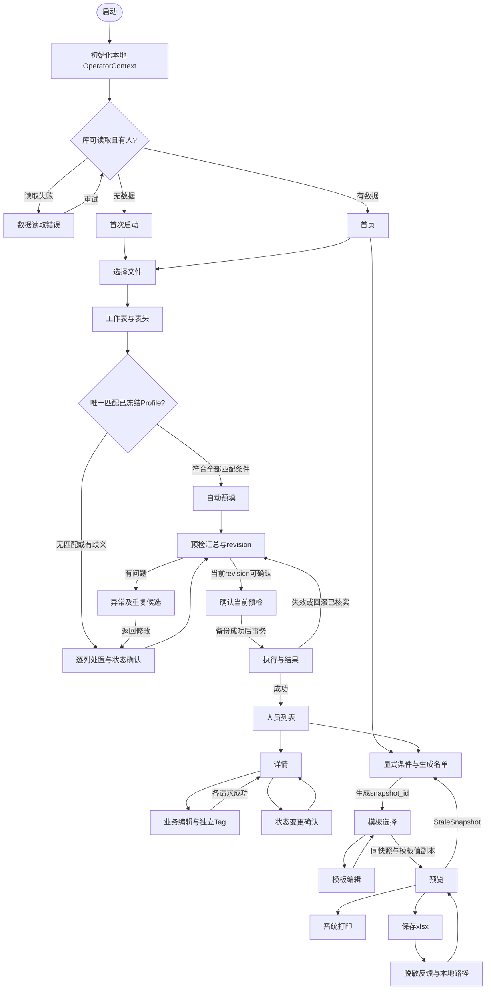

# D1B 使用流程与打印模板设计

版本：D1B-L0 v0.2｜日期：2026-10-01｜工作类型：docs｜当前状态：Draft，Gate 0 未通过，待非作者 R 复核。

本轮按 PR1 详细修改清单返工，设计对齐 PR2 的 ContractVersion 3 草案。契约修订号不表示业务批准、接口冻结或数据库迁移版本。DatabaseSchemaVersion 独立且尚未分配；本文没有实现业务服务或签认 Gate。

## 1. 任务、基线与权威来源

交付范围：页面流转、静态原型、控件及键盘、大字号、34 个 Person 字段、独立 Tag、三类模板、RV01–RV09 复核脚本、Q01–Q13 对接项，以及可重复生成的 MD／离线 HTML／JSON。Win32、数据库、导入事务、规则引擎、GDI／xlsx 适配器和 Win7 VM 留给 D2–D5。

| 基线 | 当前定位 |
| --- | --- |
| PR1 HEAD `4a141ede0d3a0d82a647e774cbc4ae6861fed8ed` | 原 v0.1 历史设计；本轮纠正旧字段、接口缺口和冻结表述 |
| PR2 HEAD `279a204aaf00233fac262f79ac4e3dd80d392f21` | 本轮隔离返工工作树的起点；未合并的稳定化草案，不自动升级为批准基线 |
| [基线与权威来源](../../baseline/00_基线与权威来源.md) | 已批准 Owner Decision／ADR > 需求 v2.0 > 规划 v2.0 > 任务台账 > Gate 冻结公共契约 > README／CONTRIBUTING；未合并 PR 为草案。未批准 ADR 无覆盖效力 |
| [schema_types.hpp](../../../include/retiree_roster/schema_types.hpp) | ContractVersion 3 Draft；FieldSpec、输入 DTO、导入、FilterSpec、快照及打印模板的具体表达 |
| [Gate Status](../../status/GATE_STATUS.md) | Gate 0 未通过；A/B/C/R 和甲方证据仍待齐备。本轮不改正式状态表 |
| [导入 Profile](../../baseline/01_导入Profile冻结说明.md) | 当前没有已冻结 Profile；配置仓储与审批证据负责判定冻结状态 |
| [源字段保留](../../baseline/02_字段映射与数据保留策略.md) | Sheet1 第 3 行 23 个非空标题候选映射；第 1 行额外与重复字段、第二份样表待确认 |
| [日期 ADR](../../decisions/ADR-0002-日期精度模型.md)、[快照 ADR](../../decisions/ADR-0003-名单快照与输出一致性.md)、[标签 ADR](../../decisions/ADR-0004-标签与关怀状态模型.md) | Proposed；用于本轮草案对齐，不冒充已批准规则 |
| [GitHub 协作命名规范](../../../GitHub协作命名规范.md)、[OD-0001](../../decisions/OD-0001-分支命名规则.md) | 新分支只用 ASCII；本轮不擅自重命名 PR1 的既有中文分支 |

术语：PersonId 是内部永久 ID；PersonCode 是业务可见固定编号，服务生成且只读；EmployeeNo 是源工号，可空、可重复，不是上述两种标识。print_serial_number 属于一次名单，从 1 连续生成。筛选决定入选，模板决定展示，snapshot_id 决定三条输出消费的同一名单。旧 CONTEXT 或历史提取稿的冲突描述按上述权威顺序定位，不反向覆盖当前草案。

工作采用 ask-matt 路由及 beginning-work：清单已给出范围，直接修复设计表达和证据；不为设计检查伪造产品功能测试。用户原始 Word／Excel 与 PR2 契约均保持不变。

## 2. 页面流转与失败返回

P 为页面，D 为对话框。首次运行先初始化本地操作员归属，再读取库；读库失败不能显示为空库。



当前无已冻结 Profile，因此当前导入必须经过 P12；图中自动预填分支只有未来满足冻结和唯一匹配要求后可用。所有分支保留预检和明确确认。

| 页面／对话框 | 前进条件与结果 | 返回／取消 | 失败或失效 |
| --- | --- | --- | --- |
| P00／P01 | 稳定非空本机 operator_id；空库导入，有库选业务 | 退出；未保存草稿进入 D90 | 读取错误到 D00，不冒充空库 |
| P10／P11 | 可读 xlsx；有效工作表和 1 起算表头行 | 上一步；取消回 P00/P01/P20 来源页 | 文件／表头无法读取留页；无 Person 写入 |
| P12 | 每个源列明确处置；仅可导入字段；姓名与状态可解析 | 上一步 P11；取消回来源页 | Unsupported、歧义、重复目标或未确认状态阻止前进，定位源列 |
| P13／P14 | 服务完成预检；问题定位文件名、表、行、列及字段 | 返回 P12/P13；取消整个向导回来源 | 修改语义后标旧revision失效；问题报告只含脱敏摘要 |
| D10 | valid_record_count>0、invalid_record_count=0、unresolved_duplicate_count=0，列与状态全部解决，revision仍有效且未成功确认 | 初始焦点返回检查；取消回 P13 | 服务再校验；备份失败不入库；失效重新预检 |
| P15 | 保存的预检副本事务入库；成功后到 P20 | 写入中等待，完成才可返回 | 已回滚才可重预检；结果不确定先核对，不盲目再次提交；成功revision不重复确认 |
| P20／P21 | 搜索姓名、PersonCode或工号；查看选中记录 | 详情回原列表位置；列表回首页 | 搜索失败留旧列表并标未更新；内部PersonId不作固定编号展示 |
| P22 | 新增、编辑、Tag各自契约和服务校验成功 | 有草稿 D90；取消回来源详情／列表 | 业务资料与Tag不声称跨请求原子；各区独立反馈和草稿，成功部分刷新，失败部分保留 |
| D20 | 明确状态意图、有效 DateValue、业务更正规则对齐，备份后更新 | 取消回 P21，原状态不变 | 日期精度和死亡日期必填／未来日期政策见Q04，不新增未批准限制；保存失败保留原状态 |
| P30 | 完整as_of_date、显式状态、有效条件；生成RosterResult | 回来源P01/P20 | 条件改变禁用旧结果输出；0人禁用模板输出；生成失败不拿旧人数冒充新结果 |
| D30／D31 | 保存方案／屏幕列选择，至少一列 | 取消回P30保留原配置 | 重名不得静默覆盖；屏幕列不改变模板或快照排序 |
| P40／P41 | snapshot_id和template值副本；模板合法 | 回来源；有模板草稿D90 | 管理模式无名单不能预览；参数错误定位列或尺寸 |
| P50 | 服务校验快照版本后生成PrintModel | 回P40调整模板；旧快照回P30 | StaleSnapshot禁用预览、打印与导出；旧画面加失效水印仅供核对，不作为有效预览 |
| D50／D51 | 同快照和同模板物理语义 | 系统取消回P50，无错误 | 设备或路径失败留页；拒绝旧快照；作业提交不是实物打印成功 |
| P51 | 导出完整成功；本地私有日志含真实路径 | 回P50，打开文件或文件夹 | 打开失败不抹掉导出结果；普通反馈与公共证据脱敏 |
| D90／D00 | 保存／放弃／继续编辑；读取重试／退出 | 默认继续编辑或安全取消 | 保存失败留编辑页；事务写入期间关闭不打断 |

窗口关闭和 Esc 遵守同一导航策略；导航上下文保存来源页、滚动位置和触发控件，返回恢复焦点。系统文件、覆盖、帮助、历史及打印对话框使用原生取消路径。

## 3. 静态原型与请求边界

### 3.1 首次启动、操作员与首页

```text
P00 本地维护员：显示名[可选] [使用固定本机维护员标识] [保存本地设置]
    说明：仅记录本机操作归属；无登录和身份认证
    还没有人员资料。选择表格 → 检查问题 → 生成名单
    [开始导入] [查看帮助] [退出]
P01 人数／最近导入；维护员显示名或本机标识
    [发放名单] [重阳节] [党员名单] [党龄50周年] [状态组合] [标签组合]
    [最近方案] [人员维护] [导入] [模板管理] [帮助] [退出]
```

本机非空稳定 operator_id 由本地配置保存；显示名修改不追改历史。confirmed_by／changed_by／requested_by 等来自 OperatorContext，只用于审计归属，不提供权限控制；管理员手册后续需解释标识采集和更换。六类首页入口是 UI 预设，只对应 Custom、Chongyang、Party50 三个 RosterScenario。

### 3.2 Profile、全列处置与不可变预检

```text
P10 [文件名／本地选取位置] [选择文件] [下一步] [取消]
P11 [工作表] [表头行] [列位置与原表头预览] [上一步] [下一步] [取消]
P12 [列索引 | 原标题 | 处置 | ImportFieldId | 状态源确认 | 问题]
    [处置方式] [可导入目标] [确认状态源列] [应用] [重置为Unsupported]
    [缺失状态默认值：未选择] [明确确认默认值]
    Profile ID/版本、映射版本、状态来源（只读）
    [上一步] [开始预检] [取消]
P13 总记录／有效／异常／重复候选／未解决重复；Profile／映射／状态摘要
    技术信息：batch_id、preview_revision、source_sha256
    [查看问题] [上一步修改] [确认导入] [取消]
D10 明确确认当前预检身份；不编辑映射、状态或重复处置
    [返回检查（初始焦点）] [确认入库]
P15 [进度] 事务状态、批次与revision反馈
    [进入人员列表] [返回并重新预检] [导出脱敏批次报告]
```

唯一匹配已冻结 Profile 且无缺失、重复、歧义、顺序变化、未知列时才自动预填。表头行是具体 Profile 配置，不能全球固定第1或第3行。配置仓储按 profile_id/version 查批准证据；UI 的标识或布尔勾选不构成冻结证明。

P12 的处置方式为 ImportColumnDisposition：PersonField 绑定唯一 ImportFieldId；BatchRawOnly 由维护员明确确认仅保存在本机 ImportRawCell，目标必须 Unspecified，不进入 Person 或公共日志；Unsupported 是默认，阻断确认。重复标题、有值无标题和未知列必须逐列处理，空白列保留物理位置，不能压缩后右移。第3行 W 当前为空，X 是备注，格式化空列不作人员。

当前 27 个可导入字段由 FieldSpec.source_importable 与 ImportFieldId 联合限定。PersonId、PersonCode、PinyinSortKey、CreatedAt、UpdatedAt、ImportBatchId、LastModifiedBy 不在目标下拉；打印序号、年龄、党龄和Tag也不在 Person 导入目标中。FullName 是唯一 required_for_import=true 的字段，但所有新建／导入状态仍必须解析为 Living 或 Deceased，不能从元数据必填标志推导 Unknown 可确认。

LifeStatus 源列要求 status_source_confirmed=true，仍逐值解析；源缺失可以明确确认批次默认或采用已冻结 Profile 约定，非法源值不能被默认值掩盖。ImportStatusResolution.source 为 Unresolved／SourceColumn／ConfirmedBatchDefault／FrozenProfile／Mixed，fallback_status 与 fallback_confirmed 记录缺失值补充；确认状态来源和目标变更同样使旧预检失效。当前样表无状态列，初始不猜在世。

P13 保存 ImportPreview 的 batch_id、preview_revision、source_sha256、source_record_count、valid_record_count、invalid_record_count、duplicate_candidate_count、unresolved_duplicate_count、profile_id、profile_version、mapping_version、status_resolution、column_bindings和issues。普通用户看到数量和版本摘要，技术身份在只读信息区列明；指纹由服务计算。这里是总记录、有效、异常、重复候选、未解决重复5项计数，不相加推算总量，一行可交叉有多类问题，定义与处置对账待D3实现。

ConfirmImportRequest 只含 ApiMeta、batch_id、preview_revision、confirmed_by。确认时加载服务保管的不可变预检副本，不能重读可能已变化的 Excel，也不再次接收映射、默认状态或重复处置。文件内容、工作表、表头、Profile及版本、列绑定、mapping_version、状态解析、重复候选处置任一变化均使旧revision失效，必须重新预检获得新revision。成功revision不可重复确认；网络／服务结果未知先核对，不能盲重提。服务缓存、生命周期、事务和幂等仍待D3证据。

重复工号不证明同一人，不自动覆盖或合并档案。未解决重复候选禁用确认，候选算法与人工处置待 A/R；修正源副本后重检。不提供未经契约实现的确认时跳过／合并按钮。原始Excel由维护员在外部副本修正，UI不写源文件。

### 3.3 34 字段、日期精度与独立 Tag

```text
P20 [姓名／PersonCode／工号] [显式状态] [查询] [清空]
    固定编号PersonCode | 工号EmployeeNo | 姓名 | 状态 | 类别 | 原单位 | 派生年龄
P21 固定编号：业务只读；工号单独显示；技术详情中PersonId只读
    敏感值默认脱敏；[本地显示／隐藏] [修改] [状态变更] [历史] [返回]
P22 A 业务资料区：34字段按能力呈现，新增与编辑模式分别启用
        每个日期：精度[未知／年／年月／完整日期] 年[ ] 月[ ] 日[ ]
        [保存业务资料] [取消]
    B 标签区（已保存人员）：Tag列表、代码、值、适用年、审计只读
        [添加／修改标签] [删除标签]
    C 系统信息：PersonId、PersonCode、创建／更新时间、批次、修改归属只读
D20 明确转为去世，DateValue精度与组件；[确认] [取消（初始）]
```

新增使用 PersonCreateInput：仅业务字段，服务生成 PersonId、PersonCode、初始PinyinSortKey和审计字段。编辑用 PersonEditInput.changes[]／FieldChange，只接 EditableFieldId；未改变字段不发change，清空用clear_value=true，不能把脱敏掩码当新值写回。日期通过 date_value，文本 value 不充当隐式日期解析器。PinyinSortKey 创建时只读，保存后允许人工修正，不能导入。LifeStatus 新增必须显式选择；已有人员状态经 D20 确认路径修改，DeathDate 日期补录仍遵守业务校验。PersonRecord 只作存储／输出，不整对象回传作为输入。

DateValue 为 Unknown（组件全0）、Year（有效年，月日0）、YearMonth（有效年月，日0）、FullDate（有效年月日含闰日）。所有六个日期字段使用该精度模型，显示“未知”／“YYYY”／“YYYY-MM”／“YYYY-MM-DD”，导出保留精度；不补造组件、不把年月填成1日、不用1900-01-01代替未知。周岁需完整生日；当年年龄与党龄只需有效年份；不足对应精度不参与精确规则，UI显示“不可计算／待补录”，不显示为0。快照派生字段的-1仅是契约不可计算标记，不能参与比较。未知死亡日期的业务政策和更正回在世仍见Q04，不能凭UI自行冻结。

独立 TagRecord 持久化困难、长期患病、慰问等人工关怀信息；P22与P30读同一来源，快照保存副本。TagMutation 只含 tag_code、tag_value、applicable_year、remove；UpdateTagRequest 另含PersonId、changed_by和ApiMeta。updated_at／updated_by仅服务生成；添加、修改、删除均独立反馈。常年标签 applicable_year=0；年度慰问须具体年，不跨年继承；代码和值域待A/R。高龄是规则派生，不作为可写Person字段或“高龄”标签。新增人员保存后才可操作Tag，业务保存与Tag保存不宣称同一事务。

敏感字段 NationalId／Phone／RelativePhone／HomeAddress 默认脱敏、不打印；显示／隐藏采用本地二次确认，离页恢复，不是认证机制。备注和原始批次值同样可能敏感，不进入公开报告。业务固定编号的格式和旧编号策略待甲方，不从源工号自动继承。

### 3.4 FilterSpec 与名单快照

```text
P30 [场景Custom/Chongyang/Party50] [目标年] [完整as_of_date] [人员状态]
    [年龄口径] [年龄启用] [年龄集合] [下限启用] [含边界下限]
    [党龄启用] [党龄集合] [下限启用] [含边界下限] [要求党员]
    字段条件：字段／比较／首值／次值 [添加更新] [删除] [All/Any]
    标签条件：代码／值／适用年 [添加更新] [删除] [All/Any]
    [生成名单] [重置] [保存方案] [屏幕列选择]
    排序只读：拼音键、姓名、PersonId
    snapshot_id／data_version／生成时间／已展开条件／N人
    连续打印序号 | 固定编号PersonCode | 工号 | 姓名 | 快照派生值
    [选择模板] [返回]
```

| UI入口 | 契约场景和条件 | 状态与边界 |
| --- | --- | --- |
| 发放名单 | Custom；无年龄条件，业务分组用FieldCondition | 状态由维护员显式选择；不暗设在世 |
| 重阳节 | Chongyang；CalendarYearAge；accepted_values={70,75,80,85} OR minimum=90 | R02展开LivingOnly；89不入，90/91入；无出生年排除并提示 |
| 党员名单 | Custom；require_party_member=true | 状态显式选择；政治代码待字典，不把空值当党员 |
| 党龄50周年 | Party50；require_party_member=true；party_seniority.accepted_values={50} | 不额外强制在世；初始Unspecified须明确选择；49/51、缺入党年、非党员排除 |
| 状态组合 | Custom；字段条件按类型和值域设置 | LivingOnly／DeceasedOnly／All明确传入 |
| 标签组合 | Custom；TagCondition含适用年；tag_match=All或Any | 状态显式；年度慰问不引用旧年份；空标签集合不约束 |

FilterSpec 为 target_year、FullDate as_of_date、scenario、life_status、age_basis、age、party_seniority、require_party_member、conditions/field_match、tags/tag_match，并可带filter_id和display_name。UI可传当天完整as_of_date，测试固定日期，服务不隐读全局时钟。Chongyang固定条件与手工输入冲突时ValidationFailed，不由UI另设优先级。Custom／Party50的Unspecified不能被当成LivingOnly，默认状态仍待业务确认。

YearCountCondition 关闭不约束，开启须非空 accepted_values 或 has_minimum=true；集合中任一值 OR 含边界minimum即匹配。没有最大年龄控件或maximum输入。Comparison 支持 Equals、NotEquals、Contains、IsEmpty、IsNotEmpty、BetweenInclusive、GreaterThanOrEqual、LessThanOrEqual，按字段类型限制可用项和值域。field_match和tag_match各自支持All／Any，空组不约束；两组与状态、年龄、党龄、党员条件之间AND。等级集合由字典决定，不对中文“处级以上”字符串比较大小。

生成后服务返回不可变 RosterResult：snapshot_id、data_version、generated_at、展开后的filter_spec、rows、total_count（必须等于rows.size）。每行含person_id、person副本、同版本tags副本、print_serial_number、completed_age、calendar_year_age、party_seniority_years。服务按pinyin_sort_key、full_name、PersonId稳定排序；UI不能重排后沿用旧序号。更换屏幕可见列不改名单，改条件后旧输出上下文禁用，生成新快照才能继续。

### 3.5 PrintTemplate、PrintModel 与输出隐私

```text
P40 快照ID、数据版本、N人、模板ID与版本 [模板列表] [调整] [预览] [返回]
P41 模板标识只读、名称、标题；columns[]列表（顺序、visible）
    source[PersonField/DerivedField/BlankSignature/StaticText]
    活动成员[field/derived_field/static_text]、display_name、列宽mm
    [应用列] [添加] [删除] [上移] [下移] [添加签字列]
    正文pt／标题pt／表头pt；A4／方向；四边距mm／行高mm
    每页人数[0自动或正数]／repeat_header／page_number_policy
    [另存] [保存修改] [取消]
P50 snapshot_id/data_version/template_id/template_version/N人
    [翻页] [缩放] [画布] [返回调整] [打印] [导出xlsx]
    StaleSnapshot：已失效，输出禁用，[回P30重新生成]
P51 脱敏结果摘要 [显示本地文件位置] [打开文件] [打开文件夹] [返回]
```

预览、打印、导出的名单输入只含 snapshot_id 和 PrintTemplate 值副本；各请求附ApiMeta，打印／导出还含本地requested_by，导出含目标路径，不能把FilterSpec再次提交重新筛选。PrintModel持有不可变RosterResult与模板const视图。换模板不改名单和序号；模板版本在一次输出中固定。

人员、Tag、拼音键、导入、恢复、迁移变化均使data_version失效，旧输出请求返回StaleSnapshot；恢复不能复用旧版本号。输出开始前服务在同一临界区检查并固定快照，过程中不补查询新数据或标签。旧画面只能明显标失效供核对；有效预览、xlsx、打印必须同一snapshot_id，N人同序。具体版本仓储与输出锁待D4/D5实现。

TemplateColumn.source为四种来源，只解释当前活动成员。签字是columns[]中的BlankSignature，添加／删除动作编辑数组，没有第二个全局签字开关。人员备注用PersonField::Remark；确需纯空白列可用StaticText空字符串，不冒充Remark。派生列只能从快照读取PrintSerialNumber／CompletedAge／CalendarYearAge／PartySeniorityYears。

模板列宽、四边距、行高为0.1mm整数，UI毫米值乘10转换并检查精度与uint16范围，不静默舍入。A4是2100×2970，横向反转；字号为pt。rows_per_page=0由版式服务计算容量，正数须验证可容纳，不能压缩／截断行。打印机硬边距、字体度量、换行、标题、表头和页脚参与验证，非法版式InvalidTemplate。GDI与xlsx转换同一物理语义；xlsx字符宽度仍需字体度量和实际打开／实物证据，算术通过不等于打印验收。

ExportLogRecord在本机私有数据库保留真实output_path、snapshot_id、模板ID版本、脱敏条件摘要、人数、时间、归属和结果。P51普通摘要脱敏，本地用户明确点击可查看真实位置或打开文件夹；文档、截图、JSON公共证据及GitHub报告不披露真实私有绝对路径。导出失败不破坏已有文件，覆盖须系统确认；无Excel仍可导出，打开关联失败单独提示。打印反馈为“已提交作业”，实物完成另行观察。

## 4. 大字号与键盘规则

建议界面微软雅黑12／15／18pt，备用系统中文字体；界面字号与打印字号独立。1024×768工作区可操作，字体换档依据实际测量重排；双列表单转单列，长地址备注换行，内容滚动，底部保存取消可达；焦点自动滚入可见区。96／120／144DPI与三档字号组合留给C在Win7 RTM x86/x64验证，不能仅比例放大坐标。

使用系统颜色和高对比度；错误文字说明字段，不能只靠红色。必要操作不能仅右键、双击或拖拽：列表箭头选行、Space勾选、Enter执行明示动作，上下移有按钮。Tab按§5.2，Shift+Tab逆序，跳过隐藏、禁用、STATIC和进度条；列表一个停靠点，日期精度及组件分别列入Tab，多行Enter换行。

导入／状态确认初始焦点返回检查／取消，不自动触发写入。Enter只触发焦点按钮或安全的页内主动作，确认需明确聚焦；Esc与关闭遵守§2，写入中提示等待，D90初始继续编辑。返回恢复触发焦点，失败聚焦首个错误。系统对话框由原生键盘规则管理；当前仅设计约定，实际Win32导航和manifest由C验证。

## 5. 控件清单、字段能力与 Tab

编号为设计追踪ID，D2再分配整数资源ID；每项包含名称、Win32类型、用途、默认、启用、校验及错误。EDIT＋UPDOWN视为一个用户停靠点；日期精度和年月日是独立控件。各页PAGE-INFO和主窗口状态栏为只读STATIC，不设Tab；列表虽只读仍可键盘选择查看。系统打印、保存、覆盖和帮助内部控件不由本稿重编号。

<!-- CONTROLS -->

### 5.1 PersonFieldId 34字段覆盖与 Tag 区

字段能力直接从PR2 FieldSpec解析；source_importable、user_editable、system_managed分别控制导入、人工编辑和系统专管。UI的新增／编辑启用条件进一步遵守请求边界，不能用“可编辑”推导“可新增填写”。

<!-- FIELDS -->

Tag独立于Person字段表，完整控件见P22-T区。Readonly updated_at／updated_by来自TagRecord，提交只含TagMutation。Person字段表不含TagCodes、CareFlags或派生高龄。

### 5.2 逐页 Tab 顺序

P22先业务字段、保存取消，再独立Tag区；系统信息跳过。P22初始姓名，D10返回检查，D20取消，D90继续编辑；禁用项目实际跳过。每页末接全局字号／帮助，共用区只在非模态主窗口可达。

<!-- TAB -->

## 6. 三类候选模板参数

全部名称、标题和数值为建议值／待甲方确认；template_version=1仅候选配置修订，不构成冻结。年度标题在选模板时根据快照的target_year解析成固定文本，渲染期间不读系统日期。T03可用于党员名单或党龄纪念，用途由FilterSpec决定，模板不能另行筛人。

<!-- TEMPLATES -->

建议宋体，标题18pt、表头与正文14pt，黑网格；总人数摘要、重复表头、页码由布局策略测量。字体族与标题／人数／页脚具体布局不是当前PrintTemplate新增字段，D5布局服务和甲方确认后固化，不伪造契约成员。算术预留标题120、摘要80、表头120、页脚80（单位0.1mm，均为作者建议预留）共400；列宽和行高采用同一单位。

初检可用宽＝纸宽−左右边距，可用高＝纸高−上下边距；列宽合计≤可用宽，400+每页人数×行高≤可用高。实际标题换行、硬边距、字宽和xlsx转换仍待D5验证。0自动人数、隐藏列、空白静态列及不同页码策略也需实际验证，不用关闭签字另留幽灵空列。

## 7. RV01–RV09 非作者 R 复核脚本

当前材料是L0静态原型；先走查入口、控件和提示，D3–D5再在真实程序执行。每项保留“待 R 复核”，作者未执行真实操作或代签。样例应虚构／脱敏，由A/R手算期望人数与编号；现样表无人员行，不能伪造导入或输出人数。

| 编号 | 操作步骤 | 预期观察／后续证据 | 当前结论 |
| --- | --- | --- | --- |
| RV01 首次导入 | 初始化本机操作员→选择xlsx/工作表/表头→无冻结Profile进入P12→逐列处置→确认状态来源→预检→D10确认 | 未确认前不写Person；三处置明确；仅ImportFieldId；Profile/映射/状态/batch_id/revision可核对；D10仅确认身份 | 待 R 复核 |
| RV02 异常与精度 | 构造Year/YearMonth/FullDate/Unknown日期→看问题定位；分别改变文件内容、工作表、表头、Profile版本、绑定、映射版本、状态和重复处置→重检 | 不补造日；未知不为0年龄；source_sha256由服务计算；每次旧revision失效、新revision可辨；确认不重读原文件 | 待 R 复核 |
| RV03 重复候选 | 同工号不同人、工号为空、同名、同证号候选→查看并按批准规则处理→重预检→尝试重复确认成功revision | 工号不是唯一键且保留前导零；不自动覆盖合并；unresolved_duplicate_count>0禁确认；成功revision不重复写入；不确定结果先核对 | 待 R 复核 |
| RV04 业务、标签与审计 | PersonCode搜索→新增后读系统字段→编辑拼音/地址→改常年困难Tag→改年度慰问→跨年→删除Tag→取消及确认状态变更 | PersonCode不变、PersonId不作业务编号；拼音可编辑不可导入；FieldChange区分不改和清空；Tag走独立请求、审计只读；旧年慰问不继承 | 待 R 复核 |
| RV05 六入口与条件 | 固定2026-10-01测试重阳89/90/91、70/75/80/85；Party50选择不同显式状态；字段All/Any、TagAll/Any、年龄/党龄集合或下限；缺年份 | enum仅3场景；Party50不强制在世；Custom/Party50未选状态阻断；空组不约束；精度不足不参与对应规则；党员代码不猜测 | 待 R 复核 |
| RV06 模板配置 | 调四来源、活动成员、visible/列序/宽度、三字号、方向、四边距、行高；人数0自动及正数；添加删除BlankSignature；另存 | 0.1mm整数正确转换；PersonCode为固定编号；Remark不是空白列；非法版式InvalidTemplate；字体/硬边距/换行校验；种子不覆盖 | 待 R 复核 |
| RV07 同快照三输出 | 生成多页名单记snapshot_id/N/PersonCode顺序/打印序号→固定模板值副本→预览→xlsx→GDI打印，分别取消再执行 | 三输出同snapshot_id、同N、同序；从快照读派生值和Tag，不重新FilterSpec；跨页序号连续；repeat_header/页码正确；作业提交与实物区分 | 待 R 复核 |
| RV08 旧快照与失败 | 生成名单后分别编辑Person、Tag、拼音、导入、恢复、迁移→尝试预览/导出/打印；模拟备份/输出不可写、无打印机 | 旧data_version返回StaleSnapshot、输出禁用并回P30；恢复不复用版本；同临界区固定输出；失败保留数据和已有文件；私有ExportLog有真实路径，公共报告脱敏 | 待 R 复核 |
| RV09 键盘与字号 | 不用鼠标走导入、业务/Tag、筛选、模板；Tab/逆序/箭头/Space/Enter/Esc；切12/15/18pt与DPI | 精度各组件可达、模态无陷阱、错误定位、底部按钮不裁切，隐藏禁用项跳过；确认初始安全焦点；Win7两VM实测证据后补 | 待 R 复核 |

R签认：姓名____；日期____；材料版本____；结论□通过 □返工 □阻塞；逐项证据____。正式非作者R签认并汇入Gate Status之前，不进入下一Gate。

## 8. Q01–Q13 决策与实现待办

“契约已补齐”只指PR2草案已能表达，不表示Profile批准、服务实现或实物验证完成。下表重新判定旧Q项；真正业务未决保留责任和时点。

| 编号 | 当前状态与已解决部分 | 仍待事项／责任／时点 | 当前UI处理 |
| --- | --- | --- | --- |
| Q01 | 唯一匹配冻结Profile策略已定义 | 两区域与第二样表、匹配条件及批准证据：A/B/R/甲方，D1；配置仓储D3 | 当前无冻结Profile，进入映射；未来自动预填仍预检 |
| Q02 | DateValue精度和显式缺失状态契约已定义 | 第二份脱敏样表、日期解析/枚举/真实批次状态政策：A/R/甲方，D1–D3 | 不补造年月日、不猜在世、不以Unknown确认 |
| Q03 | ConfirmImportRequest含preview_revision；不再是DTO缺口 | 不可变缓存、确认幂等、事务、重复候选算法与人工处置：A/R，D3 | 未解决候选阻断，任何语义变化重预检 |
| Q04 | PersonCreateInput/PersonEditInput及系统字段边界已定义 | PersonCode格式与旧编号、状态更正回在世、死亡日期政策、历史服务/备份：甲方/A/R，D1–D3 | 编号只读，工号不自动继承；状态确认，不伪造历史接口 |
| Q05 | 34字段覆盖第3行23源列，职称职务独立，不再缺目标 | 第1行重复/额外字段、第二样表、身份/类别/级别/党员代码：A/R/甲方，D1–D3 | 按物理位置逐列处置，不把额外字段混进Remark |
| Q06 | FilterSpec集合/下限、字段All/Any、标签All/Any已可表达 | 代码字典、值域与规则引擎；Party50默认状态业务意向：A/R/甲方，D1–D4 | Party50/Custom状态显式；无最大年龄；UI不算规则 |
| Q07 | snapshot_id/data_version/PrintModel三输出契约已补齐 | D4/D5快照仓储、失效、输出锁与同名单集成证据：A/B/R | P40/P50消费同快照；StaleSnapshot阻断 |
| Q08 | PrintTemplate四来源、0.1mm、三字号、页码和人数已补齐 | D5字体度量、xlsx单位转换、打印机硬边距及实物证据：B/C/R | 0自动人数；建议值不标冻结，版式组合校验 |
| Q09 | 三模板候选完整，T03编号为PersonCode | 名称/用途/标题/列/字号/边距/人数/签字最终参数：甲方/R，D1意向、D5实物前批准 | 所有种子参数均为建议值 |
| Q10 | 原生界面、大字号与键盘设计保留 | VS2017/v141_xp、Win7 RTM x86/x64、DPI/字体/打印机：C/R，D1/D2/D5 | 本轮不声称L1/L2/L3兼容通过 |
| Q11 | 本地OperatorContext及隐私规则已明确，无权限服务器 | 方案/模板仓储、显示名配置、字典/历史服务、管理员手册：A/B/R，D2–D5 | 本地显示隐藏敏感值；审计只读；公开证据脱敏 |
| Q12 | 作者证据与R质量签认责任已明确 | L0–L3台账口径、非作者走查与Gate批准证据：R，D1及各Gate | 本轮仅作者静态检查，不代签Gate |
| Q13 | 命名规范及OD-0001已存在；ASCII分支规则已明确；用户已授权本轮commit/push/prbody | PR2正式合并、PR1依赖基线与最终差异、Gate复核：用户/R，合并前 | 新分支ASCII，既有PR1分支不擅改；按授权更新正文，旧文备份，不合并PR |

A核对字段、状态、字典与导入处置；B完成本稿；C验证字体/DPI/设备；非作者R逐项走查及复核基线；甲方确认编号、状态和模板。当前Gate 0未通过；不将这些待办改登记为“已完成”。

## 9. 作者检查与交接

<!-- VALIDATION -->

以上仅检查作者设计结构、契约表达、模板算术及原始指纹。HTML交付检查与逐项清单对照见[交付与审核记录](../D1B_交付与审核记录.md)；结构化数据和两类检查JSON位于证据目录。代码／VM／事务／GDI／xlsx版式及实物未运行；非作者R未签认。建议提交信息：`docs: 对齐D1B与契约v3并补齐返工证据`。
